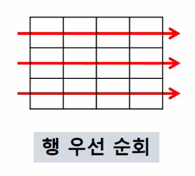
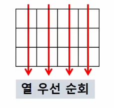
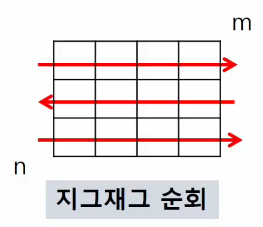
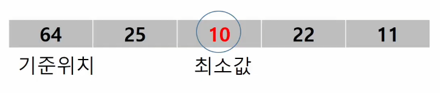
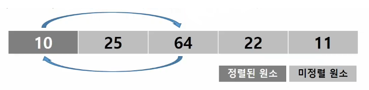
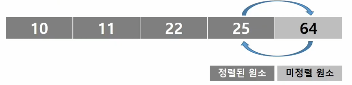

# 2022. 08. 10.

# 2차원 배열

> 2차원 배열의 선언

- 2차원 이상의 다차원 List는 차원에 따라 Index를 선언

- 2차원 List의 선언 : 세로길이(행의 개수), 가로 길이(열의 개수)를 필요로 함
  
  ```python
  N = int(input())  # N = 3
  arr = [list(map(int, input().split())) for _ in range(N)]
  # 1 2 3
  # 4 5 6
  # 7 8 9
  # => [[1, 2, 3], [4, 5, 6], [7, 8, 9]]
  ```

> 배열 순회

- n X m 배열의 모든 원소를 빠짐없이 조사하는 방법

- 행 우선 순회
  
  
  
  ```python
  for i in range(n):
      for j in range(m):
          Array[i][j]
  ```

- 열 우선 순회
  
  
  
  ```python
  for j in range(m):
      for i in range(n):
          Array[i][j]
  ```

- 지그재그 순회
  
  
  
  ```python
  for i in range(n):
      for j in range(m):
          # 짝수 행일 때 Array[i][j]
          # 홀수 행일 때 Array[i][m - 1 - j] 
          # 홀수 행 => m - 1을 시작으로 j만큼 감소!
          Array[i][j + (m - 1 - (2 * j)) * (i % 2)]
  ```

> 델타를 이용한 2차 배열 탐색

- 2차원 배열의 한 좌표에서 4방향의 인접 배열 요소를 탐색하는 방법

- 방향을 나름대로 정하자 (상하좌우 - 1 2 3 4)

- pseudo code
  
  ```
  arr[0 ... N - 1][0 ... N - 1]  # N x N 배열
  di = [0, 0, -1 ,1]  # 상하 델타
  dj = [-1, 1, 0, 0]  # 좌우 델타
  for i : 1 -> N - 1
    for j : 1 -> N - 1
      for k in range(4):
        n_i = i + di[k]
        n_j = i + dj[k]
        if 0 <= ni<N and 0 <= j<N   # 유효한 인덱스면 출력
            test(arr[n_i][n_j])
  ```

- python code

  ```python
  N = 3
  M = 4

  list_a = [[1, 2, 3, 4], [5, 6, 7, 8], [9, 10, 11, 12]]

  di = [0, 0, -1, 1]  # 상하
  dj = [-1, 1, 0, 0]  # 좌우

  for i in range(N):
      for j in range(M):
          print(f'{i, j}에서 가능한 방향 : ', end=' ')
          for dir in range(4):
              n_i = i + di[dir]
              n_j = j + dj[dir]
              if 0 <= n_i <= N-1 and 0 <= n_j <= M-1:
                  print(f'{n_i, n_j}', end=' ')
          print()
  
  # 출력 결과
  # (0, 0)에서 가능한 방향 :  (0, 1) (1, 0) 
  # (0, 1)에서 가능한 방향 :  (0, 0) (0, 2) (1, 1) 
  # (0, 2)에서 가능한 방향 :  (0, 1) (0, 3) (1, 2) 
  # (0, 3)에서 가능한 방향 :  (0, 2) (1, 3) 
  # (1, 0)에서 가능한 방향 :  (1, 1) (0, 0) (2, 0) 
  # (1, 1)에서 가능한 방향 :  (1, 0) (1, 2) (0, 1) (2, 1) 
  # (1, 2)에서 가능한 방향 :  (1, 1) (1, 3) (0, 2) (2, 2) 
  # (1, 3)에서 가능한 방향 :  (1, 2) (0, 3) (2, 3) 
  # (2, 0)에서 가능한 방향 :  (2, 1) (1, 0) 
  # (2, 1)에서 가능한 방향 :  (2, 0) (2, 2) (1, 1) 
  # (2, 2)에서 가능한 방향 :  (2, 1) (2, 3) (1, 2) 
  # (2, 3)에서 가능한 방향 :  (2, 2) (1, 3)
  ```


> 부분집합 합(Subset Sum) 문제

- 유한 개의 정수로 이루어진 집합이 있을 때, 이 집합의 부분집합 중에서 그 집합의 원소를 모두 더한 값이 0이 되는 경우가 있는지를 알아내는 문제

- 예를 들어, [-7, -3, -2, 5, 8]라는 집합이 있을 떄, [-3, -2, 5]는 이 집합의 부분집합이면서 (-3) + (-2) + 5 = 0이므로 이 경우의 답은 참이 된다.

> > 부분집합 생성하기

- 집합의 원소가 n개일 때, 공집합을 포함한 부분집합의 수는 2^n개 이다.

- 이는 각 원소를 부분집합에 포함시키거나 포함시키지 않는 2가지 경우르 모든 원소에 적용한 경우의 수와 같다.

- python code

  ```python

  ```

> 비트 연산자

- `&` : 비트 단위로 AND 연산을 한다.

- `|` : 비트 단위로 OR 연산을 한다.

- `<<` : 피연산자의 비트 열을 왼쪽으로 이동시킨다.

- `>>` : 피연산자의 비트 열을 오른쪽으로 이동시킨다.

> > '<<' 연산자

- 1 << n : `2^n과 같다`고 생각하면 된다. 원소가 n개일 경우 모든 부분 집합의 수를 의미한다.

> > & 연산자

- i & (1 << j) : `i의 j번째 비트를 검사`한다.  

- 부분집합을 생성해보자
  
  ```python
  arr = [3, 6, 7, 1, 5, 4]
  
  n = len(arr)
  
  for i in range(1<<n):     # 1<<n : 부분 집합의 개수
      for j in range(n):    # 원소의 수만큼 비트를 비교함
          if i & (1<<j):    # 자리 인덱스를 비트로 생각하여 j번 비트가 1인 경우
            print(arr[j], end=", ")
      print()
  print()
  ```

---

# 검색(Search)

> 검색

- 저장되어 있는 자료 중에서 원하는 항목을 찾는 작업

- 목적하는 탐색 키를 가진 항목을 찾는 것
  
  - 탐색 키(search keyu) : 자료를 구별하여 인식할 수 있는 키

- 검색의 종류
  
  - 순차 검색(sequential search)
  - 이진 검색(binary search)
  - 해쉬(hash)

> 순차 검색

- 일렬도 되어있는 자료를 순서대로 검색하는 방법

- 알고리즘이 단순하여 구현이 쉽지만, 검색 대상의 수가 많은 경우에는 수행시간이 급격히 증가하여 비효율적임

> > 정렬되어 있지 않은 경우

- 검색 과정
  - 첫 번째 원소부터 순서대로 검색 대상과 키 값이 같은 원소가 있는지 비교하며 찾는다.
  - 키 값이 동일한 원소를 찾으면 그 원소의 인덱스를 반환한다.
  - 자료구조의 마지막에 이를 때까지 검색 대상을 찾지 못하면 검색 실패

> > 정렬되어 있는 경우

- 자료를 순차적으로 검색하면서 키 값을 비료하여, 원소의 키 값이 검색 대상의 키 값보다 크면 찾는 원소가 없다는 것이므로 검색을 종료

- 정렬이 되어있으므로, 검색 실패를 반환하는 경우 평균 비교 회수가 반으로 줄어든다.

> 이진 검색

- 자료의 가운데에 있는 항목의 키 값과 비교하여 다음 검색의 위치를 결정

- 이진 검색을 하기 위해서는 자료가 `정렬된 상태`여야 한다.

--- 

# 인덱스

> 인덱스

- 인덱스라는 용어는 Database에서 유래했으며, 테이블에 대한 동작 속도를 높여주는 자료 구조를 일컫는다.

- 인덱스를 저장하는데 필요한 디스크 공간은 보통테이블을 저장하는데 필요한 디스크 공간보다 작다.

- 배열을 사용한 인덱스
  
  - 대량의 데이터를 매번 정렬하면, 프로그램의 반응은 느려질 수 밖에 없다. 이러한 대량 데이터의 성능 저하 문제를 해결하기 위해 배열 인덱스를 사용할 수 있다.

> 선택 정렬

- 주어진 자료들 중 가장 작은 값의 원소부터 차례대로 선택하여 위치를 교환하는 방식

- 정렬 과정
1. 주어진 리스트에서 최소값을 찾는다.
   
   

2. 리스트의 맨 앞에 위치한 값과 교환한다
   
   

3. 미정렬 리스트에서 최소값을 찾는다.

4. 리스트의 맨 앞에 위치한 값과 교환한다.

5. 같은 작업을 반복...

6. 미정렬원소가 하나 남은 상황에서는 마지막 원소가 가장 큰 값을 갖게 되므로 수행을 종료하고 선택 정렬이 완료된다.
   
   

- Pseudo code

  ```
  def SelectionSort(a[], n)
      for i from 0 to n - 2
          a[i], ..., a[n - 1] 원소 중 최소값인 a[k]를 찾는다
          a[i]와 a[k] 교환
  ```

- python code, 예시

  ```python
  def selectionSrot(a, N):
    for i in range(N - 1):
        minIdx = i
        for j in range(i + 1, N):
            if a[minIdx] > a[j]:
                minIdx = j
        # 중간에 쓸데 없이 if a[i] != a[minIdx]: 같은 if문을 끼워넣지 말자
        # 어짜피 같은거 끼리는 바꿔도 같기 때문에 if문을 쓰면 2번 실행된다.
        a[i], a[minIdx] = a[minIdx], a[i]
  ```

  ```python
  arr = [7, 2, 5, 3, 4, 6]
  N = len(arr)

  for i in range(N - 1):
      minIdx = i  # 구간의 맨 앞을 최소값으로 가정하자.
      for j in range(i + 1, N):  # 실제 최소값 인덱스 찾기
          if arr[minIdx] > arr[j]:
              minIdx = j
      arr[minIdx], arr[i] = arr[i], arr[minIdx]  # 최소값을 구간 맨 앞으로

  print(arr)
  ```

> 셀렉션 알고리즘

- 저장되어있는 자료로부터 k번째로 큰 혹은 작은 원소를 찾는 방법을 셀렉션 알고리즘이라 한다.

