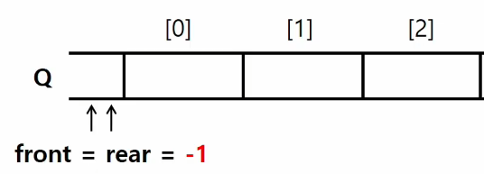
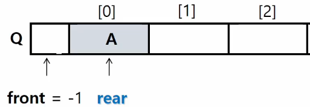
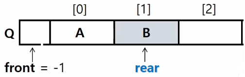
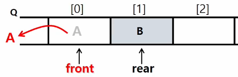
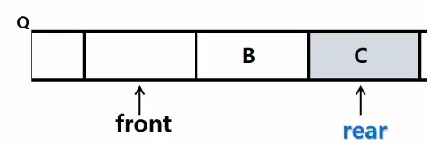
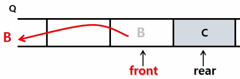
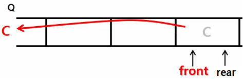

# 2022. 08. 24

# Queue

> 큐의 특성

- 스택과 마찬가지로 삽입과 삭제의 위치가 제한적인 자료구조

- 선입선출구조(First-in First-out) ex. 줄서기

> 큐의 선입선출 구조

- 머리(Front) : 저장된 원소 중 첫 번째 원소(또는 삭제된 위치)

- 꼬리(Rear) : 저장된 원소 중 마지막 원소

> 큐의 연산

- enQueue(item) : 큐의 뒤쪽(rear 다음)에 원소를 삽입

- deQueue() : 큐의 앞쪽(front)에서 원소를 삭제하고 반환

- createQueue() : 공백 상태의 큐를 생성

- isEmpty() : 큐가 공백상태인지를 확인

- isFull() : 큐가 포화상태인지를 확인

- Qpeek() : 큐의 앞쪽(front)에서 원소를 삭제 없이 반환

> 큐의 연산 과정

1. 공백 큐 생성 : createQueue()
   
   

2. 원소 A 삽입 : enQueue(A)
   
   

3. 원소 B 삽입 : enQueue(B)
   
   

4. 원소 반환 / 삭제 : deQueue()
   
   

5. 원소 C 삽입 : enQueue(C)
   
   

6. 원소 반환 / 삭제 : deQueue(); 
   
   

7. 원소 반환 / 삭제 : deQueue => Queue가 비어있는 상태`(front == rear)`
   
   

---

## 선형 큐

> 1차원 배열을 이용한 큐

- 큐의 크기 = 배열의 크기
- front : 저장된 첫 번째 원소의 인덱스
- rear : 저장된 마지막 원소의 인덱스

> 상태 표현

- 초기 상태 : front = rear =  -1
- 공백 상태 : front == rear
- 포화 상태 : rear == n - 1(n : 배열의 크기, n - 1: 배열의 마지막 인덱스)

> 선형 큐 이용시의 문제점 : 잘못된 포화상태 인식

- 삽입과 삭제를 계속 할 경우, 배열의 앞부분에 활용할 수 있는 공간이 남아있음에도 rear = n - 1 인 상태 즉, 포화상태로 인식하여 더 이상의 삽입을 수행하지 않게 됨

- 해결방법1 : 매 연산이 이루어질 때마다 저장된 원소들을 배열의 앞부분으로 모두 이동 => 이동에 많은 시간이 소요되어 비효율적임

- 해결방법2 : 1차원 배열을 사용하되, 논리적으로는 배열의 처음과 끝이 연결되어 `원형형태의 큐`를 이룬다고 가정하고 사용
  
  

---

## 원형 큐

> 초기 공백 상태

- front = rear = 0

> index의 순환 

- front와 rear의 위치가 배열의 마지막 인덱스인 n - 1을 가리킨 후, 그 다음에는 논리적 순환을 이루어 배열의 처음 인덱스인 0 으로 이동해야 함

- 나머지 연산자 mod 사용

> front 변수

- 공백 상태와 포화 상태 구분을 쉽게 하기 위해 front가 있는 자리는 사용하지 않고 항상 빈자리로 둠

- 삽입 위치 및 삭제 위치

  |         |        삽입 위치        |        삭제 위치        |
  | ------- | :---------------------: | :---------------------: |
  | 선형 큐 |     rear = rear + 1     |    front = front + 1    |
  | 원형 큐 | rear = (rear + 1) mod n | rear = (rear + 1) mod n |

  ---

## 우선순위 큐(Priority Queue)

> 우선순위 큐의 특성

- 우선순위를 가진 항목들을 저장하는 큐

- FiFo 순서가 아니라, 우선순위가 높은 순서대로 먼저 나가게 된다.

> 우선순위 큐의 적용 분야

- 시뮬레이션 시스템

- 네트워크 트래픽 제어

- 운영체제의 테스크 스케줄링

---

## 큐의 활용 : 버퍼(Buffer)

> 버퍼

- 데이터를 한 곳에서 다른 한 곳으로 전송하는 동안 일시적으로 그 데이터를 보관하는 메모리의 영역

- 버퍼링 : 버퍼를 활용하는 방식 또는 버퍼를 채우는 동작을 의미한다.

> 버퍼의 자료 구조

- 버퍼는 일반적으로 입출력 및 네트워크와 관련된 기능에서 이용된다.

- 순서대로 입력/출력/전달되어야 하므로 FiFo 방식의 자료구조인 큐가 활용된다.

---

## BFS(Breadth First Search)

> 그래프를 탐색하는 방법

- 깊이 우선 탐색(Depth First Search, DFS)

- 너비 우선 탐색(Breadth First Search, BFS)

- 경로가 있는지 탐색 : DFS, BFS

- 경로의 개수는? DFS

- 최단경로의 길이? BFS

> BFS

- 탐색 시작점의 인접한 정점들을 먼저 모두 차례로 방문한 후에, 방문했더 정점을 시작점으로 하여 다시 인접한 정점들을 차례로 방문하는 방식

- 인접한 정점들에 대해 탐색을 한 후, 차례로 다시 너비우선탐색을 진행애햐 함으로, 선입선출 형태의 자료구조인 큐를 활용함.

> BFG 예제

- visited 리스트를 인접 정점의 다음 그룹으로 넘어갈 때마다 1씩 더해주는 이유 : 최단거리 문제에서 유용하게 써먹을 수 있음!

- DFS는 `경로의 수를 찾는 문제`에서 유용하게 쓰임

- BFS는 `출발점이 여러 개로 주어져도 수행이 가능`하다.