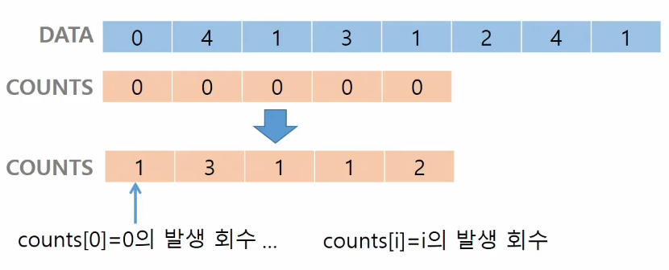
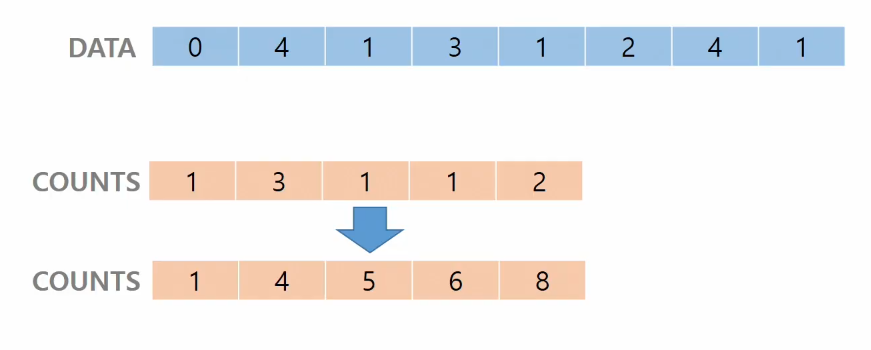
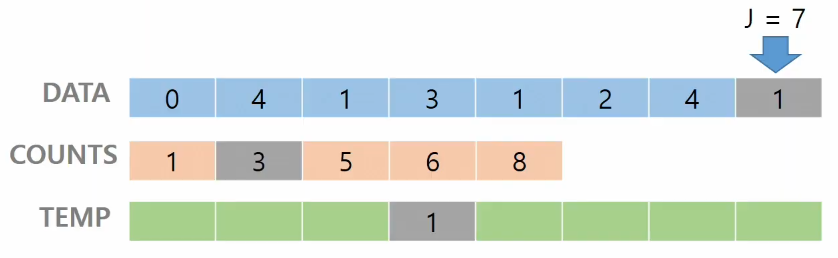
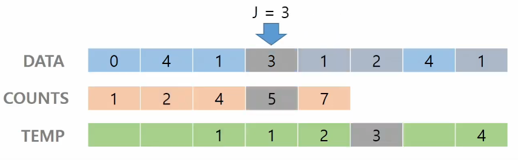
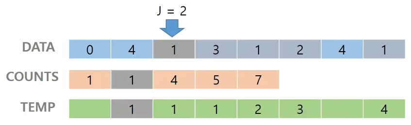
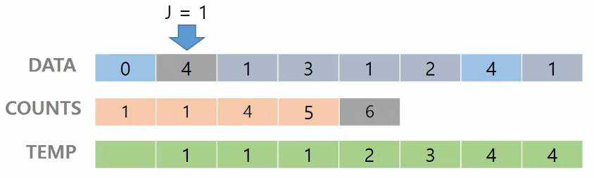
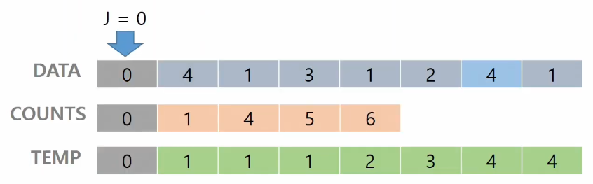

# 2022. 08. 08.

# 알고리즘

> 알고리즘

- 유한한 단계를 통해 문제를 해결하기 위한 절차나 방법이다. 컴퓨터가 어떤 일을 수행하기 위한 단계적 방법을 말한다.

- 간단하게 말하면 어떠한 문제를 해결하기 위한 절차

> 무엇이 좋은 알고리즘인가?

- 정확성 : 얼마나 정확하게 동작하는가

- 작업량 : 얼마나 적은 연산으로 원하는 결과를 얻어내는가

- 메모리 사용량 : 얼마나 적은 메모리를 사용하는가

- 단순성 : 얼마나 단순한가

- 최적성 : 더 이상 개선할 여지없이 최적화되었는가

> 시간 복잡도(Time Complexity)

- 실행되는 명령문(연산)의 개수를 계산 (대략적인 방법)

- 빅-오(O) 표기법
  
  - 시간 복잡도 함수 중에서 `가장 큰 영향력을 주는 n`에 대한 항만을 표시
  
  - 계수(Coefficient)는 생략
  
  - ex) O(3n+2) => O(3n) => O(n) / O(2n^2+10n+100) = O(n^2)

---

# 배열

> 배열이란?

- 일정한 자료형의 변수들을 하나의 이름을 열거하여 사용하는 자료구조

- 단순히 다수의 변수 선언을 의미하는 것이 아니라, 다수의 변수로는 하기 힘든 작업을 배열을 활용해 쉽게 할 수 있다.

---

# 정렬

> 정렬

- 2개 이상의 자료를 특정 기준에 의해 작은 값부터 큰 값(오름차순 : ascending), 혹은 그 반대의 순서대로(내림차순 : descending) 재배열하는 것

- 키(Key)
  
  - 자료를 정렬하는 기준이 되는 특정 값

> 대표적인 정렬 방식의 종류

- **`버블 정렬`**

- `카운팅 정렬`

- **`선택 정렬`**

- `퀵 정렬`

- 삽입 정렬

- 병합 정렬

> 버블 정렬 (Bubble sort)

- 인접한 두 개의 원소룰 비교하며 자리를 계속 교환하는 방식

- 정렬 과정
  
  1. 첫 번째 원소부터 인접한 원소끼리 계속 자리를 교환하면서 맨 마지막 자리까지 이동한다.
  2. 한 단계가 끝나면 가장 큰 원소가 마지막 자리로 정렬된다.
  3. 한 단게가 끝나면 마지막 자리를 제외하고 남은 구간에 대해서 과정을 다시 진행
  4. 1~3의 과정 반복

- 시간 복잡도 : O(n^2) (2중 for문)

- Pseudo Code
  
  ```
  for : i : N-1 -> 1  # 구간의 끝을 정함
    for : j : 0 -> i-1  # 인접한 원소 중 왼쪽 인덱스를'j'
      if arr[j] > arr[j+1]     # 왼쪽이 크면
         arr[j] <-> arr[j+1]  # 자리바꿈 
  ```

- 예시 코드

  ```python
  N = int(input())
  arr = list(map(int, input().split()))
  
  for i in range(N-1, 0, -1): # 구간의 맨 끝 인덱스
      for j in range(i): # 인접원소 중 왼쪽원소의 인덱스
          if arr[j] > arr[j+1]:   # 오름차순, 더 큰 수를 오른쪽으로
              arr[j], arr[j+1] = arr[j+1], arr[j]

  print(arr)
  ```
  
> 카운팅 정렬 (Counting sort)

- 항목들의 순서를 결정하기 위해 집합에 각 항목이 몇 개씩 있는지 세는 작업을 하여, `선형 시간 O(n)`에 정렬하는 효율적인 알고리즘

- 제한 사항
  
  - 정수나 정수로 표현할 수 있는 자료에 대해서만 적용 가능 : 각 항목의 발생 횟수를 기록하기 위해, 정수 항목으로 인덱스 되는 카운트들의 배열을 사용하기 때문이다.
  
  - 카운트들을 위한 충분한 공간을 할당하려면 집합 내의 가장 큰 정수를 알아야 한다.

- 시간 복잡도 : O(n + k) => n은 리스트의 길이, k는 정수의 최대값

> > ex) [0, 4, 1, 3, 1, 2, 4, 1]을 카운팅 정렬하는 과정

- 1단계 : Data에서 각 항목들의 발생 회수를 세고, 정수 항목들로 직접 인덱스 되는 카운트 배열 counts에 저장한다.
  
  - 횟수를 저장하는 `count배열의 최대크기`는 통상 `100만`까지로 제한한다.
  
  

- 2단계 : 정렬된 집합에서 각 항목의 앞에 위치할 항목의 개수를 반영하기 위해 counts의 원소를 조정한다.
  
  

- 3-1단계 : Data[7]에 해당하는 원소인 `1`에 대하여, counts[`1`]을 감소시키고 Temp에 1을 삽입한다.
  
  

- 3-2단계 : Data[6]에 해당하는 원소인 `4`에 대하여, counts[`4`]를 감소시키고 Temp에 4를 삽입한다.

- 3단계 과정을 계속 반복하여 Temp 리스트를 채워넣는다.
  
  
  
  
  
  
  
  
  
- Pseudo Code

  ```
  def Counting_sort(A, B, k)
  # A[] -- 입력 배열(1 to k)
  # B[] -- 정렬된 배열
  # C[] -- 카운트 배열

    C = [0] * (k+1)
    for i in range(0, len(A)):
      C[A[i]] += 1

    for i in range(1, len(C)):
      C[i] += C[i-1]

    for i in range(len(B)-1, -1, -1):
      C[A[i]] -= 1
      B[C[A[i]]] = A[i]

  ```

- 예시 코드

  ```python
  # 카운트 정렬
  N = int(input())
  arr = list(map(int, input().split()))

  tmp = [0] * N
  c = [0] * 101   # 0부터 100까지 숫자 개수, 인덱스가 100까지 있어야 함
  for i in range(N):  # 카운트
      c[arr[i]] += 1

  for j in range(1, 101): # 갯수 누적
      c[j] += c[j-1]

  for i in range(N-1, -1, -1):    #원본을 뒤에서부터 읽으면서 정렬 결과를 tmp에 저장
      c[arr[i]] -= 1
      tmp[c[arr[i]]] = arr[i]

  print(tmp)
  ```
---

# 완전 검색(Exaustive Search)

> 완전 검색

- 문제의 해법으로 생각할 수 있는 모든 경우의 수를 나열해보고 확인하는 기법이다.

- Brute-force 혹은 genrate-and-test 기법이라고도 불리 운다.

- 일반적으로 경우의 수가 상대적으로 작을 때 유용하다.

- 모든 경우의 수를 생성하고 테스트하기 때문에 수행 속도는 느리지만, 해답을 찾아내지 못할 확률이 작다.

- 우선 완전 검색으로 접근하여 해답을 도출한 후, 성능 개선을 위해 다른 알고리즘을 사용하고 해답을 확인하는 것이 바람직하다.

> 순열

- 서로 다른 것들 중 몇 개를 뽑아서 한 줄로 나열하는 것

- nPr = n * (n-1) * (n-2) * ... * (n-r+1)

- 완전 검색 시, 경우의 수가 몇 개가 되는지 판별

- ex) {1, 2, 3}을 포함하는 모든 순열을 생성하는 함수

  ```python
  for i1 in range(1, 4):
      for i2 in range(1, 4):
          if i2 != i1:
              for i3 in range(1, 4):
                  if i3 != i1 and i3 != i2:
                      print(i1, i2, i3)
  ```

# 탐욕(Greedy) 알고리즘

> 탐욕 알고리즘

- `최적해`를 구하는데 사용되는 근시안적인 방법

- 여러 경우 중 하나를 결정해야 할 때마다 그 순간에 최적이라고 생각되는 것을 선택해 나가는 방식으로 진행하여 최종적인 해답에 도달

- 각 선택의 시점에서 이루어지는 결정은 `지역적으로는 최적`이지만, 그 선택들을 계속 수집하여 `최종적인` 해답을 만들었다고 하여, 그것이 `최적이라는 보장은 없다`.

> > ex) 거스름돈 줄이기

- 거스름돈으로 주는 지폐와 동전의 개수를 최소한으로 줄이자!

- 과정

1. 해 선택 : 단위가 큰 동전으로만 거스름돈을 만들면 동전의 개수가 줄어들으므로 현재 고를 수 있는 가장 단위가 큰 동전을 하나 골라 거스름돈에 추가한다.
2. 실행 가능성 검사 : 거스름돈이 손님에게 내드려야 할 액수를 초과하는지 확인한다. 초과한다면 마지막에 추가한 동전을 거스름돈에서 빼고, 1)로 돌아가서 현재보다 한 단계 작은 단위의 동전을 추가한다.
3. 해 검사 : 모은 지폐와 동전을 합산한 액수가 거스름돈의 액수화 일치하는지 확인해야 한다. 액수에서 모자라면 다시 1)로 돌아가서 거스름돈에 추가할 동전을 고른다.

>> ex) Baby gin

- **꼭 알고 있어야하는 코드**

  ```python
  # 수를 입력 받을 때 자릿 수가 정해져있지 않은 경우

  while num > 0:
      counts[num % 10] += 1
      num //= 10
  ```

- 구현 예

  ```python
  num = 456789  # Baby gin 확인할 6자리 수
  c = [0] * 12  # 6자리 수로부터 각 자리 수를 추출하여 개수를 누적할 리스트
  # 카드는 10장인데 굳이 배열칸을 2개 더 추가하는 이유?
  # => if문 비교연산을 더 추가하기보다는 메모리 2칸을 더 쓰는게 단순하기 때문

  for i in range(6):
      c[num % 10] += 1
      num //= 10

  i = 0
  tri = run = 0

  while i < 10:
      if c[i] >= 3: # triplete 조사 후 데이터 삭제
          c[i] -= 3
          tri += 1
          continue
      if c[i] >= 1 and c[i+1] >= 1 and c[i+2] >= 1  # run 조사 후 데이터 삭제
          c[i] -= 1
          c[i+1] -= 1
          c[i+2] -= 1
          run += 1
          continue
      i += 1

  if run + tri == 2 : 
      print("Baby Gin")
  else : 
      print("Lose")
  ```

>> 자주 실수하는 오답

- 입력받은 숫자를 정렬한 후, 앞 뒤 3자리씩 끊어서 Baby gin을 확인하는 방법

  - ex1) [6, 4, 4, 5, 4, 4] : 정렬하여 [4, 4, 4, 4, 5, 6]을 얻어 쉽게 확인

  - ex2) [1, 2, 3, 1, 2, 3] : 정렬하면 [1, 1, 2, 2, 3, 3]으로, 오히려 Baby gin확인에 실패할 수 있음

- 탐욕 알고리즘적인 접근은 `해답을 찾아내지 못하는 경우도 있으니` 유의해야함!

---

# 알고리즘 풀 때

> 사고방식

- 고민 80%, 코드 작성 20%

> 풀이 과정

1. 문제 읽고 주요 정보들 필기하기

2. 테스트 케이스 보기

3. 사람의 입장에서 본 아이디어

4. 컴퓨터의 동작(사람 -> 컴퓨터 : if, for, while)

5. 구현

