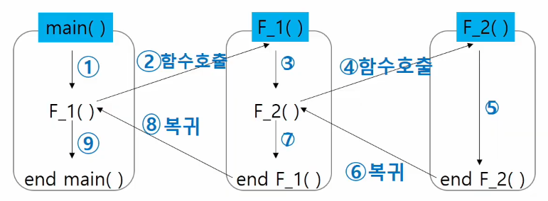

# 2022. 08. 17

# Stack

> 스택의 특성

- 물건을 쌓아 올리듯 자료를 쌓아 올린 형태의 자료구조이다.

- 스택에 저장된 자료는 선형 구조를 갖는다.
  
  - 선형구조 : 자료 간의 관계가 1대1의 관계를 갖는다.
  - 비선형구조 : 자료 간의 관계가 1대N의 관계를 갖는다. ex)트리

- 스택에 자료를 삽입하거나 스택에서 자료를 꺼낼 수 있다.

- 마지막에 삽임한 자료를 가장 먼저 꺼낸다. 후입선출(Last-In-First_Out)
  
  - 예를 들어, 스택에 1, 2, 3 순으로 자료를 삽입한 후 꺼내면 3, 2, 1 (역순)로 꺼낼 수 있다.

> 스택의 구현

- `자료구조` : 자료를 선형으로 저장할 저장소
  
  - 배열을 사용할 수 있다.
  - 저장소 자체를 스택이라 부르기도 한다.
  - 스택에서 마지막 삽입된 원소의 위치를 top이라 부른다.

> > 연산

- 삽입 : 저장소에 자료를 저장한다. 보통 `push`라고 부른다.

- 삭제 : 저장소에서 `자료를 꺼낸다`. 꺼낸 자료는 삽입한 자료의 역순으로 꺼낸다. 보통 `pop`이라고 부른다.

- `스택이 공백인지 아닌지`를 확인하는 연산 : `isEmpty` => 비어있으면 True

- 스택의 `top에 있는 item(원소)`을 반환하는 연산 : `peek`

> > 스택의 push 알고리즘

- append 메소드를 통해 리스트의 마지막에 데이터를 삽입

- `append, pop은 속도가 느리`기 때문에 아래와 같은 방법을 추천
  
  ```python
  def push(item, size):
      golbal top
      top + 1
      if top == size:
          print('overflow!')  # 디버깅용..
      else:
          stack[top] = item
  
  size = 10
  stack = [0] * size
  top = -1
  
  push(10, size)
  top += 1        # push(20)
  stack[top] = 20 #
  ```

> > 스택의 pop알고리즘

- pop이 수행된 후에 그 자리에 있던 값을 초기화 혹은 삭제 시켜줄 필요는 없다. 어짜피 이후에 push 명령이 들어오면 top이 가리키는 곳에 자료가 덮어 씌워진다.

- pop 코드
  
  ```python
  def pop():
      global top
      if top == -1:
          print('underflow')
          return 0
      else:
          top -= 1
          return stack[top + 1]
  
  print(pop())
  
  if top > -1:
      top -= 1
      print(stack[top + 1])
  ```

---

# 스택의 응용

> 스택 구현 고려 사항

- 1차원 배열을 사용하여 구현할 경우 구현이 용이하다는 장점이있지만, 스택의 크기를 변경하기가 어렵다는 단점이 있다.

- 이를 해결하기 위한 방법으로 저장소를 동적으로 할당하여 스택을 구현하는 방법이 있다. 동적 연결리스트를 이용하여 구현하는 방법을 의미한다.

> 괄호검사

- 조건
  
  - 왼쪽 괄호의 개수와 오른쪽 괄호의 개수가 같아야 한다.
  - 같은 괄호에서 왼쪽 괄호는 오른쪽 괄호보다 먼저 나와야 한다.
  - 괄호 사이에는 포함 관계만 존재한다.

---

# 스택의 응용2

> Function call

- 프로그램에서의 함수 호출과 복귀에 따른 수행 순서를 관리
  
  - 가장 마지막에 호출된 함수가 가장 먼저 실행을 완료하고 복귀하는 후입선출 구조

- 함수 호출과 복귀에 따른 전체 프로그램의 수행 순서
  
  

> 재귀 호출

- 함수에서 실행해야 하는 작업의 특성에 따라 일반적인 호출 방식보다 재귀호출 방식을 사용하여 함수를 만들면 프로그램의 크기를 줄이고 간단하게 작성 가능

> Memoization

- 피보나치를 재귀함수로 구현한 알고리즘은 문제점이 있다. => 엄청난 중복호출이 존재한다는 것! (실행시간 O(2^n))

- 메모이제이션은 컴퓨터 프로그램을 실행할 때 이전에 계산한 값을 메모리에 저장해서 매번 다시 계산하지 않도록 하여 전체적인 실행속도를 빠르게 하는 기술이다. 동적 계획법의 핵심이 되는 기술이다.

- 피보나치 알고리즘에서 fibo(n)의 값을 계산하자마자 저장하면(memoize). 실행시간을 O(n)으로 줄일 수 있다.

  ```python
  # memo를 위한 배열을 할당하고, 모두 0으로 초기화한다.
  # memo[0]을 0으로, memo[1]은 1로 초기화한다.

  def fibo1(n):
      if n >= 2 and len(memo) <= n:
          memo.append(fibo1(n - 1) + fibo1(n - 2))
      return memo[n]
  
  memo = [0, 1]
  ```

---

# Dynamic Programing

> DP

- 동적 계획(Dynamic Programming)알고리즘은 그리디 알고리즘과 같이 최적화 문제를 해결하는 알고리즘이다.

- 동적 계획 알고리즘은 먼저 입력 크기가 작은 부분 문제들을 모두 해결한 후에 그 해들을 이용하여 보다 큰 크기의 부분 문제들을 해결하여, 최종적으로 원래 주어진 입력의 문제를 해결하는 알고리즘이다.
  
> 피보나치 수 DP 적용

- 피보나치 수는 부분 문제의 답으로부터 본 문제의 답을 얻을 수 있으므로 `최적 부분 구조`로 이루어져있다.

- 과정

1. 문제를 부분 문제로 분할한다
  - fibo(n) = fibo(n - 1) + fibo(n - 2)
  - fibo(n - 1) = fibo(n - 2) + fibo(n - 3)
  - ...
  - fibo(2) = fibo(1) + fibo(0)
  
2. 가장 작은 부분 문제푸터 해를 구한다.

3. 그 결과는 `테이블`에 저정하고, 테이블에 저장된 부분 문제의 해를 이용하여 상위 문제의 해를 구한다.

- 피보나치 수 DP 적용 알고리즘

  ```python
  def fibo2(n):
      f = [0, 1]

      for i in range(2, n + 1):
          f.append(f[i - 1] + f[i - 2])

      return f[n]
  ```

> DP의 구현 방식

- recursive 방식(memoization 이용)

- iterative 방식

- memoization을 재귀적 구조에 사용하는 것보다 반복적 구조로 DP를 구현한 것이 성능 면에서 보다 효율적이다. (함수 호출과 복귀하는 과정에서 시간이 오래 걸리면, 함수의 반복적인 호출은 비효율적이라고 볼 수 있다.)

- 재귀적 구조는 내부에 시스템 호출 스택을 사용하는 오버헤드가 발생하기 때문이다

---

# DFS(깊이 우선 탐색)

> DFS

- 비선형구조인 그래프 구조는 그래프로 표현된 모든 자료를 빠짐없이 검색하는 것이 중요함.

- 두 가지 방법
  - 깊이 우선 탐색(Depth First Search)
  - 너비 우선 탐색(Breadth First Search)

> DFS 정의

- 시작 정점(출발점)의 한 방향으로 갈 수 있는 경로가 있는 곳까지 깊이 탐 탐색해 가다가 더 이상 갈 곳이 없게 되면, 가장 마지막에 만났던 갈림길 간선이 있는 정점으로 되돌아와서 다른 방향의 정점으로 탐색을 계속 반복하여 결국 모든 정점을 방문하는 순회방법

- 가장 마지막에 만났던 갈림길의 정점으로 되돌아가서 다시 깊이 우선 탐색을 반복해야하므로 `후입선출 구조`의 **스택** 사용

> DFS 알고리즘

- 과정

1. 시작 정점 v를 결정하여 방문한다.

2. 정점 v에서 `인접`(연결되어있는, 갈수 있는)한 정점 중에서
  
  - 방문하지 않은 정점 w가 있으면, 정점 v를 스택에 push하고 정점 w를 방문한다. 

  - 방문하지 않은 정점이 없으면, 탐색의 방향을 바꾸기 위해 스택을 pop하여 받은 가장 마지막 방문 정점을 v로 하여 다시 2)를 반복한다.

3. 스택이 공백이 될 때까지 2)를 반복한다.

  ```
  visited[], stack[] 초기화
  DFS(v)
      시작지점 v 방문(또는 할 일을 수행); # 초기화
      visited[v] <- True;                 # 초기화
      while {
          if ( v의 인접 정점 중 방문 안한 정점 w가 있으면)
              push(v);
              v <- w; (w에 방문)
              visited[w] <- True;
          else
              if (스택이 비어있지 않으면)
                  v <- pop(stack);
              else
                  break
      }
  ```

