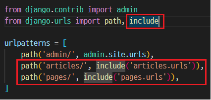
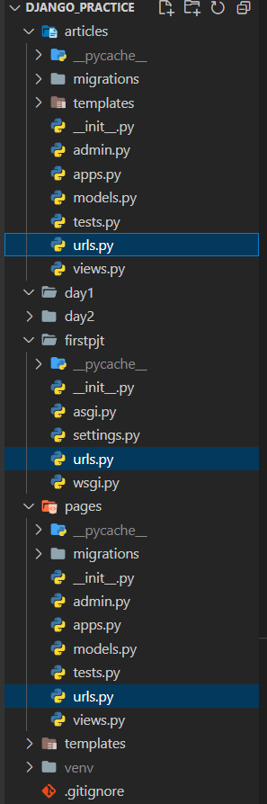

# 2022. 08. 30

# Django

## Django 시작하기

> Framework

- 서비스 개발에 필요한 기능들을 미리 구현해서 모아놓은 것!

- `틀`을 가지고 일한다

- 누군가 만들어 놓은 코드를 `재사용`

- 전 세계의 수많은 개발자들이 이미 수없이 많이 개발해 봤고, 그 과정에서 자주 사용되는 부분들을 재사용 할 수 있게 좋은 구조의 코드로 만들어 두었음.

- 내가 `만들고자 하는 본질(로직)`에 집중해 개발할 수 있음

- 소프트웨어의 `생산성과 품질`을 높임

> Django를 배워야하는 이유

- Python 기반의 프레임워크 : Flask, `Django`, Fast API

- 검증된 프레임 워크 : 화해, 토스, 두나무, 당근마켓, 요기요 등

---

## Web 이해하기

> WWW(World Wide Web)

- `전 세계에 퍼져 있는 거미줄 같은 연결망`

- 우리가 구글 홈페이지에 접속할 수 있는 이유는 구글 본사 컴퓨터와 우리간에 통신선이 연결되어 있기 때문(해저 케이블)

- 결국 인터넷을 이용한다는 것은 전세계의 컴퓨터가 연결되어 있는 하나의 인프라를 이용하는 것과 같다.

---

## 클라이언트와 서버

> 클라이언트 - 서버 구조

- 클라이언트가 `요청(request)`을 보내면 서버에서 `응답(response)`을 해준다.

---

## Web browser와 Web page

> 웹 브라우저란?

- 웹 페이지 파일을 우리가 보는 화면으로 바꿔주는(렌더링) 프로그램

> 정적 웹 페이지 (Static Web page)

- 한 번 작성된 `HTML 파일의 내용이 변하지 않고`, `모든 사용자에게 동일한 모습`으로 전달되는 것

- 서버에 `미리 저장된 HTML 파일을 그대로 전달`

- 같은 상황에서 모든 사용자에게 동일한 정보를 표시

> 동적 웹 페이지 (Dynamic Web page)

- 사용자의 요청에 따라 웹 페이지에 `추가적인 수정`이 되어 클라이언트에게 전달

- 웹 페이지의 내용을 바꿔주는 주체 == `서버`

- 이렇게 사용자의 요청을 받아서 적절한 응답을 만들어주는 프로그램을 쉽게 만들 수 있게 도와주는 프레임워크가 바로 `Django`

--- 

## Design Pattern

> Design Pattern 이란?

- 여러번 만들다 보니 `자주 사용되는 구조가 있다`는 것을 알게 되었고, 이를 `일반화`해서 `하나의 공법`으로 만든 것

> Django에서의 디자인 패턴

- **`MTV 패턴`** 

- MTV 패턴은 `MVC디자인 패턴을 기반`으로 조금 변형된 패턴이다.

> MVC 소프트웨어 디자인 패턴

- Model View Controller의 준말

- Model : 데이터와 관련된 로직을 관리

- View : 레이아웃과 화면을 처리

- Controller : 명령을 model과 view 부분으로 연결

- MVC와 MTV 패턴은 서로 크게 다른 점은 없으며, 일부 역할에 대해 부르는 이름이 다름
  
  | MVC        | MTV      |
  | ---------- | -------- |
  | Model      | Model    |
  | View       | Template |
  | Controller | View     |

> > Model

- 응용프로그램의 `데이터 구조를 정의`하고 `데이터베이스의 기록을 관리`

> > Template

- 화면상의 사용자 `인터페이스 구조`와 `레이아웃`을 정의

> > View

- Model & Template과 관련한 로직을 처리해서 `응답을 반환`

- 동작 예시
  
  - 데이터가 필요하다면 model에 접근하여 데이터를 가져온다.
  - 가져온 데이터를 template로 보내 화면을 구성
  - 구성된 화면을 응답으로 만들어 클라이언트에게 반환

> MTV 도식화

---

## Django 설정하기

> 가상환경 설정하기

- `python -m venv venv` : 명령으로 폴더명이 'venv'인 가상환경을 만든다

- `source venv/Scripts/activate` : 명령으로 가상환경 활성화 

- `pip list` : 가상환경 패키지 목록 조회

- `deactivate` : 가상환경 비활성화 가능

- `pip install django==3.2.13` : 버전에 맞는 Django 설치

- `pip freeze > requirements.txt` : requirements.txt 파일 생성(패키지 목록과 동일) => github에 가상환경은 용량이 너무 크므로 올리지 않는다. 따라서 다른 컴퓨터에서도 따로 가상환경을 만들어주게 되는데, 이 때 필요한 패키지 목록을 보여줌

- `pip install -r requirements.txt` : requirements.txt에 있는 목록을 한번에 설치

- `django-admin startproject firstpjt .` : 현재 폴더에 django 프로젝트 생성

- `python manage.py runserver` : Django 서버 실행 => 링크를 클릭하여 서버 확인
  
  

- `python manage.py startapp "원하는 어플리케이션 이름"` : Django 애플리케이션 생성 (어플리케이션 이름은 웬만하면 복수형으로 쓰자 ex.articles, acounts, hosts, menus) 여기서는 'articles'로 생성함
  
  
  
  - 사용자가 만든 앱은 INSTALLED_APPS의 가장 첫 번째로 쓰는 것을 권장.(에러가 날 수 있음)
    
    
  
  - `반! 드! 시!` `python manage.py startapp 명령으로 먼저 어플을 생성`한 후에 INSTALLED_APPS에 등록할 것. 반대로 하면 `절! 대! 로!` 안된다.

- urls.py에 path 등록(from articles import views)
  
  

- views.py에 함수 생성
  
  

- articles 파일 내부에 template 폴더 생성
  
  

> 프로젝트 구조

- settings.py : Django 프로젝트 설정을 관리

- manage.py : Django 프로젝트와 다양한 방법으로 상호작용하는 커맨드라인 유틸리티

> 애플리케이션 내부 구조

- models.py : MTV 패턴의 Model에 해당

- views.py : MTV 패턴의 view에 해당

> 코드 작성 순서

- URL -> View -> Template 순으로 작성
  
  

---

## Django Template

> Django Template Language (DTL)

- 조건, 반복, 변수, 치환, 필터 등의 기능을 제공

- Python처럼 일부 프로그래밍 구조(if, for)를 사용할 수 있지만, Python 코드로 실행되는 것은 아님.

- 프로그래밍적 로직이 아니라 프레젠테이션을 표현하기 위한 것

> DTL Syntax

> > Variable

- 변수를 설정하여 사용할 수 있다.

- `{{ 변수이름 }}` 으로 사용

- (.)을 사용하여 변수 속성에 접근할 수 있음

- render()의 세번째 인자로 {'key': value}와 같이 딕셔너리 형태로 넘겨주며, 여기서 정의한 key에 해당하는 문자열이 template에서 사용 가능한 변수명이 됨

> > Filters

- 변수 뒤에 파이프라인(|)을 붙여서 사용

- 60개의 built-in template filters를 제공

> > Tags

- 출력 텍스트를 만들거나, 반복 또는 논리를 수행하여 제어 흐름을 만들 수 있다.

- `` 으로 사용

- `` 처럼 단독으로 사용 가능한 태그도 있지만, ` `와 같이 **반드시 닫아주어야** 하는 태그들도 있다.

- 약 24개의 built-in template tags를 제공

> > Comments

- 한줄 주석 : `{# 주석 내용 #}`

- 여러줄 주석 : ` 주석 내용 주석 내용 주석 내용`

---

## Template inheritance

> 템플릿 상속에 관련된 태그

- 템플릿 상속은 기본적으로 `코드의 재사용성`에 초점을 맞춤

> > extedns 태그

- 자식(하위) 템플릿이 보무 템플릿을 확장한다는 것을 알림

- `extends` 태그는 무조건 html의 최상단에 존재해야 한다.

> > block 태그

- 하위 템플릿에서 재지정(overriden)할 수 있는 블록을 정의

- 가독성을 높이기 위해 선택적으로 endblock태그에 이름을 지정할 수 있음
  
  

> > 추가 템플릿 경로 추가하기

- base.html의 위치를 앱 안의 template 디렉토리가 아닌 프로젝트 최상단의 templates 디렉토리 안에 위치하고 싶다면?

- settings.py의 TEMPLATES 리스트에 `DIRS` 값에 `BASE_DIR / 'templates'`을 추가해 주면 모든 애플리케이션에서 탬플릿을 사용할 수 있다.
  
  

---

## Sending and Retrieving Form Data

> HTML \<form> element

- 데이터가 전송되는 방법을 정의

> > action

- 입력 데이터가 전송될 URL을 지정

- 데이터를 `어디로` 보낼 것인지를 지정하는 것이며, 이 값은 반드시 `유효한 URL`이어야 함

> > method

- 데이터를 `어떻게` 보낼 것인지 정의

- GET 방식과 POST 방식

- 번외) HTTP의 메서드 : GET, POST, PUT, DELETE

> GET

- 서버로부터 정보를 조회하는데 사용. 즉, 서버에게 리소스를 요청

- 데이터를 가져올 때만 사용해야 함

- 데이터를 서버로 전송할 때 Query String Parameters를 통해 전송
  
  - 데이터는 URL에 포함되어 서버로 보내짐
  
  

> > GET 메서드 작성

- 데이터 입력 후 submit 버튼을 누르고 URL의 변화를 확인해보자
  
  

> > action 작성

- throw 페이지에서 form의 action 부분을 마저 작성하고 데이터를 보낸다.
  
  

- index 페이지에 throw 하이퍼 링크를 작성하여 확인해보자
  
  

---

## Django URLs

> Django URLs

- "Dispatcher(운행 관리원)로서의 URL 이해하기"

- 웹 어플리케이션은 URL을 통한 클라이언트의 요청에서부터 시작함

> Trailing Slashes

- Django는 URL끝에 /가 없다면 자동으로 붙여주는 것이 기본 설정

- 잘 써주자!

---

## `Variable routing`

> Variable routing의 중요성

- 템플릿의 많은 부분이 중복되고, 일부분만 변경되는 상황에서 비슷한 URL과 템플릿을 계속해서 만들어야 되나?

> Variable routing

- `URL 주소를 변수로 사용`하는 것을 의미

- 변수 값에 따라 하나의 path()에 여러 페이지를 연결 시킬 수 있다.

> 작성법

- 변수는 "<>"에 정의하며 view함수의 인자로 할당됨

- 기본타입은 string

---

## App URL mapping

> App URL mapping

- 앱이 많아졌을 때 urls.py를 각 app에 매핑하는 방법
  
  

> url 분리 및 연결하는 방법

- 원래 있던 프로젝트 경로의 urls.py에서 `import path` 뒤에 `include`를 추가한다

- 이후 생생 되어있는 앱의 이름과 개수에 맞추어 path를 그림과 같이 설정해준다. 이 때 include에 들어가는 경로가 urls.py 파일이 생성될 경로이다. 
  
  

- path로 지정한 경로에 맞게 urls.py파일을 생성해준다.
  
  

---

## Naming URL patterns

> Naming URL patterns의 필요성 

- "index/"의 주소를 "new_index/"로 바꿔야 한다면?

- "index/"의 주소를 사용했던 모든 곳을 찾아서 변경해야하는 번거로움이 발생

> Built-in tag "url"

- ``

- 주어진 URL 패턴 이름 및 선택적 매개 변수와 일치하는 절대 경로 주소를 반환

