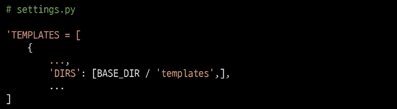

# 2022. 08. 31.

# Namespace

> Namespace의 필요성

- naming url 패턴을 이용해서 이름을 지정해 줬는데.. 서로 다른 애플리케이션에 이름이 같은 url이 존재한다면?

- 2가지 문제 발생
  
  - articles app의 index 페이지에 pages app의 index로 이동하는 하이퍼 링크를 클릭 시 현재 페이지로 다시 이동 => URL namespace
  - pages app의 index url(http://.../pages/index/)로 직접 이동해도 articles app의 index 페이지가 출력됨 => Template namespace

> URL namespace

- URL namspace를 사용하면 서로 다른 앱에서 동일한 URL이름을 사용하는 경우에도 지정된 URL을 고유하게 사용할 수 있음

- `app_name 속성`을 각 app의 urls.py마다 작성하여 URL namespace를 설정
  
  

- 기존의 URL tag
  
  

- 변경된 URL tag
  
  

- 주의! app_name을 지정한 이후에는 url 태그에서 반드시 `app_name:url_name 형태로만 사용`해야 함. 그렇지 않으면 NoReverceMatch 에러가 발생

> 첫 번째 문제는 해결 했지만.. pages/index를 요청했는데 articles/index를 응답으로 주네?

- 장고는 무조건 templates 경로의 다음 경로부터 읽기 때문에
  `articles/templates/index` 와 `pages/templates/index`를 구분해주지 못한다. 따라서 index.html 파일들의 물리적인 위치를 재조정 해주어야 한다.

> 디렉토리 생성을 통해 물리적인 이름공간을 구분

- 물리적인 위치를 각 앱에서 `templates` => `templates/app_name`으로 이동시켜 준다.
  
  

- views.py의 렌더링 함수들의 경로도 `app_name/index.html` 로 바꾸어준다. 
  
  

---

# Django Model

> 개요

- Model(모델)의 핵심 개념과 ORM을 통한 데이터베이스 조작 이해

- Django는 웹 애플리케이션의 데이터를 구조화하고 조작하기 위한 추상적인 모델을 제공

---

## Database

> Database

- 체계화된 데이터의 모임

- 검색 및 구조화 같은 작업을 보다 쉽게 하기 위해 조직화된 데이터를 수집하는 저장 시스템

> Database 기본 구조

- 스키마, 테이블

> > `스키마`

- 뼈대

- 데이터베이스에서 자료의 구조, 표현방법, 관계 등을 정의한 구조

> > `테이블`

- 필드와 레코드를 사용해 조직된 데이터 요소들의 집합

- 관계(Relation)라고도 부름

> > 필드(field)

- 속성, 열(Column)

- 각 필드에는 고유한 데이터 형식이 지정됨 (INT, TEXT 등)

> > 레코드(record)

- 튜플, 행(Row)

- 테이블의 데이터는 레코드에 저장됨

> > PK(Primary Key)

- 기본 키

- 각 레코드의 고유한 값(식별자로 사용)

- 기술적으로 다른 항목과 절대로 중복될 수 업는 단일 값(unique)

- 데이터베이스 관리 및 테이블간 관계 설정 시 주요하게 활용 됨

> 쿼리(Query)

- 데이터를 조회하기 위한 명령어

- 조건에 맞는 데이터를 추출하거나 조작하는 명령어

---

## Model

> 개요

- Django는 Model을 통해 데이터에 접근하고 조작
  
  

- 사용하는 데이터들의 필수적인 필드들과 동작(메서드)들을 포함

- 일반적으로 각각의 모델은 하나의 데이터베이스 테이블에 매핑(mapping)
  
  - 모델 클래스 1개 == 데이터베이스 테이블 1개

> Model 작성하기

1. 새 프로젝트 명("crud"), 앱(articles) 작성 및 앱 등록

2. models.py 작성
   
   - 모델 클래스를 작성하는 것은 데이터베이스 테이블 스키마를 정의하는 것 => "모델 클래스 == 테이블 스키마"

> Model 이해하기

- 각 모델은 django.models.Model 클래스의 서브 클래스 => 상속받아 구성
  
  - `클래스 상속 기반 형태`의 `Django 프레임워크 개발`
  
  - 프레임 워크에서는 잘 만들어진 도구를 가져다가 잘 쓰는 것!
  
  

- models 모듈을 통해 어떠한 타입의 DB필드(column)을 정의할 것인지 정함
  
  - Article에는 어떤 데이터 구조가 필요한지 정의
  
  - 클래스 변수 title과 content는 DB 필드를 나타낸다.

> Django Model Field

- Django는 모델 필드를 통해 테이블 필드(Column)에 저장할 데이터 유형을 정의

- 데이터 유형에 따라 다양한 모델 필드를 제공
  
  - DataField(), CharField(), IntegerField() 등
  - 공식 문서 참고 : https://docs.djangoproject.com/en/3.2/ref/models/fields/ 

- 클래스 변수(속성)명 = DB필드의 이름

- 클래스 변수 값(models 모듈의 Field 클래스) = DB필드의 데이터 타입
  
  

> > CharField(max_length=None, **options)

- 길이의 제한이 있는 문자열을 넣을 때 사용

- `max_length`
  
  - 필드의 최대 길이(문자). 최대 255까지 지정 가능
  - CharField의 `필수 인자`
  - 데이터베이스와 Django의 유효성 검사에서 활용

> > TextField(**options)

- 글자의 수가 많을 때 사용

- max_length 옵션 작성 시 사용자 입력 단계에서는 반영되지만, 모델과 데이터베이스 단계에서는 적용되지 않음
  
  - 따라서 데이터 저장 시 유효성 검증도 하지 않음

> 데이터베이스 스키마

- 모델의 변경사항을 실제 데이터베이스에 반영하기 위한 과정(`설계도` 제작)이 필요 => Migrations!

---

## Migrations

> migrations

- Django가 모델에 생긴 `변화`(필드 추가, 수정 등)를 실제 `데이터베이스에 반영`하는 방법

> 필수 명령어

- makemigrations, migrate

> makemigrations

- 모델의 변경사항에 대한 새로운 migration을 만들 때 사용

- `python manage.py makemigrations` 명령 실행 후 migrations 경로에 0001_initila.py가 생성된 것을 확인

- "파이썬으로 작성된 `설계도`"

> migragte

- `python manage.py migrate`

- makemigrations로 만든 설계도를 실제 데이터베이스에 반영하는 과정(`db.sqlite3 파일에 반영`됨) => db.sqlite3을 열어보면 `앱 이름_클래스 명`에 해당하는 우리가 만든 스키마 정보가 들어가있음

- 결과적으로 모델의 변경사항과 데이터베이스를 `동기화`

> 기타 명령어

- `python manage.py showmigrations` : migrations 파일들이 migrate 되었는지 여부를 확인

- `python manage sqlmigrate app이름 migration파일번호네자리`: 해당 migrations 파일이 SQL문으로 어떻게 해석될지 미리 알 수 있음

> Mdoel 변경사항 반영하기

- 기존에 id, title, content필드를 가진 테이블에 2개의 필드를 추가하고자 함

- Django 입장에서는 이미 존재하는 테이블에 새로운 속성이 추가되는 요구사항을 받았는데, 이러한 컬럼들은 기본적으로 "NULL(빈 값)"을 갖고 추가될 수 없음

- 따라서 Django는 우리에게 추가되는 속성에 대한 기본값을 설정하도록 제시함
  
  

- "1"을 입력 후 엔터() => 새로운 설계도 "0002_auto..."가 만들어진다.

- 새로운 설계도를 생성했기 때문에 DB와 동기화를 진행해야 함. => migrate 실행

> DateTimeField()

- Python의 datetime.datetime 인스턴스로 표시되는 날짜 및 시간을 값으로 사용하는 필드

- DateField를 상속받는 클래스

- 선택 인자(`헷갈리지 말것!`)
  
  - `auto_now_add` : `최초 생성` 일자. 데이터가 실제로 만들어질 때 현재 날짜와 시간으로 자동 초기화되도록 함
  - `auto_now` : `최종 수정` 일자. 데이터가 수정될 때마다 현재 날짜와 시간으로 자동 갱신되도록 함.

> ORM(Object Relational Mapping)

- 객체 지행 프로그래밍 언어를 사용하여 `호환되지 않는 유형의 시스템 간`(Django <-> DB)에 `데이터를 변환`하는 프로그래밍 기술

- Django는 `Django ORM`이 내장되어 있음

- SQL언어를 사용하지 않고도 데이터베이스를 조작할 수 있게 만들어줌

- `생산성`을 위하여 ORM을 쓴다.

- 하지만 ORM 만으로 완전한 서비스를 구현하기 어려운 경우가 있음.

---

# QuerySet API

> 외부 라이브러리 설치 및 설정

- pip install을 이용하여 `ipython, django-extensions`설치

> 참고) Shell

- 운영체제 상에서 다양한 기능과 서비스를 구현하는 인터페이스를 제공하는 프로그램

> Django Shell

- ORM 관련 구문 연습을 위해 파이썬 쉘 환경을 사용

- 하지만 일반 파이썬 쉘에서는 장고 프로젝트 환경에 영향을 줄 수 없기 때문에 Django 환경에서 진행할 수 있는 Django shell을 사용

- `python manage.py shell_plus`를 터미널에 입력하여 쉘을 켜주자

> Database API

- Django가 제공하는 ORM을 사용해 데이터베이스를 조작하는 방법

- Model릉 정의하면 데이터를 다룰 수 있는 API를 제공

> Database API 구문

- `Queryset API부분에서 읽고, 조회하고, 수정하고, 삭제`하는 명령을 하게 됨
  
  

> Objects manager

- Django는 기본적으로 모든 Django 모델 클래스에 대해 objects라는 manager 객체를 자동으로 추가한다

> Query

- 데이터베이스에 특정한 데이터를 보여달라는 `요청`

- 쿼리문을 작성한다 == 원하는 데이터를 얻기 위해 데이터베이스에 요청을 보낼 코드를 작성한다.

- 이 때, 파이썬으로 작성한 코드가 ORM에 의해 SQL로 변환되어 데이터베이스에 전달되며, 데이터베이스의 응답데이터를 ORM이 `QuerySet`이라는 자료형태로 변환하여 우리에게 전달

> QuerySet

- 데이터베이스에게서 전달 받은 객체 목록(데이터 모음)
  
  - 순회가 가능한 데이터로써, 1개 이상의 데이터를 불러와 사용할 수 있음

- 필터를 걸거나 정렬 등을 수행할 수 있음

- 단, 데이터베이스가 단일한 객체를 반환할 때는 QuerySet이 아닌 모델(class)의 인스턴스로 반환됨

> 기존의 `데이터에 필드를 추가`하는 방법

- models.py에 변경사항이 생겼을 때
  
  

- 이후 makemigrations를 진행하였을 때
  
  - Django 입장에서는 이미 존재하는 테이블에 새로운 Column이 추가되는 요구 사항을 받았는데, 이 컬럼들은 기본적으로 `빈 값으로 추가될 수 없음`
  - 따라서 Django는 우리에게 추가되는 컬럼에 대한 기본 값 설정을 물어보는 과정을 진행
  
  

- 1을 누르고 Enter 입력 후, 다음 화면에서 아무것도 입력하지 않고 Enter를 입력하면 Django에서 기본적으로 파이썬의 timezone 모듈의 now 메서드 반환 값을 기본값으로 매칭시켜줌
  
  

- 새로운 설계도(migrations 경로 확인)를 확인해보자
  
  

- 이후에 migrate 명령으로 DB와 동기화를 진행한다.

---

## QuerySet API 익히기

> CRUD

- 생성(Create) / 조회(Read) / 수정(Update) / 삭제(Delete)

- 대부분의 컴퓨터 소프트웨어가 가지는 기본적인 데이터 처리기능 4가지

## CREATE

> 첫 번째 방법

- 클래스를 통한 인스턴스 생성 : `article = Article()`
  
  

- save 메서드를 호출해야 DB에 데이터가 저장된다.(레코드 생성)
  
  

> 두 번째 방법

- 인스턴스 생성 시 초기 값을 함께 작성하여 생성
  
  

> 세 번째 방법

- QuerySet API 중 create() 메서드 활용
  
  - 생성된 데이터가 바로 반환되는 특징이 있다.
  
  

> .save()

- 객체를 데이터베이스에 저장함

- 데이터 생성 시 save를 호출하기 전 객체의 id값은 None
  
  - id값은 Django가 아니라 DB에서 계산되기 때문

- 단순히 모델 클래스를 통해 인스턴스를 생성하는 것은 DB에 영향을 미치지 않기 때문에 반드시 save를 호출해야 테이블에 레코드가 생성됨

## **READ**

- `어떻게 조회하는지`가 매우 중요하다 
- QuerySet API method는 크게 2가지로 분류된다.
  - `return new querysets`
  - `do NOT return new querysets`

> all()

- QuerySet return

- 전체 데이터 조회

> `get()`

- 단일 데이터 조회

- 객체를 찾을 수 없으면 DoesNotExist 예외, 둘 이상의 객체를 찾으면 MultipleObjectsReturned 예외를 발생시킴

- 위와 같은 특징 때문에 `Primary Key`와 같이 `고유성(uniqueness)을 보장하는 조회에서 사용`해야함!
  
  

> filter()

- 지정된 조회 매개 변수와 일치하는 객체를 포함하는 새 QuerySet을 반환

- 조회된 `객체가 없거나 1개여도 QuerySet을 반환`
  
  

> Field lookups

- 특정한 레코드에 대한 조건을 설정하는 방법

- filter(), exclude(), get()같은 쿼리셋 메서드에 대한 키워드 인자로 사용. 자세한 것은 공식문서에..

## UPDATE

> Update 과정

1. 수정하고자 하는 article 인스턴스 객체를 조회 후 반환 값을 저장

2. article 인스턴스 객체의 인스턴스 변수 값을 새로운 값으로 할당

3. save() 인스턴스 메서드를 호출하여 저장
   
   

## DELETE

> Delete 과정

1. 삭제하고자 하는 article 인스턴스 객체를 조회 후 반환 값을 저장

2. delete() 인스턴스 메서드 호출
   
   
- Django는 pk가 1인 데이터를 지우고 그 자리에 다시 집어넣지 않는다. 불필요한 데이터니까 삭제했다고 인식하기 때문. 

---

# CRUD with view functions

> 개요

- 이전에 익힌 QuerySet API를 통해 view함수에서 직접 CRUD를 구현해보자

> 사전 준비

- base 템플릿 작성 : bootstrap CDN 및 템플릿 추가 경로 작성
  
  
  
  

- URL 분리 및 연결
  
  
  
  

- index 페이지 작성 : urls.py -> views.py -> templates/articles/idex.html
