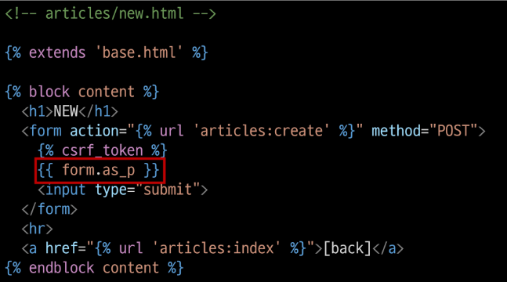
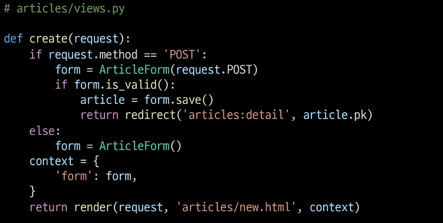

# 2022. 09. 06.

# Django Form

> 개요

- 우리는 지금까지 HTML form, input 태그를 통해서 데이터를 받았음

- 서버에 들어오는 요청을 모두 수용하기에는 비정상적이거나 악의적인 요청이 있을 수도 있다는 것을 생각해야함.

- 이처럼 사용자가 입력한 데이터가 우리가 원하는 데이터 형식이 맞는지에 대한 `유효성 검증`이 반드시 필요
  
  - 유효성 검증은 많은 부가적인 것들을 고려해서 구현해야 하는데, 이는 개발 생산성을 늦추며 쉬운 작업이 아님

- `Djangdo Form`은 이 과정에서 `어려운 작업과 반복 코드를 줄여줌`으로써 훨씬 쉽게 유효성 검증을 진행할 수 있도록 만들어줌

> Django는 Form에 관련된 작업의 세 부분을 처리

- 렌더링을 위한 데이터 준비 및 재구성

- 데이터에 대한 HTML forms 생성

- 클라이언트로부터 받은 데이터 수신 및 처리

---

## Django Form Class

> Form Class 선언

- 상속을 통해 선언 (forms 라이브러리의 Form 클래스를 상속)

- 앱 폴더에 forms.py를 생성 후 ArticleForm Class 선언

  ```python
  from django import forms


  class ArticleForm(forms.Form):
    title = forms.CharField(max_length=10)
    content = fomrs.ChaField()
  ```

- form에는 model field와 달리 TextField가 존재하지 않음

- `Forms Class를 forms.py를 새로 만들어 작성하는 것은 규약은 아니`며 models.py에 작성해도 되지만, 더 나은 유지보수의 관점 그리고 관행적으로 이렇게 하는 것을 권장한다.

- "new"함수 업데이트

  ```python
  from .forms import ArticleForm

  
  def new(request):
    form = ArticleForm()
    context = {
      'form': form,
    }
    return render(request, 'articles/new.html', context)
  ```

> Form rendering options

- \<label> & \<input> 쌍에 대한 3가지 출력 옵션

- as_p() : 각 필드가 단락(\<p>태그)으로 감싸져서 렌더링

- as_ul() : 각 필드가 목록 항목(\<li>태그)으로 감싸져서 렌더링. \<ul>태그는 직점 작성해야 한다.

- as_table() : 각 필드가 테이블(\<tr>태그) 행으로 감싸져서 렌더링

- 특별한 상황이 아니라면 `as_p()만 사용함`
  
  

> Django의 2가지 HTML input 요소 표현

1. Form fields
- 입력에 대한 유효성 검사 로직을 처리

- 템플릿에서 직접 사용됨
  
  ```python
  forms.CharFiled()
  ```
1. Widgets
- 웹 페이지의 HTML input 요소 렌더링을 담당

- input 요소의 단순한 출력 부분을 담당함

- Widgets은 반드시 form fields에 할당 됨
  
  ```python
  forms.CharField(widget=forms.Textarea)
  ```

---

## Widgets

> 개요

- Django의 HTML input element의 표현을 담당

- `단순히 HTML 렌더링을 처리하는 것`이며 **유효성 검증과 아무런 관계가 없음**

> 예시) Textarea 위젯 적용하기

- forms.py에 widget을 추가

  ```python
  # articles/forms/py

  class ArticleForm(forms.Form):
    title = forms.CharField(max_length=10)
    content = fomrs.CharField(widget=forms.Textarea)
  ```

- content에 Textarea 속성이 적용된 것을 확인

  


> 다양한 built-in 위젯

- https://docs.djangoproject.com/en/3.2/ref/forms/widgets/#built-in-widgets

---

## Django ModelForm

> 개요

- Form Class를 작성하면서.. "Model이랑 너무 중복되는 부분이 많은 것 같은데?"

- 이미 Article Model Class에 필드에 대한 정보를 작성했는데, 이를 Form에 맵핑하기 위해 Form Class에 필드를 재정의 해야만 했음.

- ModelForm을 사용하면 이러한 Form을 더 쉽게 작성 가능!

> ModelForm Class

- Model을 통해 Form Class를 만들 수 있는 helper class

- ModelForm은 Form과 똑같은 방식으로 View 함수에서 사용

> ModelForm 선언

- forms 라이브러리에서 파생된 ModelForm 클래스 상속

- 정의한 ModelForm 클래스 안에 Meta 클래스를 선언

- 어떤 모델을 기반으로 form을 작성할 것인지에 대한 정보를 Meta 클래스에 지정
  
  ```python
  # articles/forms.py
  
  from django import fomrs
  from .models import Article
  
  class ArticleForm(forms.ModelForm):
  
    class Meta:
      model = Article
      fields = '__all__'
  ```

> ModelForm에서의 Meta Class

- ModelForm의 정보를 작성하는 곳

- ModelForm을 사용할 경우 참조할 모델이 있어야 하는데, Meta class의 model 속성이 이를 구성함
  
  - 참조하는 모델에 정의된 field정보를 Form에 적용함

- fields 속성에 `'__all__'`를 사용하여 모델의 모든 필드를 포함할 수 있음
  
  ```python
  class ArticleForm(forms.ModelForm):
  
    class Meta:
      model = Articles
      fields = '__all__'
  ```

- 또는 exclude 속성을 사용하여 모델에서 포함하지 않을 필드를 지정할 수 있음
  
  ```python
  class ArticleForm(forms.ModelForm):
  
    class Meta:
      model = Article
      exclude = ('title',)
  ```

> 참고 : Meta data

- `데이터를 표현하기 위한 데이터`

- ex) 사진파일
  
  - 사진 데이터
  - 사진 데이터의 데이터(촬영 시각, 렌즈, 조리개 값 등)
  - 사진 데이터에 대한 데이터(== 사진의 Meta data)

> 참고 : 참조 값과 반환 값

- 호출하지 않고 이름만 작성하는 방식

- 함수를 예시로 들어보자
  
  - 첫번째 결과는 함수의 `참조 값`을 출력
  
  - 두번째 결과는 함수의 `반환 값`을 출력
    
    ```python
    def greeting():
    return '안녕'
    
    print(greeting) #<function greeting at 0x10751caf0>
    print(greeting()) # 안녕
    ```

- 언제 참조 값을 사용할까?
  
  - 함수를 호출하지 않고 함수 자체를 그대로 전달하여, 다른 함수에서 `"필요한 시점에"` 호출하는 경우
  
  ```python
  urlpatterns = [
    path('', views.index, name='index'),
  ]
  ```

- view 함수의 참조 값을 그대로 넘김으로써 path 함수가 내부적으로 해당 view함수를 "필요한 시점"에 사용 가능!

- 결국 Article이라는 클래스를 `호출하지 않고(== model을 인스턴스로 만들지 않고)` 작성하는 이유는 ArticleForm이 해당 클래스를 필요한 시점에 사용하기 위함

- 더불어 이 경우에는 인스턴스가 필요한 것이 아닌, 실제 Article 모델의 참조 값을 통해 해당 클래스의 필드나 속성 등을 내부적으로 참조하기 위한 이유도 있음

---

## ModelForm with view functions

> CREATE

- 유효성 검사를 통과하면 데이터 저장 후 상세 페이지로 리다이렉트
  
  

> "is_valid()" method

- 유효성 검사를 실행하고, 데이터가 유효한지 여부를 boolean으로 반환

- 데이터 유효성 검사를 보장하기 위한 많은 테스트에 대해 Django는 `is_valid()`를 제공하여 개발자의 편의를 도움

> form 인스턴스의 errors 속성

- is_valid()의 반환값이 False인 경우 form 인스턴스의 errors 속성에 값이 작성되는데, 유효성 검증을 실패한 원인이 딕셔너리 형태로 저장됨
  
  

- 이 같은 특징을 통해 다음과 같은 구조로 코드를 작성하면 유효성 검증을 실패 했을 때 사용자에게 실패 결과 메세지를 출력해줄 수 있음
  
  

> "save()" method

- form 인스턴스에 바인딩(데이터가 들어간)된 데이터를 통해 데이터베이스 객체를 만들고 저장

- ModelForm의 하위 클래스는 `키워드 인자 instance 여부`를 통해 `생성할 지, 수정할 지를 결정`함
  
  - 제공되지 않은 경우 save()는 지정된 모델의 새 인스턴스를 만듦(CREATE)
  - 제공되면 save()는 해당 인스턴스를 수정(UPDATE)
  
  ```python
  # CREATE : instance가 없으므로 생성
  form = ArcitleForm(request.POST)
  form.save()
  
  # UPDATE : instance가 있으므로 수정
  form = ArcitleForm(request.POST, instance=article)
  form.save()
  ```

> UPDATE

- ModelForm의 인자 instance는 수정 대상이 되는 객체(기존 객체)를 지정
1. request.POST
   
   - 사용자가 form을 통해 전송한 데이터(새로운 데이터)

2. instance
   
   - 수정이 되는 대상
- 참고) ModelForm 키워드 인자 data와 instance 살펴보기
  
  

> Form과 ModelForm

- ModelForm이 Form보다 더 좋은 것이 아니라 각자 역할이 다른 것

- Form 
  
  - 사용자로부터 받은 데이터가 DB와 연관되어 있지 않은 경우에 사용
  - DB에 영향을 미치지 않고 단순 데이터만 사용되는 경우(ex - `로그인`, 사용자의 데이터를 받아 인증 과정에서만 사용 후 `별도로 DB에 저장하지 않음`)

- ModelForm
  
  - 사용자로부터 받는 데이터가 `DB와 연관되어 있는 경우`에 사용 => 회원가입 같은 경우
  - 데이터의 유효성 검사가 끝나면 데이터를 각각 어떤 레코드에 맵핑해야 할지 이미 알기 떄문에 곧바로 save() 호출이 가능

---

## Handling HTTP request

> 개요

- HTTP requests 처리에 따른 view 함수 구조 변화

- new-create, edit-update의 view함수 역할을 잘 살펴보면 하나의 공통점과 하나의 차이점이 있음

- **공통점**
  
  - new-create는 모두 생성 로직을 구현하기 위한 공통 목적
  - edit-update는 모두 수정 로직을 구현하기 위한 공통 목적

- **차이점**
  
  - new와 edit는 GET 요청에 대한 처리만을, create와 update는 POST요청에 대한 처리만을 진행

- 공통점, 차이점을 기반으로 하나의 view 함수에서 method에 따라 로직이 분리되도록 변경

> CREATE

- new와 create view 함수를 합침

- 각각의 역할은 request.method 값을 기준으로 나뉨
  
  - **불필요해진 new의 view함수와 url path도 함께 삭제!**
  
  

- new.html -> create.html 로 이름변경 및 action 속성 값 수정
  
  

- new.html -> create.html 이름 변경 후 템플릿 경로도 수정해주어야 함
  
  

- 다른 html에 있는 new 관련 링크도 수정
  
  

> UPDATE

- CREATE와 마찬가지로 진행

---

## View decorators

> 개요

- View decorators 를 사용해 view함수 간단하게 만들기

### Allowed HTTP methods

> 개요

- django.views.decorators.http의 데코레이터를 사용하여 요청 메서드를 기반으로 접근을 제한할 수 있음

- 일치하지 않는 메서드 요청이라면 405 Method Not Allowed를 반환

- 메서드 목록
  
  - require_http_methods()
  - require_POST()
  - require_safe()

> reuire_safe()

- require_GET() 도 있지만 Django에서는 require_safe()를 사용하는 것을 권장

- 참고) 405 Method Not Allowed : 요청 방법이 서버에게 전달되었으나 사용 불가능한 상태 => `클라이언트의 잘못`

> require_http_methods()

- View 함수가 특정한 요청 method만 허용하도록 하는 데코레이터
  
  ```python
  # views.py
  
  from django.views.decorators.http import require_http_methods
  
  @ require_http_methods(['GET', 'POST'])
  def greate(request):
    pass
  
  @ require_http_methods(['GET', 'POST'])
  def update(request, pk):
    pass 
  ```

> require_POST

- View 함수가 POST 요청 method만 허용하도록 하는 데코레이터

---

# Rendering Fields Manually

- Django form templates를 이용한 방법(https://docs.djangoproject.com/en/4.1/topics/forms/#rendering-fields-manually)
  
  - Rendering fields manually
    
    
  
  - Looping over the form's fields
    
    
  
  - forms.py에서 attrs의 class 속성을 이용하여 bootstrap 적용하기 (base.html에 부트스트랩 CDN을 적용되어 있어야 함)
  
  
  
  - django bootstrap v5 이용
  
  
  
  

  ```html
  # create.html

  <h2>bootstrap v5 라이브러리 사용하기</h2>
  <form action="#">
    
    
      <button type="submit" class="btn btn-primary">Submit</button>
    
  </form>
  ```