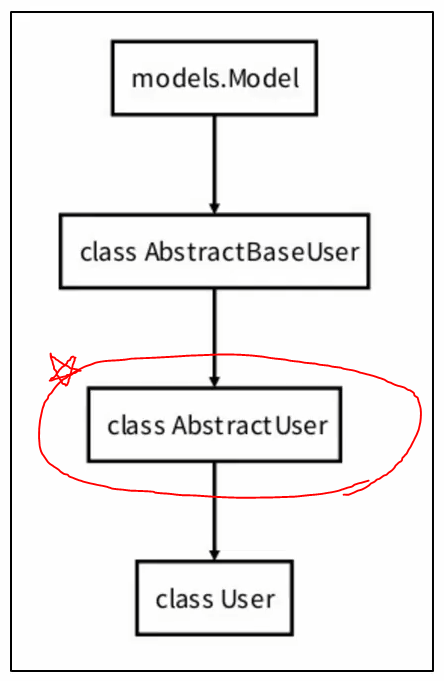
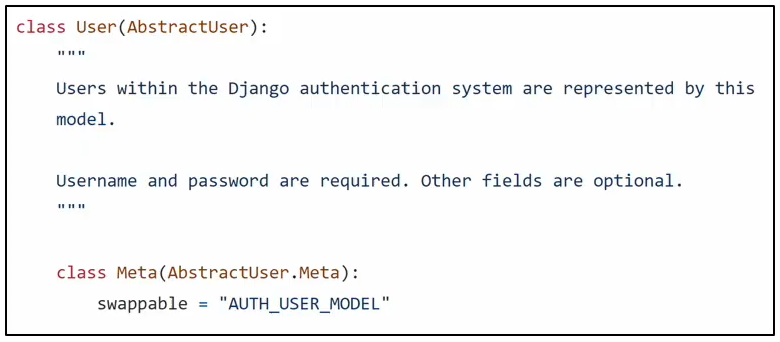

# 2022. 09. 07.

# The Django authentication system

> 개요 

- Django authentication system(인증 시스템)은 `인증(Authentication)`과 `권한(Authorization)`부여를 함께 제공(처리)하며, 이러한 기능이 어느정도 결합되어 일반적으로 인증 시스템이라고 함

- 필수 구성은 settings.py에 이미 포함되어 있으며, INSTALLED_APPS에서 확인 가능 `django.contrib.auth`

- Authentication(인증)
  
  - 신원 확인
  - 사용자가 자신이 누구인지 확인하는 것

- Authorization(권한, 허가)
  
  - 권한 부여
  - 인증된 사용자가 수행할 수 있는 작업을 결정

> 사전 설정

- 두번째 app accounts 생성 및 등록

- `주의!! auth와 관련한 경로나 키워드들을 Django 내부적으로 accounts라는 이름으로 사용하고 있기 때문에 되도록 accounts로 지정하는 것을 권장.`

---

## Substituting a custom User model

> 개요

- 커스텀 User 모델로 대체하기

- 기본 User model을 필수적으로 custom User model로 대체하는 이유?

- 개발자들이 작성하는 일부 프로젝트에서는 django가 제공하는 built-in User model의 기본 인증 요구사항이 적절하지 않을 수 있음 ex) 회원가입 시 username 대신 email을 식별 값으로 사용하려는 경우

- 그래서 Django는 현재 프로젝트에서 나타낼 User를 참조하는 `AUTH_USER_MODEL` 설정 값을 제공하여 `dafault user model을 재정의(override)할 수 있도록` 함
  
> 참고) User 모델 상속 관계

- 실제 메인 코드는 `class AbstractUser`클래스에 대부분 구현되어 있음
  
  

> 반드시 User 모델을 대체해야 할까?

- Django는 새 프로젝트를 시작하는 경우 비록 기본 User 모델을 그대로 사용하더라도 커스텀 User 모델을 설정하는 것을 `강력하게 권장(highly recommended)`

- 커스텀 User 모델은 기본 `User모델과 동일하게 작동하면서도 필요한 경우 나중에 맞춤 설정할 수 있기 때문`

- 단, User 모델 대체 작업은 프로젝트의 모든 migrations 혹은 첫 migrate를 실행하기 전에 이 작업을 마쳐야 함.

> AUTH_USER_MODEL

- 프로젝트에서 User를 나타낼 때 사용하는 모델

- `프로젝트가 진행되는 동안(모델을 만들고 마이그레이션 한 후) 변경 불가`

- 프로젝트 시작 시 설정하기 위한 것이며, `참조하는 모델은 첫 번째 마이그레이션전에 확정지어야 함`

- 커스텀 User 모델은 `기본 User 모델과 동일하게 작동`하면서도 `필요한 경우 나중에 맞춤 설정할 수 있음!`

- 기본값을 가지고 있음
  
  ```python
  # settings.py
  
  AUTH_USER_MODEL = 'auth.User'
  ```

> 참고) settings의 로드 구조

- AUTH_USER_MODEL은 settings.py에서 보이지 않는데 어디에 기본값이 작성되어 있는 걸까?

- settings.py는 사실 `global_settings.py를 상속`받아 재정의하는 파일(https://github.com/django/django/blob/main/django/conf/global_settings.py)
  
  

---

## How to substituting a custom User model

- AbstractUser를 상속받는 커스텀 User 클래스 작성

- 기존 User 클래스도 AbstractUser를 상속받기 때문에 커스텀 User 클래스도 완전히 같은 모습을 가지게 됨

> 대체하기

1. AbstractUser를 상속받는 커스텀 User 클래스 작성

   - 기존 User 클래스도 AbstractUser를 상속받기 때문에 커스텀 User 클래스도 완전히 같은 모습을 가지게 됨
  
  
  
  ```python
  # accounts/models.py
  
  from django.contrib.auth.models import AbstractUser
  
  class User(AbstractUser):
    pass
  ```

2. Django 프로젝트에서 User를 나타내는데 사용하는 모델을 방금 생성한 커스텀 User모델로 지정

  ```python
  # settings.py
  
  AUTH_USER_MODEL = 'accounts.User'
  ```

3. admin.py에 커스텀 User 모델을 등록
  - 기본 User 모델이 아니기 때문에 등록하지 않으면 admin site에 출력되지 않음

  ```python
  # accounts/admin.py

  from django.contrib import admin
  from django.contrib.auth.admin import UserAdmin
  from .models import User


  admin.site.register(User, UserAdmin)
  ```

> 참고) AbstractUser

- 관리자 권한과 함께 완전한 기능을 가지고 있는 User model을 구현하는 추상 기본 클래스

- **Abstract base classes**
  - 몇 가지 공통 정보를 여러 다른 모델에 넣을 때 사용하는 클래스
  - 데이터베이스 테이블을 만드는데 사용되지 않으며, 대신 다른 모델의 기본 클래스로 사용되는 경우 해당 필드가 하위 클래스의 필드에 추가됨

> 참고) 데이터베이스 초기화하는 방법

1. migrations 파일 삭제
  - `migrations 폴더 및 \__init__.py는 삭제하지 않는다`
  - 번호가 붙은 파일만 삭제

2. db.sqlite3 삭제
3. migration 진행

---

## HTTP Cookies

> HTTP

- Hyper Text Transfer Protocol

- 웹(WWW)에서 이루어지는 모든 데이터 교환의 기초

- 클라이언트 - 서버 프로토콜이라고도 부름

> 요청과 응답

- 요청(requests) : 클라이언트(브라우저)에 의해 전송되는 메세지

- 응답(response) : 서버에서 응답으로 전송되는 메세지

> HTTP 특징

1. 비 연결 지향(connectionless)
   - 서버는 요청에 대한 응답을 보낸 후 연결을 끊음
   - ex) 네이버 메인페이지를 보고 있을 때 우리는 네이버 서버와 연결된 것이 아니라 페이지를 응답하고 연결을 끊은 것

2. 무상태(stateless)
   - 연결을 끊는 순간 클라이언트와 서버간의 통신이 끝나며 상태 정보가 유지되지 않음

   - 클라이언트와 서버가 주고받는 메세지들은 서로 완전히 독립적

> 어떻게 로그인 상태를 유지할까?

- 서버와 클라이언트 간 지속적인 상태 유지를 위해 `쿠키와 세션`이 존재

---

### 쿠키

> 개요

- HTTP 쿠키는 `상태가 있는 세션`을 만들도록 해줌

> 개념

- 서버가 사용자의 웹 브라우저에 전송하는 작은 데이터 조각이다.

- 사용자가 웹사이트를 방문할 경우 해당 웹사이트의 서버를 통해 사용자의 컴퓨터에 설치되는 작은 기록 정보 파일
  - 부라우저(클라이언트)는 쿠키를 로컬에 `Key-Value`의 데이터 형식으로 저장
  - 쿠키를 저장해 놓았다가, `동일한 서버에 재요청 시 저장된 쿠키를 함께 전송`

- 쿠키는 두 요청이 동일한 브라우저에서 들어왔는지 아닌지를 판단할 때 주로 사용됨.
  - 이를 이용해 사용자의 로그인 상태를 유지할 수 있음
  - 상태가 없는(Stateless) HTTP 프로토콜에서 상태 정보를 기억시켜 주기 때문!

> 쿠키 사용 목적

1. `세션 관리(Session management)`
   - 로그인, 아이디 자동완성, 공지 하루 안보기, 팝업 체크, 장바구니 등의 정보 관리

2. 개인화(Personalization)
   - 사용자 선호, 테마 등의 설정

3. 트래킹(Tracking)
   - 사용자 행동 기록 및 분석

> 세션

- 사이트와 특정 브라우저 사이의 "state(상태)"를 유지시키는 것

- 클라이언트가 서버에 접속하면 서버가 특정 session id를 발급하고, 클라이언트는 session id를 쿠키에 저장
  - 클라이언트가 다시 동일한 서버에 접속하면 요청과 함께 쿠키(session id가 저장된)를 서버에 전달
  - 쿠키는 요청 때마다 서버에 함께 전송되므로 서버에서 session id를 확인해 알맞은 로직을 처리

- session id는 세션을 구별하기 위해 필요하며, 쿠키에는 session id만 저장

> 쿠키 Lifetime(수명)

1. Session Cookie

   - 현재 세션(current session)이 종료되면 삭제됨
   - 브라우저 종료와 함께 세션이 삭제됨

2. Persistent cookies
   - Expires 속성에 지정된 날짜 혹은 Max-Age 속성에 지정된 가간이 지나면 삭제됨

> Session in Django

- Django는 `database-backed sessions` 저장 방식을 기본 값으로 사용
  - session 정보는 Django DB의 `django_session 테이블`에 저장
  - 설정을 통해 다른 저장방식으로 변경 가능

---

## Authentication in Web requests

> 개요

- Django가 제공하는 인증관련 built-in forms 익히기

### Login

> 개요

- 로그인은 `Session을 Create하는 과정`

> AuthenticationForm

- 로그인을 위한 built-in Form

  - 로그인 하고자 하는 사용자 정보를 입력 받음
  - 기본적으로 username, password를 받아 데이터가 유효한지 검증

- request가 첫번째 인자

- https://github.com/django/django/blob/main/django/contrib/auth/forms.py#L174

    

- 유저 정보를 데이터베이스에 저장하려는 목적이 아니기 때문에 modelForm이 아니라 Form으로 작성된 것을 볼 수 있음.

> login()

- login(`request`, `user`, backend=None)

- 인증된 사용자를 로그인 시키는 로직으로 `view 함수에서 사용`

- 현재 세션에 연결하려는 인증된 사용자가 있는 경우 사용

- HttpRequest객체와 User객체 필요

> get_user()

- AuthenticationForm의 인스턴스 메서드

- 유효성 검사를 통과했을 경우 로그인한 사용자 객체를 반환

---

# Authentication with User

> 현재 로그인 되어있는 유저 정보 출력하기

- 템플릿에서 인증 관련 데이터를 출력하는 방법

  ```html
  <!-- base.html -->

  <div class="container">
    <!-- context가 없는데 어떻게 {{ user }}가 돼? -->
    <h3>Hello, {{ user }}</h3>
    <a href="">Login</a>
    <hr>
    
    
  </div>
  ```

- 어떻게 base 템플릿에서 context 데이터 없이 user 변수를 사용할 수 있는 걸까? => settings.py의 context processors 설정 값 때문

> context processors

- 현재 user 변수를 담당하는 프로세서는 `settings.py`에 있는 `django.contrib.auth.context_processors.auth`

- 이외에 더 많은 Built-in template context processors (https://docs.djangoproject.com/en/3.2/ref/templates/api/#built-in-template-context-processors)

> django.contrib.auth.context_processors.auth

- 현재 로그인한 사용자를 나타내는 User 클래스의 인스턴스가 템플릿 변수 `{{ user }}`에 저장됨

- 클라이언트가 `로그인하지 않은 경우`는 `AnonymousUser 인스턴스`로 표현됨!

---

## Logout

> 개요

- 로그아웃은 `Session을 Delete`하는 과정

> logout()

- logout(request) => 인자가 'request' 한 개

- HttpRequest 객체를 인자로 받고 반환 값이 없음

- 사용자가 로그인하지 않은 경우 오류를 발생시키지 않음

- 2가지 일을 처리한다
  - 1. 현재 요청에 대한 session data를 DB에서 삭제
  - 2. 클라이언트의 쿠키에서도 sessionid를 삭제

- 이는 다른 사람이 동일한 웹 브라우저를 사용하여 로그인하고, 이전 사용자의 세션 데이터에 액세스하는 것을 방지하기 위함

---

## 회원가입

> 개요

- 회원가입은 `User를 Create`하는 것이며 `UserCreation Form` built-in form을 사용

> UserCreationForm

- 주어진 username과 password로 권한이 없는 새 user를 생성하는 ModelForm

- 3개의 필드를 가짐

  1. username (from the user model)
  2. password1
  3. password2

> 회원가입 페이지 작성해보기!

- accounts/urls.py, accounts/views.py, accounts/signup.html

> 회원가입 진행 후 에러 페이지가 뜨네?

- 회원가입에 사용하는 `UserCreationForm`이 `우리가 대체한 커스텀 유저 모델이 아닌` `기존 유저 모델`로 인해 작성된 클래스이기 때문

---

## Custom user & Built-in auth forms

> AbstractBaseUser의 모든 subclass와 호환되는 forms

- 아래 Form클래스는 user 모델을 대체하고나서 커스텀을 하지 않아도 사용 가능
1. AuthenticationForm
2. SetPasswordForm
3. PasswordChangeForm
4. AdminPasswordChangeForm

- 기존 User모델을 참조하는 Form이 아니기 때문

> 커스텀 유저 모델을 사용하려면 다시 작성하거나 확장해야하는 forms

1. UserCreationForm
2. UserChangeForm

- 두 form 모두 `class Meta: model = User`가 `등록된 form`이기 때문에 반드시 커스텀(확장)해야 함

> UserCreationForm() 커스텀 하기

- dasdasdasd

> get_user_model()

- `현재 프로젝트에서 활성화된 사용자 모델(active user model)` 을 반환

- 직접 참조하지 않는 이유
  - 기존 User 모델이 아닌 User 모델을 커스텀 한 상황에서는 커스텀 User 모델을 자동으로 반환해주기 때문
  
> 참고) UserCreationForm의 save메서드

- user를 반환하는 것을 확인

  

---

## 회원 탈퇴

> 개요

- 회원탈퇴는 DB에서 유저를 Delete하는 것과 같음

> 참고) 탈퇴하면서 해당 유저의 세션 정보도 함께 지우고 싶다면?

- `탈퇴 후 로그아웃`의 순서가 바뀌면 안됨!!

- 먼저 로그아웃 해버리면 해당 요청 객체 정보가 없어지기 때문에 탈퇴에 필요한 정보 또한 없어짐

---

## 회원정보 수정

> 개요

- 회원정보 수정은 `User를 Update`하는 것이며 `UserChangeForm`을 사용

> UserChangeForm

- 사용자의 정보 및 권한을 변경하기 위해 admin 인터페이스에서 사용되는 ModelForm

- `UserChangeForm 또한 ModelForm`이기 때문에 `instance 인자`로 기존 user 데이터 정보를 받는 구조 또한 동일함

- 이미 이전에 `CustomUserChangeForm`으로 확장했기 때문에 이를 이용한다.

> UserChangeForm 사용 시 문제점

- 일반 사용자가 접근해서는 안 될 정보들(`fields`)까지 모두 수정이 가능해짐
  - admin 인터페이스에서 사용되는 ModelForm이기 때문

- 따라서 UserChangeForm을 상속받아 작성해 두었던 서브 클래스 CustomUserChangeForm에서 접근 가능한 필드를 조정해주어야 함

---

## 비밀번호 변경

> asdasd

---

## Limiting access to logged-in users

> 개요

- 로그인 사용자에 대한 접근 제한하기

- 2가지 방법

1. The raw way : `is_authenticated` attribute
2. The `login_required` decorator

> is_authenticated

- User model의 속성(attributes) 중 하나

- 사용자가 인증되었는지 여부를 알 수 있는 방법

- 모든 User 인스턴스에 대해 항상 True인 읽기 전용 속성 (AnonymousUser에 대해서는 항상 False)

- 일반적으로 request.user에서 이 속성을 사용함 (request.user.is_authenticated)

- `권한(permission)과는 관련이 없으며`, `사용자가 활성화 상태` 이거나 `유효한 세션을 가지고 있는지`도 `확인하지 않음`


