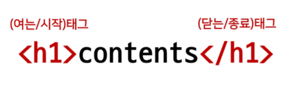
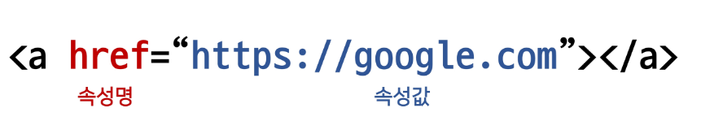
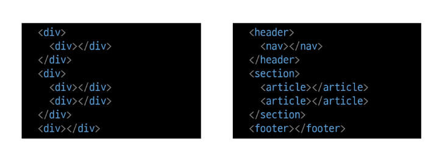
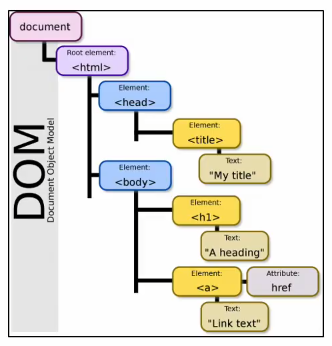
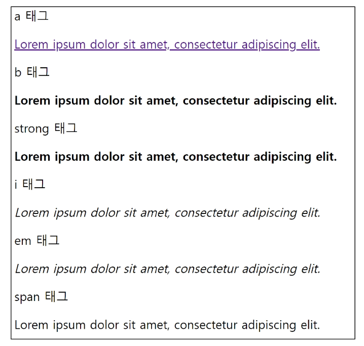
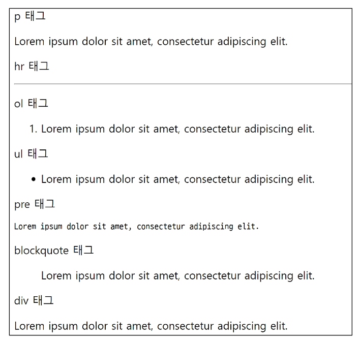
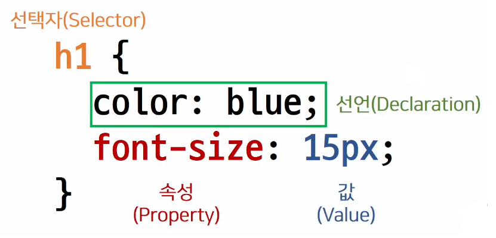

# 2022. 08. 01.

# Web 공부법

- Web은 파이썬보다는 경험으로 배워야하는 것들이 많음

- 많은 웹 사이트를 보면서 비교해보기

# Web

## Web(웹)이란?

- 웹 사이트란 브라우저를 통해서 접속하는 웹 페이지(문서)들의 모음

- 웹 페이지는 글, 그림, 동영상 등 여러 정보를 담고 있으며, 마우스로 클릭하면 다른 웹 페이지로 이동하는 '링크'들이 있음. '링크'를 통해 여러 웹 페이지를 연결한 것을 웹 사이트라고 함.

---

## 웹 사이트의 구성 요소

- HTML : 구조 (계산 같은거는 불가능, 엄밀히 따지면 프로그래밍 언어가 아니라는 설명도 있음.)

- CSS : 표현

- Javascript : 동작

---

## 웹 사이트와 브라우저

- 웹 사이트는 브라우저를 통해 동작함

- 브라우저마다 동작이 약간씩 달라서 문제가 생기는 경우가 많음(파편화)

- 해결책으로 웹 표준(USB)이 등장

- 브라우저 : HTML문서를 실행시키기 위한 도구

> 웹 표준

- 웹에서 표준적으로 사용되는 기술이나 규칙

- 어떤 브라우저든 웹 페이지가 동일하게 보이도록 함(크로스 브라우징)

- 현재 HTML5가 대세로 자리잡고 있는 상황

---

# HTML(Hyper Text Markup Language)

> Hyper Text란?

- 참조(하이퍼링크)를 통해 사용자가 한 문서에서 다른 문서로 즉시 접근할 수 있는 텍스트

> Markup Language

- 태그 등을 이용하여 문서나 데이터의 구조를 명시하는 언어
  
  - 대표적인 예 - HTML, Markdown
  
  ```html
  <!DOCTYPE html>
  <html lang='en'>
  <head>
    <meta charset="UTF-8">
    <title>Hello, HTML</title>
  </head>
  <body>
  </body>
  </html>
  ```

> HTML이란?

- 웹 페이지를 작성(구조화)하기 위한 언어

---

## HTML 기본구조

> HTML 기본구조

- html : 문서의 최상위(root)요소

- head : 문서 메타데이터 요소
  
  - 문서 제목, 인코딩, 스타일, 외부 파일 로딩 등
  
  - 일반적으로 브라우저에 나타나지 않는 내용
  
  - 메타데이터(ex. 사진을 찍은 장소, 시간, 해상도 등)

- body : 문서 본문 요소
  
  - 실제 화면 구성과 관련된 내용

> head 예시

- \<title> : 브라우저 상단 타이틀

- \<meta> : 문서 레벨 메타데이터 요소

- \<link> : 외부 리소스 연결 요소(CSS파일, favicon 등)

- \<script> : 스크립트 요소(JavaScript 파일/코드)

- \<style> : CSS 코드 작성

```html
<head>
  <title>HTML 수업</title>
  <meta charset="UTF-8">
  <link href="style.css", rel="stylesheet">
  <script scr="javascript.js"></script>
  <style>
    p {
      color: black;
    }
  </style>
</head>
```

> > head 예시 : Open Graph Protocol

- 메타 데이터를 표현하는 새로운 규약
  
  - HTML 문서의 메타 데이터를 통해 문서의 정보를 전달
  
  - 사이트에 직접 들어가지 않아도 사이트의 내용을 간략하게 나타내줌
  
  

> 요소(element)

- HTML 요소는 시작 태그와 종료 태그 그리고 태그 사이에 위치한 내용으로 구성
  
  
  
  - 요소는 태그로 컨텐츠(내용)를 감싸는 것으로 그 정보의 성격과 의미를 정의
  
  - 내용이 없는 태그들도 존재(닫는 태그가 없음)
    
    - br, hr, img, input, link, meta

- 요소는 중첩(nested)될 수 있음
  
  - 요쇼의 중첩을 통해 하나의 문서를 구조화
  
  - 여는 태그와 닫는 태그의 쌍을 잘 확인해야함
    
    - 오류를 반환하는 것이 아닌 그냥 레이아웃이 깨진 상태로 출력되기 때문에, 디버깅이 힘들어질 수 있음

> 속성(attribute)

- 태그별로 사용할 수 있는 속성은 다르다.
  
  

- 속성을 통해 태그의 부가적인 정보를 설정할 수 있음

- 태그와 상관없이 사용가능한 속성(HTML Global Attribute)들도 있음

> > 속성 지정 스타일 가이드

- 공백은 쓰면 안됨!

- "쌍따옴표" 사용 

> > HTML Global Attribute

- 모든 HTML 요소가 공통으로 사용할 수 있는 대표적인 속성
  
  - id : 문저 전체에서 유일한 고유 식별자 지정(CSS)
  
  - class : 공백으로 구분된 해당 요소의 클래스 목록(CSS, JS에서 요소를 선택하거나 접근)
  
  - data-* : 페이지에 개인 사용자 정의 데이터를 저장하기 위해 사용(좋아요 기능)
  
  - style : inline 스타일
  
  - title : 요소에 대한 추가 정보 지정
  
  - tabindex : 요소의 탭 순서('Tab'키를 눌렀을 때 바뀌는 순서)
  
  - 주석 달기
    
    ```html
    <!-- 이것은 주석입니다. -->
    ```

> 시맨틱 태그

- HTML 태그가 특정 목정, 역할 및 의미적 가치(semantic value)를 가지는 것
  
  - 예를 들어 h1태그는 "이 페이지에서 최상위 제목"인 텍스트를 감싸는 역할
  
  - HTML5에서는 기존에 단순히 콘텐츠의 구획을 나타내기 위해 사용한 div 태그를 대체하여 사용하기 위해 의미론적 요소를 담은 태그들이 추가됨
  
  
  
  - header : 문서 전체나 섹션의 헤더(머리말)
  
  - nav : 네비게이션
  
  - aside : 사이드에 위치한 공간, 메인 콘텐츠와 관련성이 적은 컨텐츠
  
  - section : 문서의 일반적인 구분, 컨텐츠의 그룹을 표현
  
  - article : 문서, 페이지, 사이트 안에서 독립적으로 구분되는 영역
  
  - footer : 문서 전체나 섹션의 푸터(마지막 부분)

> > 시맨틱 태그를 사용해야하는 이유

- 의미론적 마크업
  
  - 개발자 및 사용자 뿐만 아니라 검색엔진 등에 의미 있는 정보의 그룹을 태그로 표현
  
  - 단순히 구역을 나누는 것 뿐만 아니라 '의미'를 가지는 태그들을 활용하기 위한 노력
  
  - 가독성 증가, 유지보수 용이

> DOM(Document Object Model)트리

- 텍스트 파일인 HTML 문서를 브라우저에서 렌더링 하기 위한 구조
  
  - 렌더링(Rendering) : 웹 사이트 코드를 사용자가 보게 되는 웹 사이트로 바꾸는 과정
  
  

---

# HTML 문서 구조화

> 인라인 / 블록 요소

- `인라인 요소`는 `글자처럼 취급`

- `블록 요소`는 `한 줄` 모두 사용

> 텍스트 요소

|               태그                |                          설명                           |
| :-------------------------------: | :-----------------------------------------------------: |
|             \<a>\</a>             | herf속성을 활용하여 다른 URL로 연결하는 하이퍼링크 생성 |
| \<b>\</b><br/>\<strong>\</strong> |                     굵은 글씨 요소.                     |
|     \<i>\</i><br/>\<em>\</em>     |                    기울임 글씨 요소.                    |
|               \<br>               |                텍스트 내에 줄 바꿈 생성                 |
|              \               |             src 속성을 활용하여 이미지 표현             |
|          \<span>\</span>          |                의미없는 인라인 컨테이너                 |



> 그룹 컨텐츠

|            태그             |                                         설명                                          |
| :-------------------------: | :-----------------------------------------------------------------------------------: |
|          \<p>\</p>          |                                하나의 문단(paragraph)                                 |
|            \<hr>            | 문단 레벨 요소에서의 주제의 분리를 의미하며<br/> 수평선으로 표현됨(A Horizontal Rule) |
| \<ol>\</ol><br/>\<ul>\</ul> |            순서가 있는 리스트 (orderd)<br/>순서가 없는 리스트 (unordered)             |
|        \<pre>\</pre>        |   HTML에 작성한 내용을 그대로 표현.<br/>보통 고정폭 글꼴이 사용되고 공백문자를 유지   |
| \<blockquote>\</blockoute>  |                텍스트가 긴 인용문<br/>주로 들여쓰기를 한 것으로 표현됨                |
|        \<div>\</div>        |                              의미없는 블록 레벨 컨테이너                              |



> form

- \<form>은 `정보(데이터)를 서버에 제출`하기 위해 사용하는 태그(ex. 로그인)

- \<form> 기본 속성
  
  - action : form을 처리할 서버의 URL(데이터를 보낼 곳)
  
  - method : form을 제출할 때 사용할 HTTP 메서드(GET 혹은 POST)
  
  - enctype : method가 post인 경우 데이터의 유형

> input

- 다양한 타입을 가지는 입력 데이터 유형과 위젯이 제공됨

- \<input> 대표적인 속성
  
  - name : form control에 적용되는 이름(이름/값 페어로 전송됨)
  
  - value : form control에 적용되는 값
  
  - required, readonly, autofocus, autocompltet, disabled 등

> input, label

- `label을 클릭`하여 `input 자체의 초점을 맞추거나 활성화` 시킬 수 있음
  
  - 사용자는 선택할 수 있는 영역이 늘어나 웹/ 모바일(터치) 환경에서 편하게 사용 가능

- \<input>에 id 속성을, \<label>에는 for 속성을 활용하여 상호 연관을 시킴
  
  ```html
  <label for="agreement">개인정보 수집에 동의합니다.</label>
  <input type="checkbox" name="agreement" id="agreement">
  ```

> > input 유형 - 일반

```html
<input type="text, password, email, ..." name="..." ...>
```

- text : 일반 텍스트 입력

- password : 입력시 값이 보이지 않고 문자를 특수기호(*)로 표현

- email : 이메일 형식이 아닌 경우 form 제출 불가

- number : min, max, step 속성을 활용하여 숫자 범위 설정 가능

- file : accept 속성을 활용하여 파일 타입 지정 가능

> > input 유형 - 항목 중 선택

- 일반적으로 label 태그와 함께 사용하여 선택 항목을 작성함

- 동일 항목에 대해서는 name을 지정하고 선택된 항목에 대한 value를 지정해야 함
  
  - checkbox : 다중 선택
  
  - radio : 단일 선택

> > input 유형 - 기타

- 다양한 종류의 input을 위한 picker를 제공(color, date 등)

- hidden : 사용자 입력을 받지 않고 서버에 전송되어야 하는 값을 설정

---

# CSS(Cascading Style Sheets)

- 스타일을 지정하기 위한 언어

- HTML 태그를 선택하고, 스타일을 지정한다

> CSS 구문

- CSS 구문은 선택자를 통해 스타일을 지정할 HTML 요소를 선택

- 중괄호 안에서는 속성과 값, 하나의 쌍으로 이루어진 선언을 진행
  
  - 속성(Property) : 어떤 스타일 기능을 변경할지 결정
  
  - 값(Value) : 어떻게 스타일 기능을 변경할지 결정
  
  

> CSS 정의 방법

1. 인라인(inline)
- 인라인을 쓰게 되면 실수가 잦아짐(중복, 찾기 어려움)
  
  ```html
  <!DOCTYPE html>
  <html lang="en">
  <head>
    <meta charset="UTF-8">
    <meta name="viewport" content="width=device-width, initial-scale=1.0">
    <title>Document</title>
  </head>
  <body>
    <!-- 인라인 -->
    <h1 style="color: blue; font-size: 100px;">Hello</h1> 
    <!-- 인라인 끝 -->
  </body>
  </html>
  ```
2. 내부 참조(embedding) - \<sytle>
- 내부 참조를 쓰게 되면 코드가 너무 길어짐
  
  ```html
  <!DOCTYPE html>
  <html lang="en">
  <head>
    <meta charset="UTF-8">
    <meta name="viewport" content="width=device-width, initial-scale=1.0">
    <title>Document</title>
    <!-- 내부참조 -->
    <style>
      h1 {
        color: blue;
        font-size: 100px;
      }
    </style>
    <!-- 내부참조 끝 -->
  </head>
  <body>
  </body>
  </html>
  ```
3. `외부 참조(link file)` - 분리된 CSS 파일
- 외부 CSS파일을 \<head>내 \<link>를 통해 불러오기`(가장 많이 쓰는 방식)`

```html
<!-- html 파일 -->
<!DOCTYPE html>
<html lang="en">
<head>
  <title>Document</title>
  <!-- html파일에서 css파일을 불러오는 방법! -->
  <link rel="stylesheet" href="mystyle.css">
  <!-- html파일에서 css파일을 불러오는 방법! -->
</head>
<body>
  <h1>This is my site</h1>
</body>
</html>
```

```css
/* mystyle.css파일 */
h1 {
  color: pink;
  font-size: 16px;
}
```

---

## CSS Selectors

> CSS with 개발자 도구

- styles : 해당 요소에 선언된 모든 CSS

- computed : 해당 요소에 최종 계산된 CSS

> 선택자(Selector) 유형

- 기본 선택자
  
  - 전체 선택자, 요소 선택자
  
  - 클래스 선택자, 아이디 선택자, 속성 선택자

- 결합자(Combinators)
  
  - 자손 결합자, 자식 결합자
  
  - 일반 형제 결합자, 인접 형제 결합자

- 의사 클래스/요소(Pseudo Class)
  
  - 링크, 동적 의사 클래스
  
  - 구조적 의사 클래스, 기타 의사 클래스, 의사 엘리먼트, 속성 선택자

> CSS 선택자 정리

- 요소 선택자 : `HTML 태그를 직접 선택`

- 클래스 선택자 : `마침표(.)문자로 시작`하며, 해당 클래스가 적용된 항목을 선택

- 아이디(id)선택자 
  
  - `# 문자로 시작`하며, 해당 아이디가 적용된 항목을 선택
  
  - 일반적으로 하나의 문서에 1번만 사용
  
  - 여러 번 사용해도 동작하지만, 단일 id를 사용하는 것을 권장

> CSS 적용 우선순위(cascading order)

1. 중요도(Importance) - 사용시 주의
   
   - !important

2. 우선 순위(Sepcificity)
- 인라인 > id > class, 속성, pseudo-class > 요소 `범위가 좁을수록 강하다!!`
3. CSS 파일 로딩 순서

> CSS 상속

- CSS는 상속을 통해 부모 요소의 속성을 자식에게 상속한다.
  
  - 상속 되는 것 : Text관련 요소(font, color, text- align), opacity, visibiltiy 등
  
  - 상속이 되지 않는 것 : Box model 관련 요소(width, height, margin, padding, border, box-sizing, display), position 관련 요소(position, topa/right/bottom/left, z-index) 등

---

## CSS 기본 스타일

> 크기 단위

- px(픽셀)
  
  - 모니터 해상도의 한 화소인 '픽셀'기준
  
  - 픽셀의 크기는 변하지 않기 때문에 고정적인 단위

- %
  
  - 백분율 단위
  
  - 가변적인 레이아웃에서 자주 사용

- em
  
  - (바로 위, 부모 요소에 대한)상속의 영향을 받음
  
  - 배수 단위, 요소에 지정된 사이즈에 상대적인 사이즈를 가짐

- rem
  
  - (바로 위, 부모 요소에 대한)상속의 영향을 받지 않음
  
  - 최상위 요소(html)의 사이즈를 기준으로 배수 단위를 가짐

> > viewport

- 웹페이지를 방문한 유저에게 바로 보이게 되는 웹 컨텐츠의 영역(디바이스 화면)

- 디바이스의 viewport를 기준으로 상대적인 사이즈가 결정됨(브라우저 창의 크기를 줄이거나 늘이면 같이 움직임)

- vw(가로), vh(세로), vmin, vmax

> 색상 단위

- 색상 키워드(background-color: red;)
  
  - 대소문자를 구분하지 않음
  
  - red, blue, black과 같은 특정 색을 직접 글자로 나타냄
  
  ```html
  p { color: black; }
  ```

- RGB 색상(background-color: rgb(0, 255, 0);)
  
  - 16진수 표기법 혹은 함수형 표기법을 사용해서 특정 색을 표현
  
  ```html
  p { color: #000000; }
  p { color: rgb(0, 0, 0); }
  ```

- HSL 색상(background-color: hsl(0, 100%, 50%);)
  
  - 색상, 채도, 명도를 통해 특정 색을 표현하는 방식
  
  ```html
  p { color: hsl(120, 100%, 0); }
  ```

> 결합자(Combinators)

- 자손 결합자(공백)
  
  - selectorA 하위의 모든 selectorB 요소
  
  ```html
  <style>
    div span{
      color: red,
    }
  </style>
  <div>
    <span>이건 빨강입니다.</span>
    <p>이건 빨강이 아닙니다.</p>
    <p>
      <span>이건 빨강입니다.</span>
    </p>
  </div>
  ```

- 자식 결합자(>)
  
  - selectorA 바로 아래의 selectorB 요소
  
  ```html
  <style>
    div > span{
      color: red,
    }
  </style>
  <div>
    <span>이건 빨강입니다.</span>
    <p>이건 빨강이 아닙니다.</p>
    <p>
      <span>이건 빨강이 아닙니다.</span>
    </p>
  </div>
  ```

- 일반 형제 결합자
  
  - selectorA의 형제 요소 중 바로 뒤에 위치하는 selectorB 요소를 모두 선택

- 인접 형제 결합자
  
  - selectorA의 형제 요소 중 바로 뒤에 위치하는 selectorB 요소를 선택

---

## Box model

> CSS 원칙 1

- 모든 요소는 네모(박스모델)이고. 위에서부터 아래로, 왼쪽에서 오른쪽으로 쌓인다.

> Box model 구성

- content : 글이나 이미지 등 요소의 실제 내용

- padding : 테두리 안쪽의 내부 여백

- border : 테두리 영역

- margin : 테두리 바깥의 외부 여백. 배경색 지정 불가

> Box-sizing

- 기본적으로 모든 요소의 box-sizing은 content-box
  
  - Padding을 제외한 순수 contents 영역만을 box로 지정

- 다만, 우리가 일반적으로 영역을 볼 때에는 border까지의 너비를 100px로 보는 것을 원함 => box-sizing을 border-box로 설정!

---

## CSS Display

> CSS 원칙 2

- display에 따라 크기와 배치가 달라진다.

> 대표적으로 활용되는 display

- display: block(한줄을 차지하며 쌓인다)
  
  - 줄 바꿈이 일어나는 요소
  
  - 화면 크기 전체의 가로 폭을 차지한다.
  
  - 블록 레벨 요소 안에 인라인 레벨 요소가 들어갈 수 있음.

- display: inline(글자)
  
  - 줄 바꿈이 일어나지 않는 행의 일부 요소
  
  - content 너비만큼(내용물의 크기 만큼) 가로 폭을 차지한다.
  
  - width, height, margin-top, margin-bottom을 지정할 수 없다.
  
  - 상하 여백은 line-height로 지정한다.

> 블록 레벨 요소와 인라인 레벨 요소

---

## CSS Position

- 문서 상에서 요소의 위치를 지정

- relative : 상대 위치
  
  - 자기 자신의 static 위치를 기준으로 이동(normal flow 유지)
  
  - 레이아웃에서 요소가 차지하는 공간은 static일 때와 같음(normal position 대비 offset)

- absolute : 절대 위치
  
  - 요소를 일반적인 문서 흐름에서 제거 후 레이아웃에 공간을 차지하지 않음(normal flow에서 벗어남)
  
  - static이 아닌 가장 가까이 있는 부모/조상 요소를 기준으로 이동(없는 경우 브라우저 화면 기준으로 이동)

- fixed : 고정위치
  
  - 요소를 일반적인 문서흐름에서 제거 후 레이아웃에 공간을 차지하지 않음

- sticky: 기본적으로는 static이나 스크롤이 이동하면서 fixed로 변경되기도 함
