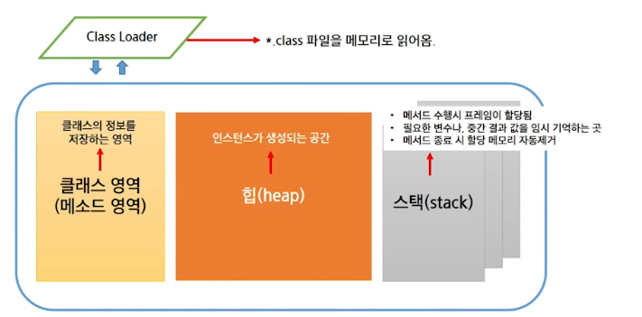
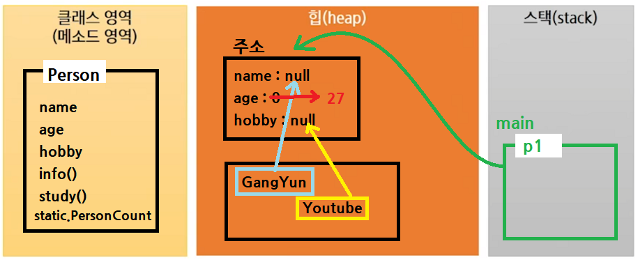

# JVM 메모리 구조

> JVM 메모리 구조

- Java 언어는 메모리 관리를 개발자가 하지 않음.

> GC(Garbage Collection)

- Heap 영역(class 영역 포함)에 생성된 메로리 관리 담당

- 더이상 사용되지 않는 객체들을 점검하여 제거

- 자동적 실행(CPU가 한가하거나, 메모리가 부족할 때 등)

- JVM에 의해서 실행

- System.gc를 통해 호출이 가능`(시스템에 영향을 주기 때문에 하지 않는 것을 추천)`

> 구조 도식화

- Class Loader : 클래스를 맨 처음 사용하려고 했을 때, .class파일을 메모리에 올려놓는다.

- 클래스 영역(메소드 영역) : 클래스의 정보, 메서드, 스태틱 등이 저장

- 힙(heap) : `new 키워드`로 생성할 때

- 스택(stack) : 필요한 변수나, 중간 결과 값을 임시로 기억. 메서드 종료시 할당된 메모리가 자동으로 제거
  
  

- 객체 생성과 메모리 할당
  
  ```java
  Person p1 = new Person();
  p1.name = "GangYun";
  p1.age = 27;
  p1.hobby = "Youtube";
  ```
  
  

> static 특정

- 로딩 시점
  -  static : 클래스 로딩 시
  -  non-static : 객체 생성 시

- 메모리상의 차이
  - static : 클래스당 하느의 메모리 공간만 할당
  - non-static : 인스턴스당 메모리가 별도로 할당

> static의 문법적 특징

- static : 클래스 이름으로 접근

- non-static : 객체 생성 후 접근

  ```java
  public class Person {
      static int pCount;
      String name;
      int age;
      String hobby;
  }
  ```
  ```java
  public class PersonTest {
      public static void main(String[] args) {
            Person p = new Person();
            p.name = "Kim";
            
            Person.pCount++;  // 클래스 이름으로 접근
            
            p.pCount++; // 오류는 나지 않지만 경고가 뜸
       }
    }
  ```

- static 영역에서는 non-static 영역에 직접 접근할 수 없다.

  ```java
  public class Main {

      String str = "문장";  
      // 인스턴스 변수
      // 아직 메모리에 할당된 것이 아님!(main에 선언이 되지 않았음)

      // 이미 static으로 선언되어 메모리에 올라가있음
      public static void main(String[] args) {
          System.out.println(str);  // 이렇게 사용 불가능
      }
  }
  ```

- non-static 영역에서는 static 영역에 대한 접근이 가능

  ```java
  public class Main {

      static String str = "문장";
      // static으로 선언되어 메모리에 올라가 있음

      public void print() {
          System.out.println(str);  // 사용 가능
      }
  }
  ```