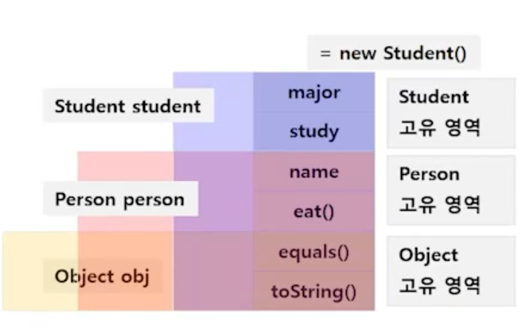

# 다형성

## 다형성

- 많은 형상을 가질 수 있는 성질

- 상속 관계에 있을 때 조상 클래스의 타입으로 자식 클래스 객체를 참조할 수 있다.
  
  ```java
  public static void maine(String[] args) {
    Student st = new Student("박싸피", 20, "수학");
    Person p = new Student("박싸피", 20, "수학");
    Object obj = new Student("박싸피", 20, "수학");
  
    Student st2 = new Person();   // Type mismatch 에러
  }
  ```

> 다형성의 활용1 - 다른 타입의 객체를 다루는 배열

- 사람의 목록과 학생의 목록을 따로 만들어야 하나? => Person[] 배열에 학생을 저장하면 되는구나!
  
  ```java
  Person[] persons = new Person[3];
  
  persons[0] = new Person();
  persons[1] = new Student();
  persons[2] = new Student();
  ```

> 다형성의 활용2 - 매개변수의 다형성

- 무엇인가 출력해보자

- 메서드가 호출되기 위해서는 메서드 이름과 파라미터가 맞아야 한다.

- println의 코드
  
  ```java
  public void println(Object x) {
    String s = String.valueOf(x);
    synchronized (this) {
      print(s);
      newLine();
    }
  }
  ```

- `조상을 파라미터로 처리`한다면 객체의 타입에 따라 메서드를 만들 필요가 없어진다.

> 다형성과 참조형 객체의 형 변환

- 메모리에 있는 것과 사용할 수 있는 것의 차이
  
  - 메모리에 있더라도, 참조하는 변수의 타입에 따라 접근할 수 있는 내용이 제한된다.
  
  

- 작은 집(child)에서 큰 집(super)으로 형변환 -> 묵시적 캐스팅
  
  ```java
  byte b = 10;
  int i = b;
  
  Person person = new Person();
  Object obj = person;
  ```

- 큰 집(super)에서 작은 집(child)으로 형변환 -> 명시적 캐스팅
  
  ```java
  int i = 10;
  byte b = (byte)i;
  
  Person person = new Student();
  Student student = (Student)person;
  ```

- 무늬만 Student인 Person : 메모리 상에는 study()가 올라가 있지 않다.
  
  ```java
  Person person = new Student();
  Student student = (Student)person;
  student.study();
  ```
  
  

- 따라서 조상을 무작정 자손으로 바꿀 수는 없다. => instanceof 연산자를 사용하여 실제 메모리에 있는 객체가 특정 클래스의 타입인지 boolean으로 반환하여 비교

  ```java
  Person person = new Person();

  if (person instanceof Student) {
    Student student = (Student)person;
    student.study();
  }
  ```

> 참조 변수의 레벨에 따른 객체의 멤버 연결

- 상속 관계에서 객체의 멤버 변수가 중복 될 떄
  - 참조 변수의 타입에 따라 연결이 달라짐

- **상속 관계에서 객체의 `메서드가 중복`(Overridig)될 때에는?**
  - 무조건 `자식 클래스의 메서드가 호출` 됨 -> virtual method invocation
  - 최대한 메모리에 생성된 실제 객체에 최적화 된 메서드가 동작(동적 바인딩)

  ```java
  package com.ssafy.ploymorphism;

  class UserInfo {
    String name = "홍길동";

    @Override
    public String toString() {
      return "이름: " + this.name;
    }
  }

  class MemberInfo extends UserInfo {
    String grade = "정회원";

    @Override
    public String toString() {
      return super.toString() + ", 등급: " + grade;
    }
  }

  public class PringObject {
    public static void main(String[] args) {
      Object member = new MemberInfo();
      System.out.print("객체 정보: " + member);
    }
  }
  // 객체정보: 이름: 홍길동, 등급: 정회원  으로 출력됨
  ```