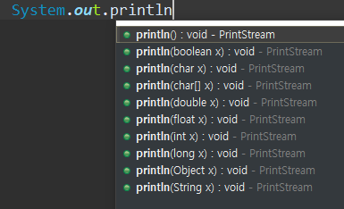

# 객체지향 in Java

# 객체지향 프로그래밍(Object Oriented Programming)

> OOP

- 객체 모델링 : 현실세계의 객체를 SW객체로 설계하는 것
  
  - 속성과 행동(기능)으로 이루어짐

- 객체 지향 프로그래밍의 특징
  
  - Abstraction (추상화)
  
  - Polymorphism (다형성)
  
  - Inheritance (상속)
  
  - Encapsulaiton (캡슐화)

---

# 클래스

> 클래스

- 사람의 정보를 관리해보자
  
  ```Java
  public class Person {
      String name;
      int age;
      String hobby;
  
      public void info() {
          System.out.println("나의 이름은 " + name + "입니다.");
          System.out.println("나이는 " + age + "세, 취미는 " + hobby + "입니다.");
        }
  }
  ```

- 관련 있는 변수와 함수를 묶어서 만든 `사용자 정의 자료형`

- 모든 객체들의 생산처

- 클래스 == 객체를 생성하는 틀 (설계도)

- 클래스를 통해 `생성된 객체`를 `인스턴스`라고 한다.

- 객체들 사이에서 메시지(상호작용)를 주고 받도록 만들어 준다.

> 클래스 구성

- 속성 (Attribute) : 필드 (멤버 변수)

- 동작 (Behavior) : 메소드 (함수)

- 생성자(Constructor) : 인스턴스를 생성할 때 호출되는 메소드

> 클래스 선언

- 클래스 선언하기
  
  ```java
  [접근제한자] [활용제한자] class 클래스명 {
  
      속성 정의 (필드)
      기능 정의 (메소드)
      생성자
  
  }
  ```

---

# 변수

- 클래스를 선언하게 되면 클래스 내부의 변수들과 메서드들이 클래스 메모리(메소드 메모리)에 올라감

> 클래스 변수

- 클래스 메모리 영역에 선언 (`static 키워드`가 붙음!), 자료형의 기본값으로 초기화 됨

- 생성 시기 : 클래스가 `메모리에 올라 갔을 때`

- 소멸 시기 : 프로그램 종료 시

- 모든 인스턴스가 공유함

> 인스턴스 변수

- 클래스 메모리 영역에 선언 (`new 키워드`로)

- 생성 시기 : 인스턴스가 생성되었을 때 => 초기화가 기본값으로 자동 설정됨

- 소멸 시기 : 인스턴스를 더이상 참조하는 곳이 없을 떄 G.C에 의해서

- 인스턴스 별로 생성됨.

> 지역 변수(local variable)

- 클래스 영역 이외 (메서드, 생성자, 블록 영역... 등) 

- 사용하기전 초기화가 꼭 필요

- 외부 접근이 불가

- 생성 시기 : 선언되었을 때

- 소멸 시기 : 중괄호를 벗어나면 소멸

> 변수들 확인하기

```java
public class Person {
    static int personCount; // 클래스 변수
    String name;    // 인스턴스 변수
    int age;        // 인스턴스 변수
    String hobby;   // 인스턴스 변수

    public void info() {
       System.out.println("나의 이름은 " + name + "입니다.");
        System.out.println("나이는 " + age + "세, 취미는 " + hobby + "입니다.");
      }
}


public class PersonTest {
    public static void main(String[] args) {
        Person p1 = new Person(); // 인스턴스 생성

        p1.name = "Yang"; // 인스턴스 변수에 접근
        p1.age = 45;      // 인스턴스 변수에 접근
        p1.hobby = "Youtube"; // 인스턴스 변수에 접근

        Person p2 = new Person();

        p2.name = "Hong";
        p2.age = 25;
        p2.hobby = "Golf";

        System.out.println(Person.personCount);    // 클래스 변수
        System.out.println(p1.personCount++);    // 클래스 변수 : 인스턴스에서도 접근 가능

        System.out.println(p2.personCount);
        System.out.println(Person.personCount);    // 모든 변수와 공유하므로 증가되어있음
  }

  void test() {
    // 블록을 벗어나는 순간  p1, p2변수를 사용할 수 없음!
  }
}
```

---

# 메소드

> 메소드(Method)

- 객체가 할 수 있는 행동을 정의

- 메소드의 이름은 소문자로 시작하는 것이 관례

- 형식 
  
  - 매개변수들 = 파라미터 : 없어도 됨
  - 반환값 = 리턴타입 : `리턴타입이 없으면 void 사용!`
  
  ```Java
  [접근제한자]  [활용제한자]  반환값  메소드이름([매개변수들]){
      행위 기술 ...
  }
  
  //ex
  public static void main(String[] args)
  ```

> 메소드 선언

- 선언 시 {}안에 메소드가 해야 할 일을 정의
  
  ```java
  public class Person{
  
      public void info() {
          // 메소드 내용 정의
      }
  
      public static void hello() {
          // 메소드 내용 정의
      }
  }
  ```

> 메소드 호출

- 호출한 메소드가 선언되어 있는 클래스를 접근한다.

- `클래스 객체.메소드 이름` 으로 호출 
  
  ```java
  Person p = new Person();
  p.info();   // 메소드 호출
  ```

- static이 메소드에 선언되어 있을 때는 `클래스 이름.메소드 이름`으로 호출
  
  ```java
  Person.hello();
  ```

> 매개변수(Parameter)와 인자(Argument)

- 매개변수 : 메소드에서 사용하는 것

- 인자 : 호출하는 쪽에서 전달하는 것

- `매개변수 생략 가능`

- 파라미터 전달 시 묵시적 형 변환

> 메소드 오버로딩 (Overloading)

- 이름이 같고 매개변수가 다른 메소드를 여러 개 정의하는 것

- 중복 코드에 대한 효율적 관리 가능

- 파라미터의 개수 또는 순서, 타입이 달라야 할 것(파라미터 이름만 다른 것은 X)
  
  
