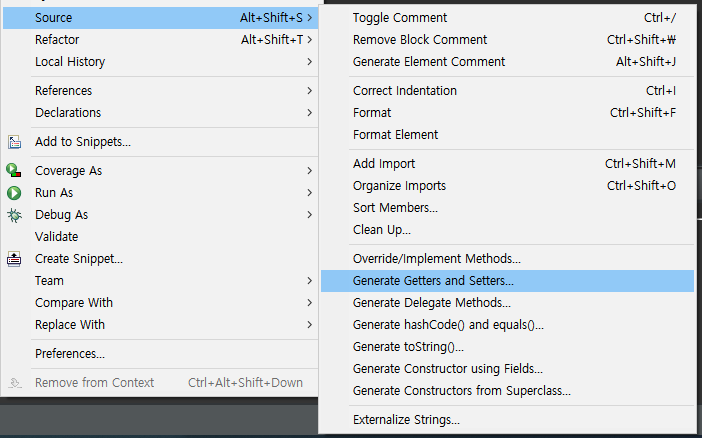

# 객체지향 in Java

# 객체지향 프로그래밍(Object Oriented Programming)

> OOP

- 객체 모델링 : 현실세계의 객체를 SW객체로 설계하는 것
  
  - 속성과 행동(기능)으로 이루어짐

- 객체 지향 프로그래밍의 특징
  
  - Abstraction (추상화)
  
  - Polymorphism (다형성)
  
  - Inheritance (상속)
  
  - Encapsulaiton (캡슐화)

---

# 클래스

> 클래스

- 사람의 정보를 관리해보자
  
  ```Java
  public class Person {
      String name;
      int age;
      String hobby;
  
      public void info() {
          System.out.println("나의 이름은 " + name + "입니다.");
          System.out.println("나이는 " + age + "세, 취미는 " + hobby + "입니다.");
        }
  }
  ```

- 관련 있는 변수와 함수를 묶어서 만든 `사용자 정의 자료형`

- 모든 객체들의 생산처

- 클래스 == 객체를 생성하는 틀 (설계도)

- 클래스를 통해 `생성된 객체`를 `인스턴스`라고 한다.

- 객체들 사이에서 메시지(상호작용)를 주고 받도록 만들어 준다.

> 클래스 구성

- 속성 (Attribute) : 필드 (멤버 변수)

- 동작 (Behavior) : 메소드 (함수)

- 생성자(Constructor) : 인스턴스를 생성할 때 호출되는 메소드

> 클래스 선언

- 클래스 선언하기
  
  ```java
  [접근제한자] [활용제한자] class 클래스명 {
  
      속성 정의 (필드)
      기능 정의 (메소드)
      생성자
  
  }
  ```

---

# 변수

- 클래스를 선언하게 되면 클래스 내부의 변수들과 메서드들이 클래스 메모리(메소드 메모리)에 올라감

> 클래스 변수

- 클래스 메모리 영역에 선언 (`static 키워드`가 붙음!), 자료형의 기본값으로 초기화 됨

- 생성 시기 : 클래스가 `메모리에 올라 갔을 때`

- 소멸 시기 : 프로그램 종료 시

- 모든 인스턴스가 공유함

> 인스턴스 변수

- 클래스 메모리 영역에 선언 (`new 키워드`로)

- 생성 시기 : 인스턴스가 생성되었을 때 => 초기화가 기본값으로 자동 설정됨

- 소멸 시기 : 인스턴스를 더이상 참조하는 곳이 없을 떄 G.C에 의해서

- 인스턴스 별로 생성됨.

> 지역 변수(local variable)

- 클래스 영역 이외 (메서드, 생성자, 블록 영역... 등) 

- 사용하기전 초기화가 꼭 필요

- 외부 접근이 불가

- 생성 시기 : 선언되었을 때

- 소멸 시기 : 중괄호를 벗어나면 소멸

> 변수들 확인하기

```java
public class Person {
    static int personCount; // 클래스 변수
    String name;    // 인스턴스 변수
    int age;        // 인스턴스 변수
    String hobby;   // 인스턴스 변수

    public void info() {
       System.out.println("나의 이름은 " + name + "입니다.");
        System.out.println("나이는 " + age + "세, 취미는 " + hobby + "입니다.");
      }
}


public class PersonTest {
    public static void main(String[] args) {
        Person p1 = new Person(); // 인스턴스 생성

        p1.name = "Yang"; // 인스턴스 변수에 접근
        p1.age = 45;      // 인스턴스 변수에 접근
        p1.hobby = "Youtube"; // 인스턴스 변수에 접근

        Person p2 = new Person();

        p2.name = "Hong";
        p2.age = 25;
        p2.hobby = "Golf";

        System.out.println(Person.personCount);    // 클래스 변수
        System.out.println(p1.personCount++);    // 클래스 변수 : 인스턴스에서도 접근 가능

        System.out.println(p2.personCount);
        System.out.println(Person.personCount);    // 모든 변수와 공유하므로 증가되어있음
  }

  void test() {
    // 블록을 벗어나는 순간  p1, p2변수를 사용할 수 없음!
  }
}
```

---

# 메소드

> 메소드(Method)

- 객체가 할 수 있는 행동을 정의

- 메소드의 이름은 소문자로 시작하는 것이 관례

- 형식 
  
  - 매개변수들 = 파라미터 : 없어도 됨
  - 반환값 = 리턴타입 : `리턴타입이 없으면 void 사용!`
  
  ```Java
  [접근제한자]  [활용제한자]  반환값  메소드이름([매개변수들]){
      행위 기술 ...
  }
  
  //ex
  public static void main(String[] args)
  ```

> 메소드 선언

- 선언 시 {}안에 메소드가 해야 할 일을 정의
  
  ```java
  public class Person{
  
      public void info() {
          // 메소드 내용 정의
      }
  
      public static void hello() {
          // 메소드 내용 정의
      }
  }
  ```

> 메소드 호출

- 호출한 메소드가 선언되어 있는 클래스를 접근한다.

- `클래스 객체.메소드 이름` 으로 호출 
  
  ```java
  Person p = new Person();
  p.info();   // 메소드 호출
  ```

- static이 메소드에 선언되어 있을 때는 `클래스 이름.메소드 이름`으로 호출
  
  ```java
  Person.hello();
  ```

> 매개변수(Parameter)와 인자(Argument)

- 매개변수 : 메소드에서 사용하는 것

- 인자 : 호출하는 쪽에서 전달하는 것

- `매개변수 생략 가능`

- 파라미터 전달 시 묵시적 형 변환

> 메소드 오버로딩 (Overloading)

- 이름이 같고 매개변수가 다른 메소드를 여러 개 정의하는 것

- 중복 코드에 대한 효율적 관리 가능

- 파라미터의 개수 또는 순서, 타입이 달라야 할 것(파라미터 이름만 다른 것은 X)
  
  

---

# 생성자

> 생성자

- 인스턴스가 생성될 때 최초로 한번 수행되는 함수
  
  - new 키워드와 함께 호출
  - 클래스를 생성할 때 반드시 하나의 생성자가 호출됨
  - 성공적으로 실행되면 힙 영역에 객체 생성 후 객체의 번지가 리턴
  - 필드의 초기화, 객체 생성 시 실행되어야 할 작업 작성
  - PascalCase로 작성하는 것이 관례

> 생성자의 특징

- 클래스 명과 이름이 동일(대, 소문자 사용 가능)

- 반환 타입이 없다.(void 조차 작성하지 않음)
  
  ```java
  public class Dog {
      public Dog() {
          System.out.println("기본 생성자!");
          System.out.println("클래스 이름과 동일하고 반환타입X");
      }
  }
  // 객체가 생성될 때 자동으로 출력됨
  ```

> > 기본(default) 생성자

- 클래스 내에 생성자가 하나도 정의되어 있지 않을 경우, JVM이 자동으로 제공하는 생성자

- 매개변수가 없는 형태 : `클래스명() {}`

> > 파라미터가 있는 생성자

- 생성자의 목적이 필드 초기화

- 생성자 호출 시 인자를 꼭 넘겨주어야 함

- 해당 생성자를 작성하면 JVM에서 기본 생성자를 추가하지 않음
  
  ```java
  class Dog {
      String name;
      int age;
      Dog(String n, int a) {
          name = n;
          age = a;
      }
  }
  ```

> 생성자 오버로딩

- 클래스 내에 메소드 이름이 같고 매개변수의 타입 또는 개수가 다른 것
  
  ```java
  class Dog{
      Dog( ) { }
      Dog(String name) { }
      Dog(int age) { }
      Dog(String name, int age) { }
  }
  ```

> this(파이썬의 인스턴스 변수self와 비슷?)

- 참조 변수로써 객체 자신을 가리킴

- this를 이용하여 자신의 멤버 접근 가능

- 지역변수와 필드의 이름이 동일할 경우, 필드임을 식별해줌

- 객체에 대한 참조이므로, static 영역에서 this 사용 불가

> this의 활용

- this.멤버변수
  
  ```java
  class Dog{
      String name;  // this.name이 가리키는 곳
      int age;      // this.age가 가리키는 곳
      Dog(String n, int a) {
          this.name = name   
          this.age = age
      }
  }
  ```

- this([인자값..]) : 생성자 호출
  
  ```java
  class Dog{
      String name;  // this.name이 가리키는 곳
      int age;      // this.age가 가리키는 곳
      Dog( ) {
        // Dog("쫑"); => 오류발생!
          this("쫑");
      }     //   ↓
      Dog (String name) {
  
      }
  }
  ```

- this 생성자 호출 시 제한사항
  
  - 생성자 내에서만 호출이 가능
  - 생성자 내에서 첫번째 구문에 위치해야 함

---

# 패키지

> 패키지

- PC의 많은 파일을 관리하기 위해서 폴더를 이용한다.

- 프로그램의 많은 클래스를 관리하기 위해서 패키지를 이용한다.

- 클래스와 관련 있는 인터페이스들을 모아두기 위한 이름 공간

- 패키지의 구분은 .(dot) 연산자를 이용한다.

- 패키지의 이름은 `시중에 나와 있는 패키지들과 구분`되게 지어야 한다.

- 일반적으로 `소속이나 회사`의 `도메인`을 사용한다.
  
  - com.ssafy.project_이름.module_이름

---

# 임포트(import)

> 임포트

- 다른 패키지에 있는 클래스를 사용하기 위해서는 import 과정이 필요하다.

- import를 선언할 때는 import 키워드 뒤에 package 이름과 클래스 이름을 모두 입력하거나 해당 패키지의 모든 클래스를 포함할 떄는 '*'를 사용하기도 한다.
  
  ```java
  import java.util.Arrays;
  
  import java.util.Scanner;
  
  import java.util.function.*;
  
  public class PackageTest{
      public static void main(string[] args) {
          Scanner sc;
          Arrays arr;
          Function f;
      }
  }
  ```

- 패키지명이 겹칠 때 쓸 수 있는 방법도 있다.
  
  ```java
  import com.ssafy.class03.Person;
  
  public class PackageTest {
      public static void main(string[] args) {
          Person p1;   // class03에 있는 Person 클래스를 가지고 온다.
  
          com.ssafy.class02.Person p2;  //import를 하지 않고 풀패키지명을 작성할 수 도 있다.
      }
  }
  ```

- `ctrl + shift + o` 를 누르면 자동 임포트를 해준다.

- System.out.과 같은 키워드들을 쓸 수 있는 이유는 `java.lang.*;`이 자동으로 임포트 되기 때문이다.

--- 

# 캡슐화(Encapsulation)

> 캡슐화

- 객체의 속성(Data fields)과 행위(메서드)를 하나로 묶고, 실제 구현 내용 일부를 외부에 감추어 은닉한다.

---

# 접근 제한자

> 접근 제한자(access modifier)

- 클래스, 멤버 변수, 멤버 메서드 등의 선언부에서 접근 허용 범위를 지정하는 역할의 키워드이다.

- 접근 제한자의 종류
  
  - public : 모든 위치에서 접근 가능
  - protected : 같은 패키지에서 접근이 가능, 다른 패키지에서는 접근 불가능. 단, 다른 패키지의 클래스와 상속관계가 있을 경우 접근 가능
  - (default) : 같은 패키지에서만 접근이 허용. 접근 제한자가 선언이 안되었을 경우 기본 적용
  - private : 자신 클래스에서만 접근 호용

- 그 외의 제한자
  
  - static : 클래스 레벨의 요소 설정
  - final : 요소를 더 이상 수정할 수 없게 함
  - abstract : 추상 메서드 및 추상 클래스 작성

> 접근자(getter) / 설정자(setter)

- 클래스에서 선언된 변수 중 접근제한에 의해 접근할 수 없는 변수의 경우 다른 클래스에서 접근할 수 없기 때문에, 접근하기 위한 `메서드(설정자와 접근자)를 public으로 선언`하여 사용

- 이클립스에서 생성된 객체의 getter와 setter를 편리하게 만들어주는 기능도 있다. 
  
  

- 예시 코드
  
  ```java
  // 패키지 내의 Car 클래스
  package com.ssafy.modifier01;
  
  public class Car {
    String color;
  
    // 아래의 speed를 private으로 선언하여 외부에서 접근할 수 없게 함
    private int speed;    // 속도를 0~250으로 제한하고 싶은데?
  
    // setter
    public void setSpeed(int speed) {
  
      // int speed = ?  
      // => 이렇게 선언하면 겍체가 가진 speed 멤버 변수인지, 매개변수르 받은 speed인지 구분을 할 수 없다.
  
      if(speed <= 250 && speed >= 0)
        this.speed = speed;
      else
        System.out.println("속도의 범위를 벗어났습니다.");
    }
  
    // getter
    public int getSpeed() {
      return this.speed;
    }
  }
  ```
  
  ```java
  // 동일 패키지 CarTest클래스의 메인 함수에서 Car클래스에 접근
  package com.ssafy.modifier01;
  
  public class CarTest {
    public static void main(String[] args) {
      Car c = new Car();    // 객체 생성
  
      c.color = "Red";
      // c.speed = 100;  => Duplicated local variable
      // System.out.println(c.speed);  => 접근이 불가능
  
      c.setSpeed(250);
      System.out.println(c.getSpeed());
    }
  }
  ```