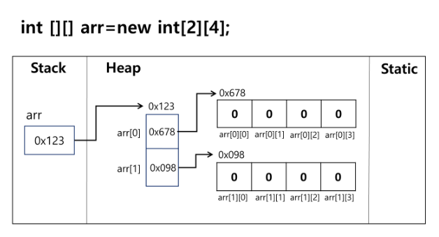

# 2022. 08. 03. Java start

# 자바 가사상 머신(JVM)이란?

- 자바 바이트코드를 실행할 수 있는 주체

- 자바 바이트코드는 `플랫폼에 독립적`이며, 모든 JVM은 자바 가상 머신 규격에 정의된대로 자바 바이트코드를 실행

- JAVA원시 프로그램(.java파일) => 컴파일(사람이 작성한 코드를 컴퓨터가 이해할 수 있게 바꿔주는 행위) => 자바 바이트코드(.class파일) => 각종 플랫폼(MAC, Linux, Windows...)

- Java Runtime Environment(JRE) : JVM이 자바 프로그램을 실행시킬 때 필요한 것들을 가지고 있음

- Java Developement Kit(JDK) : JRE + 개발에 필요한 것

> main method

- 실행 명령인 `java`를 실행 시 가장 먼저 호출되는 부분

- 만약, Application에서 main() 메소드가 없다면 절대로 실행 될 수 없음

- Application의 시작 -> 클래스의 main() 실행

- 형태 (고정된 형태)
  
  ```java
  public static void main(String[] args){}
  ```

> 주석

- 주석 사용 방식
  
  ```java
  // 가장 많이 사용하는 주석 방식
  
  /* 여러줄 주석
  여러줄 주석*/
  
  /**
  * Documentation API를 위한 주석
  */
  ```

> 출력문

- print, println

- printf
  
  - %d : 정수, %f : 실수, %c : 문자, %s : 문자열
  
  ```java
  public static void main(String[] args){
      System.out.printf("%d \n", 10)  //정수 (10진수) => 10
      System.out.printf("%o \n", 10)  //정수 (8진수) => 12
      System.out.printf("%X \n", 10)  //정수 (16진수) => A
      System.out.printf("%x \n", 10)  //정수 (16진수) => a
  
      System.out.printf("%4d \n", 10)  //4칸 확보 후 오른쪽부터 차지 =>   10
      System.out.printf("%-4d \n", 10) //4칸 확보 후 왼쪽부터 차지   => 10
      System.out.printf("%04d \n", 10) //빈칸을 0으로 채움 => 0010
  
      System.out.printf("%.2f \n", 10.1) //소수점 둘째 자리까지 =. 10.10
  
      System.out.printf("%s \n", "이강윤") //문자열 => 이강윤
      System.out.printf("%c \n", 'ㅇ')     //문자 => ㅇ
  }
  ```

---

# 자료형 (Data Type)

> 논리형

- boolean : true/false

> 문자형 

- char (2byte)

> 숫자형

- 정수형
  
  - byte
  
  - short (2byte)
  
  - int (4byte)
  
  - long (8byte)

- 실수형
  
  - float (4byte)
  
  - double  (8byte)

---

# 연산자

> 삼항 연산자

- (조건식) ? (식1) : (식2)

- 조건식이 참일 경우 식1, 거짓일 경우 식2 수행

---

# 조건문

> if문

- if문 문법

- 수행할 문장이 한문장이라면 중괄호{} 생략 가능
  
  ```java
  if(n < 10) {
    System.out.println("해당 문장을 수행")
  }
  ```

> if - else문

- 문법
  
  ```java
  if(조건식){
    실행할 문장1;
    실행할 문장2;
  } else {
    실행할 문장a;
  }
  ```

> if - else if - else 문

- 문법

- 파이썬에서는 elif, 자바에서는 `else if`
  
  ```java
  if(조건식){
    실행할 문장1;
    실행할 문장2;
  } else if (조건식){
    실행할 문장a;
  } else if (조건식){
    실행할 문장b;
  }...{
    ...
  } else {
    실행할 문장A;
  }
  ```

> switch 문

- 인자로 선택변수를 받아 변수의 값에 따라서 실행문이 결정

- 문법
  
  ```java
  switch(수식) {
    case 값1:
      실행문A;
        break;
    case 값2:
      실행문B;
      break;
    default:
      실행문C;
  }
  ```

- 특정 달이 몇 일인지 확인하는 예제
  
  ```java
  class Solution
  {
    public static void main(String args[])
    {
  
      int month = 12;
      switch(month) {
  
      case 1:
      case 3:
      case 5:
      case 7:
      case 8:
      case 10:
      case 12:
        System.out.println("31일");
        break;
      case 2:
        System.out.println("28일");
        break;
      case 4:
      case 6:
      case 9:
      case 11:
        System.out.println("30일");
        break;
      default:
        System.out.println("그러한 달은 없다.");
        break;
      }
    }
  }
  ```

---

# 반복문

> for 문

- 문법
  
  ```java
  for(int i = 0; i < 10; i++) {
    반복 수행할 문장
  }
  ```

- `초기화`는 반복문이 시작될 때 `한 번` 실행됨(다른 메모리 공간에 저장되므로 for문 초기화식의 변수를 다른 코드에서 써도 문제가 생기지 않음. 하지만 for문 위에는 초기화 식과 똑같은 변수를 선언하는 것은 문제가 됨.)

- `조건식이 false`이면 반복문 `종료`

- `증감식`은 한 루프가 끝나면 실행됨

- 초기화식, 증감식은 `(,)`를 이용하여 둘 이상을 작성할 수 있음. ex)int i = 0, j = 0 / i++, j++

- 필요하지 않은 부분은 생략할 수 있음. ex) for( ; ; ) => 무한루프

- 조건 2개 이상 예시
  
  ```java
  class Solution
  {
    public static void main(String args[])
    {
      for(int i=0 , j = 10; i < 10 && j > 0; i++, j--) {
        System.out.printf("%d,", i);
        System.out.printf("%d\n", j);
      }
    }
  } // 0,10      1,9      2,8      3,7      4,6      5,5      6,4      7,3      8,2      9,1   
  ```

> While문

- 문법
  
  ```
  while(조건식){
    반복 수행할 문장
  }
  ```

- 조건식이 True일 경우에 계속해서 반복

- 조건식 생략 불가능

> do while 문

- 문법
  
  ```java
  do {
    반복 수행할 문장;
  } while(조건식);  // 조건식 괄호 뒤에 ';'꼭 붙여야함!!!
  ```

- 블록 내용을 먼저 수행 후 조건식 판단. (최소 한번은 수행)

- 조건식 생략 불가능.

> break

- switch, while, do-while, for문의 블록에서 빠져나오기 우해서 사용

- 반복문에 이름(라벨)을 붙여 한번에 빠져 나올 수 있음.

> continue

- 반복문의 특정지점에서 제어를 반복문의 처음으로 보냄

- 반복문에 이름(라벨)을 붙여 제어할 수 있음.

---

# 배열

> 배열

- `같은 종류의 데이터`를 저장하기 위한 자료구조
  
  - 파이썬의 'list'는 배열 안에 다른 종류의 데이터도 넣을 수 있음. 구분할 것!

- 크기가 고정되어 있음. (한번 생성된 배열은 크기를 바꿀 수 없음)

- 배열은 객체로 취급

- 배열의 요소를 참조하려면 배열이름과 색인(index)이라고 하는 int 유형의 정수 값을 조합하여 사용

> 번외 - 참조

- JVM에는 stack과 heap이라는 영역이 존재
  
  - stack영역 : 선언된 지역 변수, main메서드 등이 존재
  
  - heap : 참조형, 객체

- ex) 싸피의 캠퍼스를 배열로 선언하기
  
  - stack 영역에 '캠퍼스'라는 변수가 선언
  
  - heap영역에 서울, 대전, 구미, 부울경, 광주에 대한 정보가 저장
  
  - stack의 '캠퍼스' 변수는 heap영역에 저장된 정보의 주소값이 저장(참조)

- .equals()메서드 와 '=='
  
  - 값이 같더라도 메모리 주소가 다른 경우, ==으로 비교 했을 때 fasle가 나올 수 있다. 따라서 내용을 비교하려면 .equals()메서드를 쓰자.
  
  ```java
  class Solution
  {
    public static void main(String args[])
    {
      String c = "Hi";
      String d = "Hi";
      String e = new String("Hi");
  
      System.out.println(c == d);
      System.out.println(d == e);
      System.out.println(c.equals(e));
    }
  
  } 
  // true
  // false
  // true
  ```

> 배열의 선언

- `타입[] 변수` 으로 선언
  
  |  타입   | 배열이름 |       선언       |
  | :-----: | -------- | :--------------: |
  |   int   | iArr     |   int[] iArr;    |
  |  char   | cArr     |   char[] cArr;   |
  | boolean | bArr     | boolean[] bArr;  |
  | String  | strArr   | String[] strArr; |
  |  Date   | dateArr  | Date[] dateArr;  |

- `배열의 생성과 초기화`
  
  ```java
  자료형[] 배열이름 = {값1, 값2, 값3, 값4};     //선언과 동시에 초기화
  배열이름 = new 자료형[] {값, 값2, 값3, 값4};  //배열 생성 및 값 초기화
  배열이름 = new 자료형[길이];   //길이를 지정한 배열 생성(자료형의 초기값으로 초기화)
  ```

- 자료형별 기본값
  
  |      자료형      | 기본값                                  |
  | :--------------: | --------------------------------------- |
  |     boolean      | false                                   |
  |       char       | '\\u0000'(공백 문자)                    |
  | byte, shotr, int | 0                                       |
  |       long       | 0L(int형과 구분!)                       |
  |      float       | 0.0f(java에서는 double이 실수형의 기본) |
  |      double      | 0.0                                     |
  |   참조형 변수    | null(아무것도 참조하지 않음)            |

> 배열의 사용

- index 변호를 가지고 각 요소에 접근

- index 번호는 0부터 시작

- 배열이름`.length` 메서드를 통해 `배열의 길이 조회` 가능
  
  ```java
  for(int i = 0; i < arr.length; i++){
    arr [i] ...
    ...
  }
  ```

- 배열의 길이는 `임의로 변경 불가능` => 새로운 배열을 생성 수 내용을 옮긴다.
  
  - 옮긴 이후 남아있던 배열은 사용되지 않으면 일정 시점에서 Garbage collection에 의해 삭제된다.

> 배열의 메로리 생성 과정

1. 배열 선언 : int[] points
2. 배열 생성 : new int[3]; (메모리에 연속된 공간 차지 => 크기 변경 불가)
3. 참조 값 할당 : points = new int[3];
4. 요소에 값 할당 : points[0] = 1; points[1] = 'A'

> for-each

- 문법
  
  ```java
  class Solution
  {
    public static void main(String args[])
    {
      int intArray[] = { 1, 3, 5, 7, 9 };
  
      for(int x : intArray) {
        System.out.println(x);
      }
  //--------위와 아래는 똑같은 코드임----------
      for(int i = 0; i < intArray.length; i++) {
        int x = intArray[i];
        System.out.println(x);
      }
  
    System.out.println(Arrays.toString(intArray)); 
    // [1, 3, 5, 7, 9]   => 파이썬의 리스트처럼 출력해줌.
  
    }
  }
  ```

- 가독성이 개선된 반복문으로, 배열 및 Collections에서 사용

- index 대신 직접 요소(elements)에 접근하는 변수를 제공

- naturally ready only (copied value)

> 배열의 출력

- 반복문을 통해서 출력

- Arrays.toString(배열) : 배열 안의 요소를 파이썬의 리스트처럼 출력

> 배열의 복사

- System.arraycopy(Object `src`, int `srcPo`s, Objet `dest`, int `destPos`, int `length`)
  
  - src : 원본 배열
  - srcPos : 원본배열 복사 시작 위치
  - dest : 복사할 배열
  - destPos : 복사 받을 시작 위치
  - length : 복사할 크기

# 다차원 배열

> 다차원 배열이란?

- 2차원 이상의 배열을 의미

- 배열 요소로 또 다른 배열을 가지는 배열

- 2차원 배열은 배열 요소로 1차원 배열의 참조를 가지는 배열

- 3차원 배열은 배열 요소로 2차원 배열의 참조를 가지는 배열

- 2차원 배열 선언
  
  ```java
  int[][] iArr
  
  int iArr[][]
  
  int[] iArr[]
  ```

- 2차원 배열 생성
  
  ```java
  배열의 이름 = new 배열자료형[1차원 배열 개수][1차원 배열의 크기];
  
  배열의 이름 = new 배열자료형[1차원배열개수][];
  // int[][] arr = new int[3][] 처럼 선언했을 경우 배열의 초기값은 null로 지정이 된다(2차원 배열의 각 행이 갖는 요소도 배열이기 떄문에 객체로 취급되어 null로 초기화됨!)
  ```
  
- 2차원 배열의 참조 구조
  
  

  