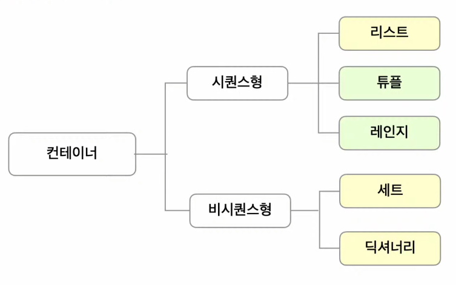
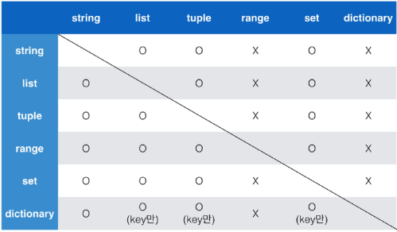

# 2022.07.18.

# 1교시

## 프로그래밍 학습 마인드 셋

> 개념 구조화

- 해당 개념과 하위 개념을 잘 묶어서 머릿속에 저장하는 것

- 프로그래밍에서 개념을 명확히 알고, 그것을 구조화하는 것이 중요

> 프로그래밍에서 개념 구조화 하기

- 개념 정의, 개념의 포함 관계, 두 개념의 차이점 
- 기본기를 탄탄하게
- 코드 작성을 통해 기본 문법을 연습
- ``동료 학습(Peer Learning)``
  - 친구에게 배운 개념 설명하기
  - 친구 코드의 에러 함께 해결하기
  - 모르는 내용을 서로 문답하면서 지식의 빈틈 채우기

---

## 프로그래밍이란?

> 프로그래밍의 정의

- 프로그램을 만드는 해우이
  
  - 프로그램 : 컴퓨터가 해야할 일들이 순서대로 적혀있는 것

- **컴퓨터에게 일을 시키기 위해서 프로그램을 만드는 행위**

> 프로그래밍 언어란?

- 프로그래밍 언어란?

- 자신의 생각을 나타내고 전달하기 위해 사용하는 체계

- 문법적으로 맞고, 언어 공동체 내에서 이해될 수 있는 말의 집합

- 컴퓨터는 ``기계어(0과 1로 이루어진 2진법)로 소통``
  
  - 기계어는 사람이 이해하기 어려움

- 사람이 이해할 수 있는 새로운 언어를 개발 => 프로그래밍 언어

- 프로그래밍 언어의 특징
  
  - 사람이 이해할 수 있는 문자로 구성
  - 기본적인 규칙과 문법이 존재

- 소스코드
  
  - 프로그래밍 언어로 작성된 프로그램

- 번역기(interpreter 혹은 compiler)
  
  - 소스 코드를 컴퓨터가 이해할 수 있는 기계어로 번역
  - ``파이썬``의 경우는 ``인터프리터``를 사용

---

## 파이썬이란?

> 파이썬을 배워야 하는 이유

1. 알고리즘 코딩 테스트에 유리
   - 코딩 테스트의 유형이 다양해지면서 변칙적인 유형에 대응하기 쉬움
     - 대회 준비`만`을 위한다면 C언어를 추천(C언어가 속도가 빠르기 떄문)
2. 구현 코딩테스트에 유리 
   - 유용한 라이브러리 중 최소한만 사용해 개발이 가능하여 가장 유리함
3. 가장 인기가 많은 언어
   - AI, 데이터 분석, 웹, 업무 자동화 등 다양한 분야에서 사용
4. Easy to Learn
   - 문법이 간결하고 변수에 별도의 타입 저장이 필요 없음
5. 인터프리터 언어
   - 파이썬은 소스코드를 기계어롤 변환할 때 통역하듯이 1줄씩 변환
6. 객체 지향 프로그래밍

## 파이썬 개발 환경

> IDE(Interagted Development Environment)

- 통합 개발 환경의 약자로, 개발에 필요한 다양하고 강력한 기능들을 모아둔 프로그램

> Jupyter Notebook

- 문법 학습을 위한 최적의 도구로, 소스 코드와 함께 실행 결과와 마크다운 저장 가능

> 코딩

- 파이썬 : 주피터 노트북, VScode

- 웹 : VScode(HTML/CSS, Django, Javascript,Vue등 모두 개발하기 편한 환경)

- 알고리즘 : pycharm

---

# 2교시

## 코드 작성법

> 코드 스타일 가이드

- 코드를 '어떻게 작성할지'에 대한 가이드라인

- 파이썬에서 제안하는 스타일 가이드
  
  - [PEP8 스타일 가이드](https://peps.python.org/pep-0008/)

- 각 회사/프로젝트마다 따로 스타일 가이드를 설정하기도 함
  
  - [Google Style guide](https://google.github.io/styleguide)

> 주석

- 코드를 보다 이해하기 쉽게 도와주고 분석 및 수정이 용이

- 주석은 ``실행에 영항을 미치지 않음``

- 프로그램의 ``속도를 느리게 하지 않으며``, ``용량을 늘리지 않음``

- 주석 작성법
  
  - 한줄 주석 '#' 
  - 여러줄 주석 ''', """

---

## 기초 문법

> 변수(Variable)

- 데이터를 어떻게 저장하고, 어떻게 처리할 것인가 => ``프로그래밍의 기본적인 원리``

- 데이터를 저장하기 위해 사용

- 복잡한 값들을 쉽게 사용할 수 있게 해줌``(추상화)`` => 변수를 사용하는 이유!!
  
  - 코드의 가독성 증가
  - 숫자를 직접 적지 않고, 의미단위로 작성 가능
  - 코드 수정이 용이해짐

- 동일한 변수에 다른 데이터를 언제든 할당할 수 있기 때문에 '변수'라고 불림

> 식별자

- 식별자의 이름은 영문알파셉, 언더스코어(_), 숫자로 구성

- 첫 글자에 숫자가 올 수 없음

- 길이 제한이 없고, 대소문자를 구별

- 다음의 키워드는 예약어(reserved words)로 사용할 수 없음
  
  - False, True, if, elif, and... 등 문법에 사용되는 단어들

> 변수 이름 규칙

- ``내장 함수``나 ``모듈`` 등의 이름도 ``사용하면 안됨 ``

- 동작을 예상할 수 없게 임의로 값을 할당하게 되므로 범용적이지 않은 코드가 된다.
  
  ```python
  print(5)
  print = 'hi'
  print(5) # 에러 발생(TypeError : 'str' is not callable)
  # 내장 함수 print가 아닌, 문자열 hi가할당된 변수 print로 사용됨
  ```

> 연산자

- 기본적인 사칙연산 및 수식 계산

- 연산자 우선순위
  
  - 기본적으로 수학에서의 우선순위와 같음
  - 괄호 => 곱하기,나누기 => 더하기 빼기

---

## 자료형(Datatype)분류

- 프로그래밍에서는 다양한 종류의 값(데이터)을 쓸 수 있음

- 사용할 수 있는 데이터의 종류들을 ``자료형``이라고 함

- 수치형(Numeric Type)
  
  - int(정수, integer)
  - float(부동소수점, 실수, floating point number)
  - complex(거의 안씀)

- 문자열(String)

- 불린형(Boolean Type)

- None

---

## 수치형

> 정수 자료형(int)

- 0, 100, -200과 같은 정수를 표현

- 일반적인 사칙연산 가능

- 여러 진수 표현 가능
  
  - 2진수(binary) : 0b
  
  - 8진수(octal) : 0o
  
  - 16진수(hexadeciaml) : 0x
    
    ```python
    print(0b10) #2
    print(0o30) #24
    print(0x10) #16
    ```

> 실수 자료형(float)

- 유리수와 무리수를 포함하는 실수를 다루는 자료형

- **실수 연산시 주의할 점``(부동 소수점)``**
  
  ```python
  print(3.2 - 3.1) # 0.10000000000009
  print(1.2 - 1.1) # 0.099999999999987
  ```
  
  - *계산 결과가 다르다???*
  - 컴퓨터는 2진수, 사람은 10진법을 사용
  - 이 때 10진수 '0.1'은 2진수로 표현하면 0.0001100110011001100110.. 같이 무한대로 반복
  - 무한대 숫자를 그대로 저장할 수 없어서 사람이 사용하는 10진법의 근사값만 표시
  - 이런 과정에서 예상치 못한 결과가 나타남(이러한 증상을 ``FLoating point rounding error``라고 함)

- 부동 소수점 연산의 해결책
  
  - 값을 비교하는 과정에서 정수가 아닌 실수면 주의할 것
  
  - 매우 작은 수보다 작은지를 확인하거나 ``math모듈 활용``
    
    ```python
    a = 3.2 - 3.1 # 0.10000000000009
    b = 1.2 - 1.1 # 0.099999999999987
    
    # 임의의 작은 수 활용
    print(abs(a - b) <= 1e-10>) #True
    
    # 2. python 3.5이상
    import math
    print(math.isclose(a,b)) #True
    ```

---

# 3교시

## 문자열 자료형

> 문자열 자료형 정의

- 모든 문자는 str 타입

- 문자열은 작은 따옴표(')나 큰 따옴표(")를 활용하여 표기

- 중첩 따옴표
  
  - 따옴표 안에 따옴표를 표현할 경우
    
    ```python
    print("문자열 안에 '작은 따옴표'를 사용하려면 큰 따옴표로  묶는다.")
    # 문자열 안에 '작은 따옴표'를 사용하려면 큰 따옴표로 묶는다.
    
    print('문자열 안에 "큰 따옴표"를 사용하려면 작은 따옴표로 묶는다.')
    # 문자열 안에 "큰 따옴표"를 사용하려면 작은 따옴표로 묶는다.
    ```

- 삼중 따옴표(Triple Quotes)
  
  - 작은 따옴표나 큰 따옴표를 삼중으로 사용
    
    ```python
    print('''문자열 안에 '작은 따옴표'나 "큰 따옴표"를 사용할 수 있고 여러 줄을 사용할 때도 편리하다. ''')
    
    # 출력 결과
    문자열 안에 '작은 따옴표'나 
    "큰 따옴표"를 사용할 수 있고 
    여러 줄을 사용할 때도 편리하다.
    ```

> Escape sequence

- 역슬래시(backslash) 뒤에 특정 문자가 와서 특수한 기능을 하는 문자 조합
  
  | 기호     | 의미                       |
  |:------:|:------------------------:|
  | \n     | 줄바꿈                      |
  | \t     | 탭                        |
  | \r     | 캐리지 리턴(커서를 맨 앞으로 옮기는 기능) |
  | \0     | Null                     |
  | \\     | \\ (백 슬래시 자체를 표현)        |
  | \\'    | 단일 인용 부호(')              |
  | \\"    | 이중 인용 부호(")              |
  | is not | 객체 아이덴티티가 아님             |

> 문자열 연산

- 덧셈
  
  - 문자열 덧셈은 문자열을 연결
  
  - String Concatenation이라고 함
    
    ```python
    print("Hello" + "World") #HeloWorld
    ```

- 곱셈 
  
  - 문자열을 곱한만큼 반복
    
    ```python
    print("Python" * 3) #PythonPythonPython
    ```

> String Interpolation

- ~~%-formatting~~ 거의 안씀
  
  ```python
  name = 'Kim'
  score = 4.5
  print('Hello, %s' % name) # Hello, Kim
  print('내 성적은 %d' % score) # 내 성적은 4
  ```

- str.format() 그나마 쪼끔 씀
  
  ```python
  name = 'Kim'
  score = 4.5
  print('Hello, {}! 성적은 {}' .format(name,score))
  #Hello, Kim! 성적은 4.5
  ```

- f-strings : python 3.6이상 **(가장 많이 사용)**
  
  ```python
  name = 'Kim'
  score = 4.5
  
  print(f'Hello,{name}! 성적은 {score}')
  # Hello, Kim! 성적은 4.5
  
  import datetime
  today = datetime.datetime.now()
  print(today) # 2022-07-08 16:04:15.200411
  
  print(f'오늘은 {today:%y}년 {today:%m}월 {today:%d}일')
  # 오늘은 22년 07월 08일
  
  pi = 3.141592
  print(f'원주율은 {pi:.3}입니다. 반지름이 2일 때 원의 넓이는 {pi*2*2}')
  # 원주율은 3.14입니다. 반지름이 2일 때 원의 넓이는 12.566368
  ```

---

# 오후 4교시

> None

- 파이썬 자료형 중 하나
- 값이 없음을 표현하기 위해 None 타입이 존재
- 일반적으로 반환 값이 없는 함수에서 사용하기도 함

---

## 불린형(Boolean)

- 논리 자료형으로 참과 거짓을 표현하는 자료형
- True 또는 False를 값으로 가짐
- 비교/논리 연산에서 활용됨

> 비교 연산자

- 주로 조건문에서 사용되며 값을 비교할 때 사용

- 결과는 True/False를 리턴
  
  | 내용     | 연산자           |
  |:------:|:-------------:|
  | <      | 미만            |
  | <=     | 이하            |
  | >      | 초과            |
  | >=     | 이상            |
  | ==     | 같음            |
  | !=     | 같지 않음         |
  | is     | 객체 아이덴티티(OOP) |
  | is not | 객체 아이덴티티가 아님  |

> 논리 연산자

- 모든 조건을 만족(And), 여러 조건중 하나만 만족(Or) 등 

- 일반적으로 비교 연산자와 함께 사용됨
  
  | 연산자     | 내용           | 반환값          |
  |:-------:|:------------:| ------------ |
  | A and B | A와 B모두 True  | True         |
  | A or B  | A와 B모두 False | False        |
  | Not     | True / False | False / True |

> 논리 연산자 주의할 점 / not 연산자

- Falsy : False는 아니지만 False로 취급 되는 다양한 값
  - 0, 0.0, (), []. {}, None, ""(빈 문자열)
- 논리 연산자도 우선순위가 존재
  - not, and, or 순으로 우선순위가 높음

> 논리 연산자의 단축 평가

- 결과가 확실한 경우 두 번째 값은 확인하지 않고 첫 번째 값 반환

- and 연산에서 첫 번째 값이 False인 경우 무조건 False => 첫 번째 값 반환

- or 연산에서 첫 번째 값이 True인 경우 무조건 True => 첫 번째 값 반환

- 0은 Fals, 1은 True
  
  ```python
  print(3 and 5) # 5
  print(3 and 0) # 0
  print(0 and 3) # 0
  print(0 and 0) # 0
  
  print(5 or 3) # 5
  print(3 or 0) # 3
  print(0 or 3) # 3
  print(0 or 0) # 0
  ```

---

## 컨테이너

- 여러 개의 값(데이터)을 담을 수 있는 것(객체)으로, 서로 다른 자료형을 저장할 수 있음
  
  - 예시 : List

### 컨테이터의 분류

- 순서가 있는 데이터(Ordered) vs. 순서가 없는 데이터(Unordered)

- 순서가 있다 != 정렬되어 있다



> 리스트

- 리스트는 여러 개의 값을 순서가 있는 구조로 저장하고 싶을 때 사용

- 리스트는 대괄호([]) 혹은 list()명령을 통해 생성
  
  - 파이썬에서는 어떠한 자료형도 저장할 수 있으며, 리스트 안에 리스트도 넣을 수 있음
  
  - 생성된 이후 내용 변경이 가능 -> 가변 자료형

- 순서가 있는 시퀀스로 인덱스를 통해 접근 가능
  
  - 값에 대한 접근은 list[i]
    
    ```python
    # 리스트명 = [요소1, 요소2, 요소3, ...]
    list_a = []
    list_b = [1, 2, 3]
    list_c = ['Life', 'is', 'too', 'short']
    list_d = [1, 2, 3, 'python', ['리스트', '안에', '리스트']]
    ```

> 튜플

- 소괄호, 혹은 tuple()을 통해 생성

- 튜플은 수정 불가능한(immutable) 시퀀스로 인덱스로 접근 가능

- 값에 대한 접근은 tuple[i]
  
### 튜플 생성 주의사항

- 단일 항목의 경우
  
  - 하나의 항목으로 구성된 튜플은 생성시 값 뒤에 쉼표를 붙여야 함

- 복수 항목의 경우,
  
  - 마지막 항목에 붙은 쉼표는 없어도 되지만, 넣는 것을 권장(Trailing comma)
  
### 튜플 대입

- 튜플 대입이란?
  
  - 우변의 값을 좌변의 변수에 한 번에 할당하는 과정

- 튜플은 일반적으로 파이썬 내부적으로 활용됨
  
  - 추후 함수에서 복수의 값을 반환할 때에도 사용
    
    ```python
    x, y = 1, 2
    print(x, y) # 1 2
    
    x, y = (1, 2)
    print(x, y) # 1 2
    # 실제로 tuple로 처리하므로 결과가 같음
    ```

> Range의 정의

- 숫자의 시퀀스를 나타내기 위해 사용
  
  - 주로 반복문과 함께 사용됨
    
    ```python
    print(range(4)) # = range(0, 4)
    
    print(list(range(4))) # [0, 1, 2, 3]
    ```

> Range의 사용법

- 기본형 : range(n)
  
  - 0부터 n-1까지의 숫자의 시퀀스

- 범위 지정 : range(n, m)
  
  - n부터 m-1까지의 숫자의 시퀀스

- 범위 및 스텝 지정 : range(n, m, s)
  
  - n부터 m-1까지 s만큼 증가시키며 숫자의 시퀀스
    
    ```python
    # 역순
    print(list(range(6, 1, -1))) # [6, 5, 4, 3, 2]
    print(list(range(6, 1, -2))) # [6, 4, 2]
    print(list(range(6, 1, 1)))  # []
    ```

> 슬라이싱 연산자

- 시퀀스를 특정 단위로 슬라이싱

- 인덱스와 콜론을 사용하여 문자열의 특정 부분만 잘라낼 수 있음

- 슬라이싱을 이용하여 문자열을 나타낼 때 콜론을 기준으로 `앞 인덱스에 해당하는 문자는 포함`되지만 `뒤 인덱스에 해당 문자는 미포함`
  
  ```python
  # 리스트([1:4]에서 1은 포함 4는 미포함)
  print([1, 2, 3, 5][1:4]) # [2, 3, 5]
  
  # 튜플
  print((1,2,3)[:2]) # (1, 2)
  
  # range
  print(range(10))[5:8] # range(5, 8)
  
  # 문자열
  print('abcd'[2:4]) # cd
  ```

## 비시퀀스형 컨테이터

> 셋(Set)

- Set이란 중복되는 요소가 없이, 순서에 상관없는 데이터들의 묶음
  
  - 데이터의 `중복을 허용하지 않기` 때문에 중복되는 원소가 있다면 하나만 저장
  
  - `순서가 없기` 때문에 인덱스를 이용한 접근 불가능

- 수학에서의 집합을 표현한 컨테이너
  
  - 집합 연산이 가능(합,차,교집합)
  
  - 중복된 값이 존재하지 않음

- 담고 있는 요소를 `삽입, 변경, 삭제 가능` => 가변 자료형(mutable)

- 셋을 활용하면 다른 컨에티너에서 중복된 값을 쉽게 제거할 수 있음

> 셋(Set) 연산자

- | : 합집합

- & : 교집합

- \- : 차집합

- ^ : 대칭차집합

- 여집합은 없음

---

# 5교시

## 딕셔너리(Dictionary)

> 딕셔너리 생성

- 중괄호({}) 혹은 dict()을 통해 생성

- `Key`를 통해 `Value`에 접근
  
  ```python
  dict_a = {}
  print(type(dict_a)) # <class 'dict'>
  
  dict_a = {'a': 'apple', 'b': 'banana', 'list':[1, 2, 3]}
  print(dict_a)
  print(dict_a['list']) # [1, 2, 3]
  # a, b, list : Key 값 / apple, banana, {1, 2, 3} : Value 값
  
  dict_b = dict(a = 'apple', b = 'banana', list = [1, 2, 3])
  print(dict_b) # {'a': 'apple', 'b': 'banana', 'list':[1, 2, 3]}
  ```

---

## 형변환

- 파이썬에서 데이터 형태는 서로 변환할 수 있음

> 암시적 형 변환(Implicit)

- 사용자가 `의도하지 않고`, `파이썬 내부적`으로 자료형을 변환하는 경우

```python
print(True + 3) # 4
print(3 + 5.0) # 8.0
```

> 명시적 형 변환(Explicit)

- 사용자가 `특정 함수를 활용`하여 `의도적`으로 자료형을 변환하는 경우

```python
print('3.5' + 3.5) # TypeError : can only concatenate str(not "float") to str

# 정수 형식인 경우에도 float로 타입 면환
print((float('3')) # 3.0

# float 형식이 아닌 경우 타입 변환할 수 없음
print(float('3/4') + 5.3) # ValueError : could not convert string to float: '3/4'
```

- **input() 명령을 이용하여 사용자 데이터를 입력할 경우** `숫자 입력은 문자열로 기본 저장`**됨**

> 컨테이너 형 변환

    

---

## 파이썬 프로그램 구성 단위

> 프로그램 구성 단위

- 식별자 : 변수, 함수, 클래스 등 다양한 값을 가질 수 있는 이름

- 예약어 : 파이썬 키워더(명령어)

- 리터럴(literal) : 읽혀지는 대로 쓰여있는 값 그 자체

- `표현식(Expression) : 새로운 데이터 값을 생성하거나 계산하는 코드 조각`

- `문장`
  
  - 표현식은 값을 생성하는 일부분이고, 문장은 특정작업을 수행하는 코드 전체
  
  - `실행 가능한 최소한의 코드 단위`
  
  - `모든 표현식은 문장이다`

- 함수, 모듈, 패키지, 라이브러리