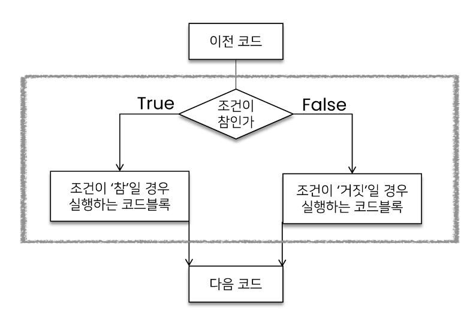
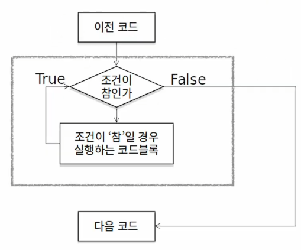
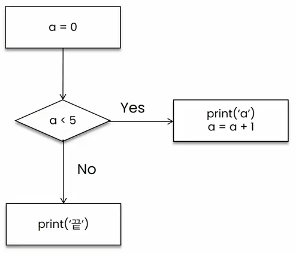
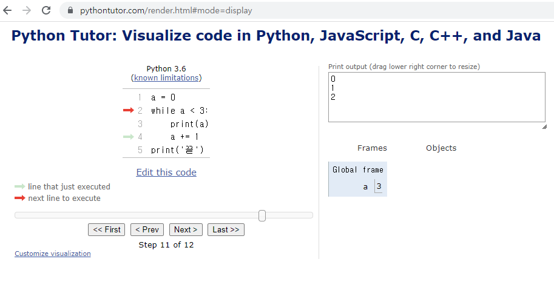
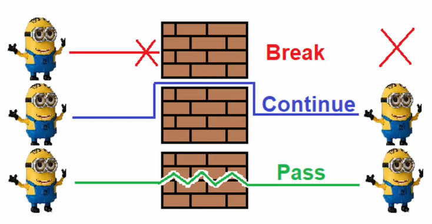
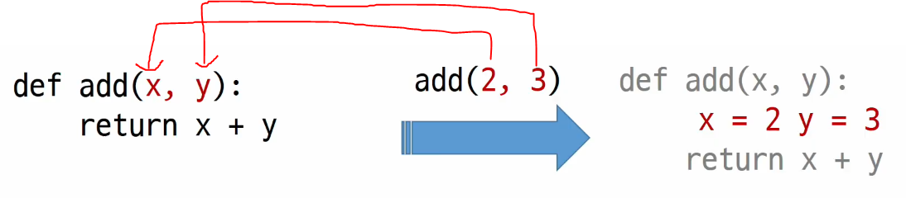

# 2022. 07. 20.

# 제어문

- 조건문, 반복문으로 이루어져 있음

- 파이썬은 기본적으로 위에서부터 아래로 차례대로 명령을 수행

- 특정 상황에 따라 코드를 선택적으로 실행(분기/조건)하거나 계속하여 실행하는 제어가 필요

- 제어문은 순서도(flowchart)로 표현이 가능

## 조건문

> 조건문

- 조건문은 참/거짓을 판단할 수 있는 조건식과 함께 사용
  
  

> 조건문의 기본 형식

- 조건에는 참/거짓에 대한 조건식
  
  - 조건이 참인 경우, 이후에 들여쓰기 되어있는 코드 블록을 실행
  
  - 이외의 경우 else 이후 들여쓰기 되어있는 코드 블록을 실행
    
    - else는 선택적으로 사용 가능!
  
  ```python
  if 조건 = True:
      # Run this Code block
  else : 
      # Run this Code block
  ```

> 조건문 실습 문제

- 조건문을 통해 입력받은 변수 num의 값의 홀수/짝수 여부를 출력하시오.
  
  ```python
  num = int(input('숫자 입력 : ')
  if num % 2 :    # if num % 2 == 1:
    print('홀수 입니다.')
  else:
    print('짝수 입니다.')
  ```

> 복수 조건문

- 복수의 조건식을 활용할 경우 elif를 활용하여 표현함
  
  ```python
  if 조건:
      # Code block
  elif 조건:
      # Code block
  elif 조건:
      # Code block
  else:
      # Code block
  ```

> > 복수 조건문 실습 문제

- 미세먼지 농도에 따른 위험 등급이 다음과 같을 때, dust 값에 다라 등급을 출력하는 조건식을 작성하시오.
  
  ```python
  if dust > 150:
      print('매우 나쁨')
  elif dust > 80:
      print('나쁨')
  elif dust > 30:
      print('보통')
  else:
      print('좋음')
  ```

> 중첩 조건문

- 조건문은 다른 조건문에 중첩되어 사용될 수 있음
  
  - 들여쓰기에 유의하여 작성할 것
  
  ```python
  if 조건:
      # Code block
      if 조건:
          # Code block
  else:
      # Code block
  ```

> > 중첩 조건문 실습 예제

- 미세먼지 농도가 300이 넘는 경우 추가
  
  ```python
  dust = 500
  if dust > 150:
      print('매우 나쁨')
      if dust > 300:
          print('실외 활동을 자제하세요')
  elif dust > 80:
      print('나쁨')
  elif dust > 30:
      print('보통')
  elif dust >= 0:
      print('좋음')
  else:
      print('값이 잘못 되었습니다.')
  
  '''
  매우나쁨
  실외 활동을 자제하세요
  '''
  ```

## 조건 표현식

> 조건 표현식(Conditional Expression)이란?

- 조건 표현식을 일반적으로 조건에 따라 값을 정할 때 활용

- 삼항 연산자(Ternary Operator)로 부르기도 함
  
  - `삼항 연산자 작성 팁` : 가운데 있는 if 조건 else를 먼저 적은 후 왼쪽에는 참일 때 출력, 오른쪽에는 거짓일 때 출력을 작성!
  
  ```python
  true인 경우 값 if 조건 else false인 경우 값
  ```

---

# 반복문

> 반복문

- 특정 조건을 만족할 때까지 같은 동작을 계속 반복하고 싶을 때 사용
  
  

> 반복문의 종류

- while 문
  
  - 종료 조건에 해당하는 코드를 통해 반복문을 종료시켜야 함

- for 문
  
  - 반복가능한 객체를 모두 순회하면 종료(별도의 종료 조건이 필요 없음)
  
  - 횟수를 이용하여 표현

- 반복 제어
  
  - break, continue, for-else

## while 문

- while 문은 조건식이 참인 경우 반복적으로 코드를 실행
  
  - 조건이 참인 경우 들여쓰기 되어 있는 코드 블록이 실행됨
  
  - 코드 블록이 모두 실행되고,다시 조건식을 검사하며 반복적으로 실행됨
  
  - while 문은 무한 루프를 하지 않도록 종료 조건이 반드시 필요

- ```python
  while 조건:
      # Code block
  ```

> while 문 예시

- 아래의 순서도를 while 문을 이용해서 코드로 나타내시오.
  
  
  
  ```python
  a = 0
  while a < 5:
      print(a)
      a += 1
  print('끝')
  ```

- ~~[python tutor](https://pythontutor.com/visualize.html#mode=edit) : 코드가 돌아가는 상황을 보여줌~~
  
  - 파이썬 튜터 보다는 `디버그 모드`를 활용할 것!
  
  

> 복합 연산자

- 연산과 할당을 합쳐 놓은 것
  
  - 반복문을 통해서 개수를 카운트 하는 경우
  
  ```python
  cnt = 100
  cnt += 1  # cnt = cnt +1
  print(cnt)  # 101
  ```

## for 문

> for 문

- for문은 시퀀스(string, tuple, list, range)를 포함한 순회 가능한 객체(iterable)의 요소를 모두 순회
  
  - 처음부터 끝까지 모두 순회하므로 별도의 종료 조건이 필요하지 않음

- iterable
  
  - 순회할 수 있는 자료형(string, list, dict, tuple, range, set 등)
  
  - 순회형 함수(range, enumerate)
  
  ```python
  for fruit in['apple', 'mango', 'banana']
      print(fruit)
  print('끝')
  
  '''
  apple
  mango
  banana
  끝
  '''
  ```

> for문을 이용한 문자열(string)순회

- 사용자가 입력한 문자를 한 글자씩 출력하시오.(happy 입력)
  
  ```python
  chars = input()
  
  # happy
  ```
  
  ```python
  for char in chars:
          print(char)
  
  '''
  h
  a
  p
  p
  y
  '''
  ```
  
  - 또는
  
  ```python
  for idx in range(len(chars)):
          print(chars[idx])
  
  '''
  h
  a
  p
  p
  y
  '''
  ```

> 딕셔너리 순회

- 딕셔너리는 기본적으로 key를 순회하며, key를 통해 값을 활용
  
  ```python
  grades = {'john' : 80, 'eric' : 90}
  for student in grades:
      print(student)
  
  '''
  john
  eric
  '''
  ```
  
  ```python
  grades = {'john' : 80, 'eric' : 90}
  for student in grades:
      print(student, grades[student])
  
  '''
  john 80
  eric 90
  '''
  ```

> `추가 메서드를 활용한 딕셔너리 순회`(권장)

- keys() : key로 구성된 결과

- values() : value로 구성된 결과

- items() : (key, value)의 튜플로 구성된 결과
  
  ```python
  grades = {'john' : 80, 'eric' : 90}
  print(grades.keys())
  print(grades.values())
  print(grades.items())
  
  '''
  dict_keys {['john', 'eric']}
  dict_values {[80, 90]}
  dict_keys {[('john', 80), ('eric', 90)]}
  '''
  ```
  
  ```python
  grades = {'john' : 80, 'eric' : 90}
  for student, grade in grades.items():
      print(student, grades)
  
  '''
  john 80
  eric 90
  '''
  ```

> enumerate 순회

- enumerate()
  
  - 인덱스와 객체를 쌍으로 담은 열거형(enumerate)객체 반환
    
    - (index, value)형태의 tuple로 구성된 열거 객체를 반환
  
  ```python
  members = ['민수', '영희', '철수']
  
  for idx, number in enumerate(members):
          print(idx, number)
  
  '''
  0 민수
  1 영희
  2 철수
  '''
  ```

- 기본값을 지정하여 start number바꾸기
  
  ```python
  members = ['민수', '영희', '철수']
  enumerate(members)  # enumerate at 0x105d3e100
  
  print(list(enumerate(members))) # [(0, '민수'), (1, '영희'), (0, '철수')]]
  
  print(list(enumerate(members, start=1))) # [(1, '민수'), (2, '영희'), (3, '철수')]]
  ```

> **`List Comprehension`**

- 표현식과 제어문을 통해 특정한 값을 가진 리스트를 간결하게 생성하는 방법

- List Comprehension의 과정
  
  ```python
  a = []
  # List Comprehension의 과정을 제어문으로 만들어 보면..
  for i in range(5):
      if i % 2 == 1:
          a.append(i)
  
  # 마법의 복사 붙여넣기
  # for문 그대로 들고가서 가운데, if문을 그 오른쪽에, 출력할 값을 왼쪽에!
  a = [i for i in range(5) if i % 2 == 1]
  ```

- `알고리즘 문제 풀 때 많이 활용됨!!`
  
  ```python
  [code for 변수 in iterable]
  
  [code for 변수 in iterable if 조건식]
  # [1, 2, 3, 4, ...] 에서 [2, 4, 6, 8...] 뽑아낼 떄 등 많이 사용됨!
  ```

> List Comprehension 예제

- 1~3의 세제곱의 결과가 담긴 리스트를 만드시오.
  
  ```python
  cubic_list = []
  for number in range(1, 4):
      cubic_list.append(number ** 3)
  print(cubic_list)
  
  # [1, 8, 27]
  ```
  
  ```python
  cubic_list = [number ** 3 for number in range(1, 4)]
  print[cubic_list]
  
  # [1, 8, 27]
  ```

> Dictionary Comprehension

- 표현식과 제어문을 통해 특정한 값을 가진 딕셔너리를 간결하게 생성
  
  ```python
  {key: value for 변수 in iterable}
  
  {key: value for 변수 in iterable if 조건식}
  ```

> Dictionary Comprehension 예제

- 1~3의 세제곱의 결과가 담긴 리스트를 만드시오.
  
  ```python
  cubic_dict = {}
  for number in range(1, 4):
      cubic_dict[number] = (number ** 3)
  print(cubic_dict)
  
  # {1: 1, 2: 8, 3: 27}
  ```
  
  ```python
  cubic_dict = {number: number ** 3 for number in range(1, 4)} # key값 : value값 for 반복 조건
  print(cubic_dict)
  
  # {1: 1, 2: 8, 3: 27}
  ```

---

# 반복문 제어

> 반복문 제어

- break
  
  - 반복문을 종료

- continue
  
  - continue 이후의 코드 블록은 수행하지 않고, 다음 반복을 수행

- for-else
  
  - 끝까지 반복문을 실행한 이후에 else문 실행
    
    - for문의 반복이 `정상적으로 끝나면(break문의 사용 등이 없이)` else문이 실행됨
      
      - `알고리즘 풀 때 편하게 이용할 수 있다!!`

- pass
  
  - 아무것도 하지 않음(문법적으로 필요하지만, 할 일이 없을 때 사용)
  
  

---

# 함수

- 함수를 왜 사용할까?
  
  - **`Decomposition(분해)`**
  
  - **`Abstraction(추상화)`**

> 분해

- `기능을 분해`하고, `재사용 가능`하게 만든다

> 추상화

- 복잡한 내용을 모르더라도 사용할 수 있도록 만드는 것

- `재사용성`, `가독성`, `생산성`

## 함수 기초

> 함수의 종류

- 함수는 크게 3가지로 분류
  
  - 내장 함수
    
    - 파이썬에 기본적으로 포함된 함수(print())
  
  - 외장 함수
    
    - import 문을 통해 사용하며, 외부 라이브러리에서 제공하는 함수
  
  - 사용자 정의 함수
    
    - 사용자가 직접 만드는 함수

> 함수의 정의

- 함수(Function)
  
  - 특정한 기능을 하는 코드의 조각(묶음)
  
  - 특정 코드를 매번 다시 작성하지 않고, 필요시에만 호출하여 간편히 사용

## 함수 기본 구조

- 선언과 호출(define & call) => 생성과 사용

- 입력(input)

- 문서화(Docstring) => 함수에 대한 설명

- 범위(Scope)

- 결과값(Output)

> 선언

- 함수의 `선언`은 `def` 키워드를 활용

- 들여쓰기를 통해 Function body(실행될 코드 블록)를 작성함
  
  - Docstring은 함수 body 앞에 선택적으로 작성 가능
    
    - 작성 시에는 반드시 첫 번째 문장에 문자열 ''''''

- 함수는 `parameter(재료)`를 넘겨줄 수 있음

- 함수는 동작 후에 `return을 통해 결괏값`을 전달함
  
  ```python
  def function_name(parameter)
      # Code block
      return returning_value
  ```

> 호출

- 함수는 함수명( )으로 호출하여 사용
  
  - parameter가 있는 경우, 함수명(값1, 값2, ...)로 호출
  
  ```python
  def foo():
      return True
  
  def add(x, y):
      return x + y
  
  foo()   # True
  
  add(2, 3)   # 5
  ```

## 함수의 결과값(Output)

> 값에 따른 함수의 종류

- Void function
  
  - 명시적인 return값이 없는 경우, None을 반환하고 종료

- Value returing function
  
  - 함수 실행 후, return문을 통해 값 반환
  
  - return을 하게 되면, 값 반환 후 함수가 바로 종료

> `주의` - print vs return

- print함수와 return의 차이점
  
  - print를 사용하면 호출될 때마다 값이 출력됨(주로 테스트를 위해 사용)
  
  - 데이터 처리를 위해서는 return 사용
    
    - ~~어제 hws풀면서 sort함수 썼을 때 None값이 반환되었던 이유가 여기있었네~~

> 튜플을 활용하여 두개 이상의 값 반환

```python
def minus_and_product(x, y):
  return x + y  # return이 두개??
  return x * y  # return이 두개??

y = minus_and_product(4, 5)
print(y)  # -1
```

```python
def minus_and_product(x, y):
  return x + y, x * y

y = minus_and_product(4, 5)
print(y)  # (-1, 20)
print(type(y))  # <class 'tuple'>
```

> 함수 반환 정리

- return이 없다 => None

- return이 있다 => 하나를 반환

- `여러 개`를 원하면 Tuple 활용(혹은 리스트같은 `컨테이너`를 활용)

## 함수의 입력

> `Parameter`와 `Argument`

- Parameter : 함수를 정의할 때, 함수 내부에서 사용되는 변수

- Argument : 함수를 호출 할 때, 넣어주는 값
  
  ```python
  def add(x, y):  #x, y는 parameter!
      return x + y 
  
  add(2, 3)   #2, 3은 Argument!
  ```

> Argument

- 함수 호출 시 함수의 parameter를 통해 전달되는 값

- Argument는 소괄호 안에 할당 : `function_name(argument)`
  
  - 필수 Argument : 반드시 전달되어야 하는 argument (없으면 error남)
  
  - 선택 Argument : 값을 전달하지 않아도 되는 경우는 기본값이 전달

> > Positional Arguments

- `기본적`으로 함수 호출 시 Argument는 `위치에 따라` 함수 내에 전달됨
  
  

>> Keyword Arguments

- 직접 변수의 이름으로 특정 Argument를 전달할 수 있음

- Keyword Argument 다음에 Positional Argument를 활용할 수 없음
  
  ```python
  def add(x, y)
      return x + y

  add(x = 2, y = 5)   # Keyword argument를 두 번 사용
  add(2, y = 5)   # Positional 다음 Keyword 사용
  add(x = 2, 5)   # Keyword 다음 Positional => !Error 발생!
  ```

>> Default Arguments

- 기본값을 지정하여 함수 호출 시 argument 설정이 필요 없음

  ```python
  def add(x, y=0)
      return x + y 

  add(2)  # 함수 선언시 parameter를 하나만 넣어도 y=0이 기본적으로 설정됨
  ```

>> 가변 인자(*args)

- 가변인자란?

  - 여러 개의 Positional Argument를 하나의 필수 parameter로 받아서 사용

- 언제 사용하나?

  - 몇 개의 Positional Argument를 받을지 모르는 함수를 정의할 때 유용

  ```python
  def add(*args)
      for arg in args:
            print(arg)

  add(2)
  add(2, 3, 4, 5)   # 여러 개의 Argument를 받을 수 있음!
  ```

>> 패킹 / 언패킹

- 가변인자 이해를 위해..
  
- asterisk 사용시 함수에서 parameter로 넣을 때는 패킹, 함수에서 argument로 받을 때는 언패킹

- 패킹

  - 여러 개의 데이터를 `묶어서 변수에 할당`하는 것

  ```python
  numbers = (1, 2, 3, 4, 5)   # 패킹
  print(numbers)   # (1, 2, 3, 4, 5)
  ```

- 언패킹

  - `시퀀스 속`의 `요소`들을 `여러 개의 변수에 나누어 할당`하는 것

  ```python
  numbers = (1, 2, 3, 4, 5) 
  a, b, c, d, e = numbers   # 언패킹
  print(a, b, c, d, e)   # (1, 2, 3, 4, 5)
  ```

- 언패킹시 변수의 개수와 할당하고자 하는 요소의 갯수가 동일해야 함

  ```python
  numbers = (1, 2, 3, 4, 5)   # 패킹
  a, b, c, d, e, f = numbers    # 언패킹
  # ValueError : not enough balues to unpack (expected 6, got 5)
  ```

- 언패킹시 왼쪽의 변수에 asterisk(*)를 붙이면, 할당하고 남은 요소를 리스트에 담을 수 있음

  ```python
  numbers = (1, 2, 3, 4, 5)   # 패킹

  a, b, *rest = numbers
  print(a, b, rest)   # 1 2 [3, 4, 5]

  a, *rest, e = numbers
  print(rest)   # [2, 3, 4]
  ```

>> 가변 인자 예시

- packing을 통해 받은 모든 숫자들의 합을 구하는 함수 만들기

```python
def sum_all(*numbers)
    result = 0
    for number in numbers:
          result += number
    return result

print(sum_all(1, 2, 3))   # 6
print(sum_all(1, 2, 3, 4, 5, 6))   # 21
```

- 반드시 받아야하는 인자와, 추가적인 인자를 구분해서 사용할 수 있음

```python
def print_family_name(fater, mother, *pets):
    print(f'아버지 : {father}')
    print(f'어머니 : {mother}')
    print(f'반려동물들..')
    for name inpets:
        print(f'반려동물: {name}')

print_family_name('아부지', '어무니', '개', '고양이')

'''
아버지 : 아부지
어머니 : 어무니
반려동물들..
반려동물 : 개
반려동물 : 고양이
'''
```

>> 가변 키워드 인자(**kwargs)

- 몇 개의 키워드 인자를 받을지 모르는 함수를 정의할 때 유용

- **kwargs는 `딕셔너리`(key와 value가 있어서)로 묶여 처리되며, parameter에 **를 붙여 표현

  ```python
  def family(**kwargs):
      for key, value in kwargs.items():
          print(key, ":", value)

  family(father = ' 아부지 ', mother= ' 어무니 ', baby= '아기 ')  # !key값을 문자열로 쓰면 안됨!

  '''
  father : 아부지
  mother : 어무니
  baby : 아기
  '''
  ```

- 가변 키워드 인자 예시

```python
def print_family_name(fater, mother, **pets):
    print(f'아버지 : {father}')
    print(f'어머니 : {mother}')
    print(f'반려동물들..')
    for species, name in pets.items():
        print(f'{species} : {name}')

print_family_name('아부지', '어무니', dog = '개', cat = '고양이')

'''
아버지 : 아부지
어머니 : 어무니
반려동물들..
dog : 개
cat : 고양이
'''
```

---

# Pyhon의 범위(Scope)

> Pyhon의 범위(Scope)

- 함수는 코드 내부에 local scope를 생성하며, 그 외의 공간인 global scope로 구분

- scope
  
  - global scope : 코드 어디에서든 참조할 수 있는 공간

  - local scope : 함수가 만든 scope. 함수 내부에서만 참조 가능

- variable

  - global vriable : global scope에 정의된 변수

  - local variable : local scope에 정의된 변수

> 변수의 수명주기(lifecycle)

- 변수는 각자의 수명주기(lifecycle)가 존재

  - built-in scop
  
    - 파이썬이 실행된 이후부터 영원히 유지

  - global scope

    - 모듈이 호출된 시점 이후 혹은 인터프리터가 끝날 때까지 유지

  - local scope
  
    - 함수가 호출될 때 생성되고, 함수가 종료될 때까지 유지

> 이름 검색 규칙(Name Resolution)

- 파이썬에서 사용되는 이름(식별자)들은 이름공간(namespace)에 저장되어 있음

- 아래와 같은 순서로 이름을 찾아나가며, LEGB Rule이라고 부름

  - `L`ocal scope : `중첩된 함수 내부`
  - `E`nclosed scope : 함수 중첩 시, `최초의 함수 내부`
  - `G`lobal scope : `.py파일 내부`
  - `B`uilt-in scope : `파이썬을 설치하면서 생긴 영역`
    - ex : print()
  
- 함수 내에서는 바깥 Scope의 변수에 접근 가능하나 수정은 할 수 없음

>> LEGB 예시

  ```python
  a = 0
  b = 1
  def enclosed():
      a = 10
      c = 3
      def local(c):
          print(a, b, c)  # 10 1 300
      local(300)
      print(a, b, c)  # 10 1 3
  enclosed()
  print(a, b)   # 0 1
  ```

> global문

- 현재 코드 블록 전체에 적용되며, 나열된 식별자(이름)이 global variable임을 나타냄

  - global에 나열된 이름은 같은 코드 블록에서 global 앞에 등장할 수 없음

  - global에 나열된 이름은 parameter, for 루프 대상, 클래스/함수 정의 등으로 정의되지 않아야 함
  
>> global문 예시

- Local scope에서 global 변수 값의 변경

  ```python
  # 함수 내부에서 글로벌 변수 변경하기
  a = 10
  def func1():
      global a
      a = 3

  print(a)  # 10
  func1()
  print(a)  # 3
  ```

> nonlocal

- 내부에 중첩된 함수에서 외부 함수의 값에 접근할 수 있게 해줌

  ```python
  x = 0
  def func1():
      x = 1
      def func2():
          nonlocal x
          x = 2
      func2()
      print(x)  # 2

  func1()
  print(x)  # 0
  ```

> nonlocal과 global의 비교

  ```python
  def func1():
      global out
      out = 3
  
  func1()
  print(out)  # 3
  ```

  ```python
  def func1():
      # 변수 y를 사용하려면 func1에서도 선언 해주어야 함. ex) y = 3
      def func2():
          nonlocal y
          y = 2
      func2()
      print(y)
  
  func1()
  print(out)  # SyntaxError: no binding for nonlocal 'y' found
  ```

> 함수의 범위 주의

- 기본적으로 함수에서 선언된 변수는 Local scope에 생성되며, 함수 종료시 사라짐

- 해당 scope에 변수가 없는 경우, LEGB rule에 의해 이름을 순차적으로 검색

  - 변수에 접근은 가능, 수정은 불가

  - 가급적 사용하지 않는 것을 권장

  - 굳이 함수로 값을 바꾸고자 한다면 argument로 넘겨서 리턴 값으로 받는 것을 추천

## 함수 응용

> map

- 순회 가능한 데이터구조(iterable)의 모든 요소에 함수로 적용하고 그 결과를 map object로 반환

  ```python
  numbers = [1, 2, 3]
  result = map(str, numbers)
  print(result, type(result))   # <map object at 0x0000028AD0178FA0> <class 'map'>
  print(list(result))   # ['1', '2', '3']
  ```

- 활용 사례 : 알고리즘 문제 풀이시 input값들을 숫자로 바로 활용하고 싶을 때

  ```python
  n, m = map(int, input().split())    # 3, 5 입력
  print(n, m)   # 3 5

  # 번외 : input의 본질은 1. 기본적으로 문자열 2. 한줄로 받는다 이므로
  # 2번 규칙에 의해 여러개를 받으려면 split()을 사용한다
  ```

> filter 

- `순회 가능한` 데이터구조의 모든 요소에 함수를 적용하고 , 그 결과가 True인 것들을 `filter object`로 반환

  ```python
  def odd(n):
      return n % 2
  numbers = [1, 2, 3]
  result = filter(odd, numbers)
  print(result, type(result))   # <filter object at 0x00000190E5D28F40> <class 'filter'>
  print(list(result))   # [1, 3]

> zip

- 복수의 iterable을 모아 튜플을 원소로하는 zip object를 반환

- 가로로 묶인 객체를 세로로 묶어줌

  ```python
  girls = ['jane', 'ashley']
  boys = ['justin', 'eric']
  pair = zip(girls, boys)
  print(list(pair))   # [('jane', 'justin'), ('ashley', 'eric')]
  ```

> lambda 함수

- 간단한 함수를 만들 때 사용

- 사용법 : `함수이름 = lambda 변수1, 변수2 : 리턴값`

> 재귀 함수(recursive function)

- 자기 자신을 호출하는 함수
  
- 무한한 호출을 목표로 하는 것이 아니며, 알고리즘 설계 및 구현에서 유용하게 활용

  - 점화식 형태의 알고리즘 풀 때

  - 변수의 사용이 줄고 코드의 가독성이 높아짐

- 1개 이상의 base case(종료되는 상황)가 존재하고, 수렴하도록 작성

- 재귀 호출은 입력 값이 커질수록 연산 속도가 오래 걸림

> 재귀 함수 주의 사항

- 재귀 함수는 base case에 도달할 때까지 함수를 호출함

- 메모리 스택이 넘치게 되면(stack overflow) 프로그램이 동작하지 않게 됨

- `파이썬의 최대 재귀 깊이가 1000번`으로, 호출 횟수가 이를 넘어가면 Recursion Error 발생

> 예시

- 팩토리얼글 코드로 구현

  ```python
  def factorial(n):
      if n == 0 or n == 1:
          return 1
      else:
          return n * factorial(n-1)
  print(factorial(4))   # 24
  ```

---

# 모듈

## 모듈과 패키지

- 합, 평균, 표준편차 등 자주쓰는 기능들을 하나의 파일로 => package

- 다양한 패키지를 하나의 묶음으로 => library

- 이것을 관리하는 관리자 => pip

- 패키지의 활용공간 => 가상환경

> 모듈

- 특정 기능을 하는 코드를 .py파일 단위로 작성한 것

> 패키지

- 특정 기능과 관련된 여러 모듈의 집합

- 패키지 안에는 또 다른 서브 패키지를 포함

> 모듈과 패키지 불러오기

  ```python
  import module
  from module import var, function, Class
  from module import *

  from package import module
  ```